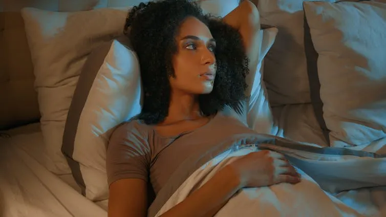
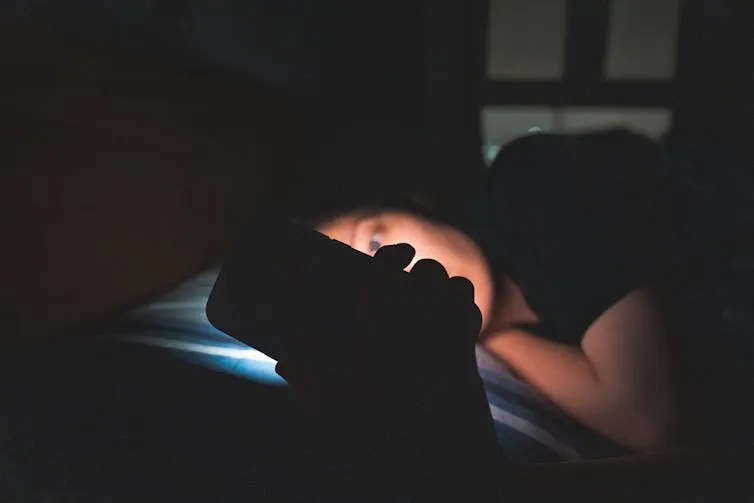

import { Link } from 'gatsby';

*出典: [Does Full Moon Really Ruin Sleep?](https://medium.com/wise-well/does-full-moon-really-ruin-sleep-76d7d169cc54)*

## 月明かりの下で眠れない夜

満月の夜、なかなか寝付けずに寝返りを打ちながら、「もしかして月の光のせい？」と思ったことはありませんか。何世代にもわたって、人々は月には不眠や奇妙な行動、さらには狂気をもたらす力があると信じてきました。英語の「lunacy（狂気）」という言葉も、ラテン語で月を意味する「luna」に由来しています。

警察官や病院スタッフ、救急隊員の多くは、満月の夜は確実に忙しくなると口を揃えて言います。しかし、これは科学的に証明されているのでしょうか。

答えは民間伝承が示すほど単純ではありません。研究によると、満月は確かに睡眠に控えめな影響を与えますが、精神健康への影響についてははるかに不確実です。

私は睡眠医学を専門とする神経科医として、睡眠が脳の健康にどう影響するかを研究しています。月光と狂気にまつわる古代の神話が、実はもっと日常的なもの―月明かりによる不安定な睡眠―に由来している可能性があることに、とても興味を惹かれています。

## 満月が睡眠に与える実際の影響

複数の研究により、満月に向かう数日間、つまり夕方の空に月光が最も明るく輝く時期に、人々の睡眠パターンが実際に変化することが示されています。この期間、睡眠時間は約20分短くなり、寝付くまでの時間が長くなり、深い回復睡眠の時間も減少します。大規模な人口調査でもこのパターンが確認されており、異なる文化圏の人々が満月前の夜に就寝時間が遅くなり、睡眠時間が短くなる傾向があることが分かっています。

最も可能性の高い理由は光です。夕方の明るい月は体内時計を遅らせ、就寝時間を知らせるホルモンであるメラトニンを減少させ、脳をより覚醒状態に保ちます。

変化は控えめです。ほとんどの人が失う睡眠時間は15〜30分程度ですが、その影響は測定可能です。農村部やキャンプ中など、人工光のない場所で最も強く現れます。研究によると、男女で影響の受け方が異なる可能性もあります。例えば、男性は月が満ちていく期間により多くの睡眠を失い、女性は満月の頃に深い安らかな睡眠がわずかに減少するようです。

## 精神健康との関連

何世紀もの間、人々は満月が狂気を引き起こすと非難してきました。民間伝承では、月の輝きが双極性障害の躁状態を引き起こしたり、てんかん患者の発作を誘発したり、統合失調症患者の精神病を引き起こしたりすると考えられていました。理論は単純でした―明るい月の下で睡眠不足になると、脆弱な心が崩壊するというものです。

現代科学は重要な視点を加えています。睡眠不足自体が精神健康問題の強力な引き金となることは研究で明らかです。たった一晩の睡眠不足でも不安を高め、気分を落ち込ませる可能性があります。継続的な睡眠障害は、うつ病、自殺念慮、双極性障害や統合失調症などの症状悪化のリスクを高めます。

つまり、満月による控えめな睡眠不足でさえ、すでにリスクを抱えている人々にとってはより重要な意味を持つ可能性があります。例えば、双極性障害の患者は、一般の人よりも睡眠時間の短縮や断片化に対してはるかに敏感かもしれません。

しかし、ここに問題があります。研究者が大規模な集団を調査すると、月の満ち欠けが精神科的危機を引き起こすという証拠は弱いのです。月と病院の入院・退院数や在院日数との間に、信頼できるパターンは見つかっていません。

一方で、小さな影響を示唆する研究もいくつかあります。インドでは、2016年から2017年のデータで満月期間中に精神科病院での身体拘束の使用が増加したことが記録されています。中国では、2012年から2017年の病院記録で満月の頃に統合失調症の入院がわずかに増加したことが指摘されています。しかし、これらの発見は世界的に一貫しておらず、生物学的要因よりも文化的要因や地域の病院の慣習を反映している可能性があります。

結局のところ、月は私たちの睡眠時間をわずかに削る可能性があり、睡眠不足は確実に精神健康に影響を与えます、特により脆弱な人々にとっては。これには、うつ病、双極性障害、統合失調症、てんかんなどの疾患を持つ人々や、睡眠障害に特に敏感な10代の若者が含まれます。しかし、満月が直接的に精神疾患の波を引き起こすという考えは、現実というよりも神話のままです。

## なぜ神話が根強く残るのか

科学的根拠がこれほど不確かなのに、なぜこれほど多くの人が「満月効果」を信じるのでしょうか。心理学者は「錯覚相関」という概念を指摘しています。私たちは満月と一致する異常な夜に気づき記憶しますが、何も起こらなかった多くの夜のことは忘れてしまうのです。

月はまた、非常に目につきやすい存在です。ストレス、カフェイン、スマートフォンのスクロールなど、隠れた睡眠妨害要因とは異なり、月は空にはっきりと見え、責任を負わせやすいのです。

## 現代の睡眠への教訓

月が私たちを「狂わせる」ことはないとしても、睡眠への小さな影響は重要なことを浮き彫りにしています。それは、夜間の光が重要だということです。

私たちの体は、光と闇の自然なサイクルに従うように設計されています。月光、街灯、スマートフォンの画面など、夕方の余分な光は、概日リズムを遅らせ、メラトニンを減少させ、より浅く断片的な睡眠につながる可能性があります。

現代の世界では、人工光は月よりもはるかに大きな睡眠への影響を持っています。多くの睡眠専門家が、生物学的リズムによりよく合致する恒久的な標準時間を主張するのはこのためです。

満月の夜に落ち着かないと感じたら、それは気のせいではないかもしれません―月は確かにあなたの睡眠を引っ張ることがあります。しかし、不眠が頻繁に起こる場合は、もっと身近なところに目を向けてください。空の光よりも、手の中の光が原因である可能性が高いでしょう。

---