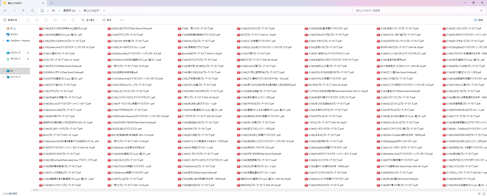

import { Link } from 'gatsby';

## はじめに

[同人誌のダウンロードサイト](https://ddd-smart.net/)で毎日更新される作品を手動でダウンロードして整理するのが面倒だったので、自動化ツールを作りました。

このツールを使えば、毎日の新着同人誌を自動でダウンロードし、イベント名やサークル名で整理されたファイル名で保存できます。


**GitHub:** [kiyohken2000/doujin-archiver](https://github.com/kiyohken2000/doujin-archiver)

## 解決したかった課題

毎日同人すまーとをチェックしている中で、以下のような課題がありました：

1. **毎日の更新チェックが面倒** - 21-23時頃に更新されるが、毎日チェックするのは大変
2. **ファイル名がバラバラ** - ダウンロードしたファイルの命名規則が統一されていない
3. **重複ダウンロード** - どれをダウンロード済みか分からなくなる
4. **イベント名の表記揺れ** - 「C104」「2024年夏コミ」「コミケ104」など表記が統一されていない

## 作ったもの

### 機能一覧

- 🔄 **自動日付リトライ** - 今日の更新が見つからない場合、自動的に1日前を検索
- 📅 **複数日対応** - 設定により複数日前まで遡ることも可能
- 📥 **自動ダウンロード** - PDFファイルを自動でダウンロード
- 📁 **整理されたファイル命名** - イベント名、サークル名、原作名による体系的な命名
- 🎪 **イベント名の統一** - コミケのイベント名を「Cxxx」形式に自動変換
- 🔄 **重複防止** - ダウンロード履歴による重複ダウンロードの防止
- ⏱️ **タイムアウト機能** - 5分以上かかるダウンロードは自動スキップ
- 📝 **詳細なログ** - 処理状況を詳細に記録

### デモ

実行するとこんな感じで動きます：

```bash
$ python doujin_downloader.py

2025-10-18 01:23:45 - INFO - ダウンロード処理を開始します
2025-10-18 01:23:45 - INFO - ダウンロードタイムアウト: 300秒 (5.0分)

==================================================
今日 (2025年10月18日) の更新を検索中...
==================================================
2025-10-18 01:23:46 - INFO - トップページにアクセスしています...
2025-10-18 01:23:47 - WARNING - 今日の更新アイテムが見つかりませんでした。1日前を検索します...

==================================================
1日前 (2025年10月17日) の更新を検索中...
==================================================
2025-10-18 01:23:48 - INFO - ✓ 2025年10月17日の更新アイテムが見つかりました！
2025-10-18 01:23:48 - INFO - 処理対象: 2025年10月17日の更新アイテム 23件

2025-10-18 01:23:50 - INFO - PDFダウンロード開始: https://...
2025-10-18 01:24:15 - INFO - ダウンロード成功 (25.3秒): (C104)[サークル名]東方Project.pdf
```

## 技術的なポイント

### 1. 自動日付リトライ機能

更新時間（21-23時）を過ぎてしまっても、自動で1日前の日付を検索します（設定により複数日前まで遡ることも可能）。

```python
def main():
    items = []
    used_date = None
    
    for days_ago in range(MAX_RETRY_DAYS + 1):  # デフォルトは1日前まで
        target_date = datetime.now() - timedelta(days=days_ago)
        items, used_date = get_items_by_date(target_date)
        
        if items:
            logging.info(f'✓ {target_date.strftime("%Y年%m月%d日")}の更新アイテムが見つかりました！')
            break
        else:
            if days_ago < MAX_RETRY_DAYS:
                logging.warning(f'{days_ago}日前も見つかりませんでした。{days_ago + 1}日前を検索します...')
```

### 2. イベント名の正規化

コミケの表記揺れを統一形式に変換します。

```python
def normalize_event_name(tag_text):
    # C104形式が既にある場合はそのまま
    c_match = re.search(r'C(\d+)', tag_text)
    if c_match:
        return f"C{c_match.group(1)}"
    
    # 年と季節から番号を推定
    year_match = re.search(r'20(\d{2})', tag_text)
    if year_match and ('夏' in tag_text or '冬' in tag_text):
        year = int(year_match.group(1))
        if '夏' in tag_text:
            # 夏コミ: C100, C102, C104...
            event_num = 100 + (year - 22) * 2
        elif '冬' in tag_text:
            # 冬コミ: C101, C103, C105...
            event_num = 101 + (year - 22) * 2
        return f"C{event_num}"
```

変換例：
- `2025年夏コミ(C106)` → `C106`
- `2025年夏コミ` → `C106`
- `コミックマーケット106` → `C106`

### 3. タイムアウト処理

大容量ファイルで処理が止まらないよう、ストリーミングダウンロード中に経過時間を監視します。

```python
def download_pdf(item, dl_page_url):
    start_time = time.time()
    
    try:
        pdf_response = session.get(pdf_url, stream=True, timeout=30)
        
        with open(filepath, 'wb') as f:
            for chunk in pdf_response.iter_content(chunk_size=8192):
                # チャンクごとに経過時間をチェック
                elapsed_time = time.time() - start_time
                if elapsed_time > DOWNLOAD_TIMEOUT:
                    logging.warning(f'タイムアウト ({elapsed_time:.1f}秒経過)')
                    if os.path.exists(filepath):
                        os.remove(filepath)  # 不完全なファイルを削除
                    return False
                f.write(chunk)
    except requests.exceptions.Timeout:
        # 接続タイムアウトの処理
        pass
```

### 4. ファイル命名戦略

優先順位を付けた命名規則で、コレクション管理しやすいファイル名を生成します。

```python
def generate_filename(item):
    # 優先順位1: イベント名
    if item['event_name']:
        return f"({item['event_name']})[{circle}]{original_work}.pdf"
    
    # 優先順位2: 発行日
    elif item['publish_date']:
        return f"[{circle}]{original_work} {item['publish_date']}.pdf"
    
    # 優先順位3: 更新日
    else:
        return f"[{circle}]{original_work} {item['update_date']}.pdf"
```

生成例：
- `(C104)[東方サークル]東方Project.pdf`
- `[オリジナルサークル]オリジナル 2024-10-15.pdf`



### 5. ダウンロード履歴管理

pickleを使ってダウンロード済みURLを永続化し、重複を防ぎます。

```python
def load_download_history():
    if os.path.exists(HISTORY_FILE):
        with open(HISTORY_FILE, 'rb') as f:
            return pickle.load(f)
    return set()

def save_download_history(history):
    with open(HISTORY_FILE, 'wb') as f:
        pickle.dump(history, f)

# 重複チェック
if url in downloaded_history:
    logging.info(f'スキップ (既にダウンロード済み): {url}')
    continue
```

## 導入方法

### 1. インストール

```bash
git clone https://github.com/kiyohken2000/doujin-archiver.git
cd doujin-archiver
pip install -r requirements.txt
```

### 2. 実行

```bash
python doujin_downloader.py
```

## カスタマイズ

### 設定可能な定数

```python
# ダウンロード先ディレクトリ
DOWNLOAD_DIR = 'downloads'

# タイムアウト時間（秒）
DOWNLOAD_TIMEOUT = 300  # 5分

# 最大何日前まで遡るか
MAX_RETRY_DAYS = 1  # デフォルトは1日前まで
```

もっと過去まで遡りたい場合は `MAX_RETRY_DAYS` を変更：

```python
MAX_RETRY_DAYS = 3  # 3日前まで遡る
MAX_RETRY_DAYS = 7  # 1週間前まで遡る
```

### 特定の日付を指定したい場合

通常は不要ですが、特定の日付を処理したい場合：

```python
# main()関数内で
target_date = datetime(2025, 10, 15)  # 2025年10月15日を指定
items, used_date = get_items_by_date(target_date)
```

## 実装で工夫した点

### 1. エラーハンドリング

各処理段階で適切なエラーハンドリングを実装し、一部のエラーで全体が止まらないようにしました。

```python
try:
    # 処理
except SpecificError as e:
    logging.error(f'エラー内容: {e}')
    continue  # 次のアイテムへ
```

### 2. サーバー負荷の考慮

```python
# 各ダウンロード間に待機時間を設定
time.sleep(3)
```

### 3. Windows対応

ファイル名に使用できない文字を自動変換：

```python
def clean_filename(filename):
    # コロンは全角に変換
    filename = filename.replace(':', '：')
    # その他の使用できない文字は半角スペースに変換
    return re.sub(r'[\\/*?"<>|]', ' ', filename)
```

### 4. ログの二重出力

ファイルとコンソールの両方にログを出力：

```python
logging.basicConfig(
    handlers=[
        logging.FileHandler('doujin_downloader.log', encoding='utf-8'),
        logging.StreamHandler()
    ]
)
```

## フィードバック歓迎

改善案や要望がございましたら、GitHubのIssuesでお知らせください。
実際、v3.0の自動日付リトライ機能は[Issue #1](https://github.com/kiyohken2000/doujin-archiver/issues/1)のフィードバックから生まれました。

## まとめ

Pythonの基本的な機能（requests、BeautifulSoup、pickle）を組み合わせることで、実用的な自動化ツールを作ることができました。

特に以下の3つの機能により、真の「自動化」を実現：

1. **自動日付リトライ** - 実行タイミングを選ばない
2. **タイムアウト機能** - 確実に処理が完了する
3. **イベント名正規化** - 統一されたコレクション管理

同じような課題を抱えている方の参考になれば幸いです。

---