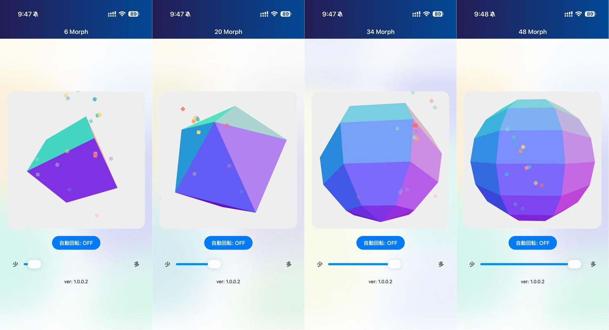

import { Link } from 'gatsby';

## PolyMorph

「**PolyMorph**」は、スマートフォン上で 3D の多面体（正四面体、立方体、正八面体、正十二面体、正二十面体など）を自由に変形・回転させて眺めることができるインタラクティブな3Dビューアーアプリです。

### 主な特徴・機能

- スライダーを動かすことで、多面体の形状を “瞬時に” 変えられます。 
- タップ＆ドラッグで、3D 多面体を自由に回転させて眺められます。 
- 面ごとにカラフルな配色がされており、視覚的にも美しくデザインされています。 
- 広告なし、課金なしの完全無料アプリです。 
- 多面体の種類としては、プラトンの立体（正多面体）から、やや複雑な多面体までを網羅。触って回して眺めることで立体図形の理解を深められます。

### 推奨される利用シーン

- 幾何学や立体図形に興味がある人。
- 短時間の “手を動かして気分転換” をしたい時。
- 空間認識能力を高める一助として、子ども向けにも◎。
- 見た目がシンプルながらも “触ってみる”楽しさがあるため、リラックス用途にも。

### ダウンロードはこちら

- [AppStore](https://apps.apple.com/jp/app/id6755909593)
- [GooglePlay](https://play.google.com/store/apps/details?id=net.votepurchase.polymorph)

## 制作後記

意識的にではないのですが、スマホアプリ開発を始めた2020年以来、毎年最低一つは新作アプリをリリースしていました。誰にも使われず、メンテもせずにストアから消えていったアプリもいくつかあります。

- 2020: Retwpay
- 2021: kenmoreader, Grafhouse, PINE pro, Find Good One, Ocacatalk
- 2022: 安倍晋三エクスプローラー(聖帝エクスプローラー), Hey 晋さん(意味のない質問だよ)
- 2023: Kiroku - 性的同意アプリ, ガチ有能AI助手
- 2024: 品評会画像メーカー

今年はガチ有能AI助手の更新や安倍晋三エクスプローラーなど、既存アプリのメンテはしていましたが新作アプリのリリースはしていませんでした。

かといって作りたいアプリのアイディアもなかったので、Claude先生に相談しつつ無理やりひねりだした結果が**PolyMorph**です。

アプリのコード、アイコン、アプリ名、ストアの説明文などほぼすべてをChatGPTとClaudeに書かせました。開発開始から審査に提出するまで約3時間でした。

2020年に初めてアプリ開発を始めたときには考えられないスピード感でした。LLMはマジで世界を変えたと思います。

---