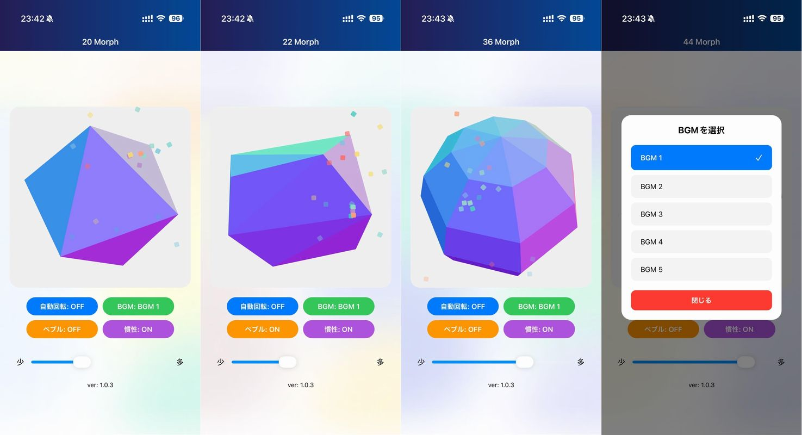

import { Link } from 'gatsby';

## はじめに

こんにちは！今回は、React NativeとThree.jsを組み合わせて、インタラクティブな3D多面体（ポリヘドロン）可視化アプリ「**PolyMorph**」を開発しました。

タッチで回転、紙吹雪エフェクト、BGM、触覚フィードバックなど、モバイルならではの体験を盛り込んだアプリです。iOS/Android両対応で、実際にAppStoreとGooglePlayで公開しています。

この記事では、React Nativeで3D表現を実現する方法と、実装のポイントを紹介します。

## ダウンロード

- [AppStore](https://apps.apple.com/jp/app/polymorph/id6755909593)
- [GooglePlay](https://play.google.com/store/apps/details?id=net.votepurchase.polymorph)

## 作成したもの

### 主な機能

- **3D多面体の表示**: 4面〜50面まで、様々な多面体を表示
- **タッチ操作**: ドラッグで自由に回転、慣性付き
- **正多面体とペブルモード**:
  - 通常モード: 正多面体や球体ベースの形状
  - ペブルモード: ランダムな点から生成される有機的な形状
- **自動回転 + BGM**: 5種類のBGMから選択可能
- **視覚エフェクト**: タッチ時の紙吹雪アニメーション
- **触覚フィードバック**: タッチや回転時のハプティック
- **ブラー背景**: Skiaを使った美しいグラデーション背景

### デモ



- [デモ動画1(YouTube)](https://youtube.com/shorts/uSyJcZi2z_g)
- [デモ動画2(YouTube)](https://youtube.com/shorts/0ts_miuA8MI)

## 技術スタック

### コアフレームワーク
```json
{
  "react": "19.1.0",
  "react-native": "0.81.5",
  "expo": "~54.0.25"
}
```

### 3Dグラフィックス
```json
{
  "three": "0.160.0",
  "expo-gl": "~16.0.7"
}
```

### アニメーション・UI
```json
{
  "react-native-reanimated": "~4.1.1",
  "react-native-gesture-handler": "~2.28.0",
  "@shopify/react-native-skia": "2.2.12",
  "lottie-react-native": "~7.3.1"
}
```

### その他
```json
{
  "expo-haptics": "~15.0.7",
  "expo-audio": "~1.0.15",
  "@reduxjs/toolkit": "1.5.1",
  "@react-navigation/native": "^7.1.17"
}
```

## 実装のポイント

### 1. React NativeでThree.jsを使う（expo-gl）

React NativeでThree.jsを動かすには、`expo-gl`を使います。WebGLコンテキストを提供してくれるので、ほぼ通常のThree.jsコードがそのまま動きます。

```javascript
import { GLView } from 'expo-gl'
import * as THREE from 'three'

const onContextCreate = async (gl) => {
  // WebGLRendererを作成
  const renderer = new THREE.WebGLRenderer({
    canvas: {
      width: gl.drawingBufferWidth,
      height: gl.drawingBufferHeight,
      style: {},
      addEventListener: () => {},
      removeEventListener: () => {},
      clientHeight: gl.drawingBufferHeight,
      getContext: () => gl,
    },
    context: gl,
  })
  renderer.setSize(gl.drawingBufferWidth, gl.drawingBufferHeight)

  // シーン、カメラ、オブジェクトを作成
  const scene = new THREE.Scene()
  const camera = new THREE.PerspectiveCamera(
    75,
    gl.drawingBufferWidth / gl.drawingBufferHeight,
    0.1,
    1000
  )
  camera.position.z = 3.5

  // メッシュを作成
  const geometry = new THREE.DodecahedronGeometry(2, 0)
  const material = new THREE.MeshNormalMaterial({ flatShading: true })
  const mesh = new THREE.Mesh(geometry, material)
  scene.add(mesh)

  // アニメーションループ
  const animate = () => {
    requestAnimationFrame(animate)
    renderer.render(scene, camera)
    gl.endFrameEXP() // expo-gl特有のメソッド
  }
  animate()
}

return <GLView style={{ flex: 1 }} onContextCreate={onContextCreate} />
```

ポイントは：
- `gl.endFrameEXP()`を毎フレーム呼ぶこと
- canvasオブジェクトのモック実装が必要なこと

### 2. 動的なジオメトリ生成

4面〜50面まで様々な多面体を表示するため、面数に応じたジオメトリを生成する関数を実装しました。

```javascript
const createGeometryForFaces = (faceCount, isPebble) => {
  // 正多面体が存在する面数
  if (faceCount === 4) {
    return new THREE.TetrahedronGeometry(2, 0) // 正四面体
  } else if (faceCount === 6) {
    return new THREE.BoxGeometry(2, 2, 2) // 正六面体（立方体）
  } else if (faceCount === 8) {
    return new THREE.OctahedronGeometry(2, 0) // 正八面体
  } else if (faceCount === 12) {
    return new THREE.DodecahedronGeometry(2, 0) // 正十二面体
  } else if (faceCount === 20) {
    return new THREE.IcosahedronGeometry(2, 0) // 正二十面体
  }

  // ペブルモード: ランダムな点から凸包を生成
  if (isPebble) {
    const points = []
    for (let i = 0; i < faceCount; i++) {
      // 球面上にランダムに点を配置
      const theta = Math.random() * Math.PI * 2
      const phi = Math.acos(2 * Math.random() - 1)
      const r = 2

      points.push(
        new THREE.Vector3(
          r * Math.sin(phi) * Math.cos(theta),
          r * Math.sin(phi) * Math.sin(theta),
          r * Math.cos(phi)
        )
      )
    }
    // 凸包（Convex Hull）を計算して多面体を生成
    return new ConvexGeometry(points)
  }

  // 正多面体以外は球体で近似
  // SphereGeometry(radius, widthSegments, heightSegments)
  // 総面数 ≈ widthSegments * heightSegments * 2
  if (faceCount === 5) {
    return new THREE.SphereGeometry(2, 3, 2) // 約6面
  }
  // ... 他の面数に応じた処理
}
```

**工夫したポイント：**
- 正多面体（4, 6, 8, 12, 20面）は専用のジオメトリを使用
- それ以外は球体のセグメント数を調整して近似
- ペブルモードでは`ConvexGeometry`を使って有機的な形状を生成
- `ConvexGeometry`はThree.jsの標準モジュールではないため、別途インポートが必要です。

```javascript
import { ConvexGeometry } from 'three/examples/jsm/geometries/ConvexGeometry'
```

### 3. タッチジェスチャーと物理演算

`PanResponder`を使ってタッチ操作を実装し、慣性回転も追加しました。

```javascript
const velocityRef = useRef({ x: 0, y: 0 })
const rotationRef = useRef({ x: 0, y: 0 })

const panResponder = useRef(
  PanResponder.create({
    onStartShouldSetPanResponder: () => true,
    onMoveShouldSetPanResponder: () => true,

    onPanResponderGrant: (evt) => {
      // タッチ開始時に速度をリセット
      velocityRef.current = { x: 0, y: 0 }
      lastMoveTimeRef.current = Date.now()
    },

    onPanResponderMove: (evt) => {
      const now = Date.now()
      const deltaTime = now - lastMoveTimeRef.current
      const deltaX = evt.nativeEvent.pageX - lastTouchRef.current.x
      const deltaY = evt.nativeEvent.pageY - lastTouchRef.current.y

      // 回転を適用
      rotationRef.current.y += deltaX * 0.01
      rotationRef.current.x += deltaY * 0.01

      // 速度を計算（時間あたりの回転量）
      if (deltaTime > 0) {
        velocityRef.current.x = (deltaY * 0.01) / deltaTime * 16
        velocityRef.current.y = (deltaX * 0.01) / deltaTime * 16
      }

      if (meshRef.current) {
        meshRef.current.rotation.x = rotationRef.current.x
        meshRef.current.rotation.y = rotationRef.current.y
      }

      lastTouchRef.current = { x: evt.nativeEvent.pageX, y: evt.nativeEvent.pageY }
      lastMoveTimeRef.current = now
    },
  })
).current
```

アニメーションループ内で慣性を適用：

```javascript
const animate = () => {
  requestAnimationFrame(animate)

  if (!autoRotateRef.current && inertiaEnabledRef.current) {
    const vx = velocityRef.current.x
    const vy = velocityRef.current.y
    const speed = Math.sqrt(vx * vx + vy * vy)

    if (speed > 0.001) {
      rotationRef.current.x += vx
      rotationRef.current.y += vy
      meshRef.current.rotation.x = rotationRef.current.x
      meshRef.current.rotation.y = rotationRef.current.y

      // 速度を減衰（摩擦係数 0.95）
      velocityRef.current.x *= 0.95
      velocityRef.current.y *= 0.95
    } else {
      velocityRef.current.x = 0
      velocityRef.current.y = 0
    }
  }

  renderer.render(scene, camera)
  gl.endFrameEXP()
}
```

**ポイント：**
- タッチの速度から初速度を計算
- 毎フレーム速度を0.95倍にして減衰
- 速度が十分小さくなったら完全に停止

### 4. 紙吹雪エフェクト

タッチ時に紙吹雪が舞うエフェクトを`Animated` APIで実装しました。

```javascript
const createConfetti = (x, y, count = 30) => {
  const colors = ['#FF6B6B', '#4ECDC4', '#45B7D1', '#FFA07A', '#98D8C8', '#F7DC6F', '#BB8FCE', '#85C1E2']
  const newConfetti = []

  for (let i = 0; i < count; i++) {
    const color = colors[Math.floor(Math.random() * colors.length)]
    const translateX = new Animated.Value(0)
    const translateY = new Animated.Value(0)
    const rotate = new Animated.Value(0)
    const opacity = new Animated.Value(1)

    // ランダムな方向と速度
    const angle = Math.random() * Math.PI * 2
    const velocity = 100 + Math.random() * 150
    const vx = Math.cos(angle) * velocity
    const vy = -Math.abs(Math.sin(angle)) * velocity - 100

    newConfetti.push({
      id: `${Date.now()}_${i}_${Math.random()}`,
      x, y, color, translateX, translateY, rotate, opacity, vx, vy,
    })

    // パラレルアニメーション
    Animated.parallel([
      Animated.timing(translateX, { toValue: vx, duration: 1000, useNativeDriver: true }),
      Animated.sequence([
        Animated.timing(translateY, { toValue: vy, duration: 300, useNativeDriver: true }),
        Animated.timing(translateY, { toValue: 500, duration: 700, useNativeDriver: true }),
      ]),
      Animated.timing(rotate, { toValue: (Math.random() - 0.5) * 720, duration: 1000, useNativeDriver: true }),
      Animated.timing(opacity, { toValue: 0, duration: 1000, useNativeDriver: true }),
    ]).start(() => {
      setConfetti(prev => prev.filter(c => c.id !== id))
    })
  }

  setConfetti(prev => [...prev, ...newConfetti])
}
```

レンダリング：

```javascript
{confetti.map((c) => (
  <Animated.View
    key={c.id}
    style={[
      styles.confettiPiece,
      {
        left: c.x,
        top: c.y,
        backgroundColor: c.color,
        transform: [
          { translateX: c.translateX },
          { translateY: c.translateY },
          { rotate: c.rotate.interpolate({
            inputRange: [0, 360],
            outputRange: ['0deg', '360deg'],
          })},
        ],
        opacity: c.opacity,
      },
    ]}
  />
))}
```

### 5. BGMと触覚フィードバック

#### BGM再生（expo-audio）

```javascript
import { useAudioPlayer } from 'expo-audio'

const player1 = useAudioPlayer(require('../../../assets/audio/bgm1.mp3'))
const player2 = useAudioPlayer(require('../../../assets/audio/bgm2.mp3'))
// ... 他のプレイヤー

useEffect(() => {
  const currentPlayer = getCurrentPlayer()
  const allPlayers = [player1, player2, player3, player4, player5]

  // すべてのプレイヤーを停止
  allPlayers.forEach(p => {
    if (p.playing) p.pause()
  })

  if (autoRotate) {
    currentPlayer.loop = true
    currentPlayer.volume = 0.5
    currentPlayer.play()
  }
}, [autoRotate, selectedBgmId])
```

#### 触覚フィードバック（expo-haptics）

```javascript
import * as Haptics from 'expo-haptics'

// タッチ開始時
onPanResponderGrant: (evt) => {
  Haptics.impactAsync(Haptics.ImpactFeedbackStyle.Medium)
}

// 一定距離回転するごとに軽いフィードバック
if (accumulatedRotationRef.current > 50) {
  Haptics.impactAsync(Haptics.ImpactFeedbackStyle.Light)
  accumulatedRotationRef.current = 0
}
```

### 6. Skiaによるブラー背景

`@shopify/react-native-skia`を使って、動的なブラーエフェクト背景を実装しました。

```javascript
import { Canvas, Circle, LinearGradient, vec, Blur } from '@shopify/react-native-skia'
import { useSharedValue, withRepeat, withTiming } from 'react-native-reanimated'

const BlurCircle = ({ startColor, endColor, cx, cy, r }) => {
  const offset = useSharedValue(0)

  useEffect(() => {
    offset.value = withRepeat(
      withTiming(1, { duration: 3000 }),
      -1,
      true
    )
  }, [])

  return (
    <Circle cx={cx} cy={cy} r={r}>
      <LinearGradient
        start={vec(0, 0)}
        end={vec(250, 250)}
        colors={[startColor, endColor]}
      />
      <Blur blur={20} />
    </Circle>
  )
}
```

## コードハイライト

### ジオメトリの動的更新

面数が変わったときにジオメトリを更新する処理：

```javascript
useEffect(() => {
  if (meshRef.current) {
    const newGeometry = createGeometryForFaces(faces, isPebble)
    meshRef.current.geometry.dispose() // メモリリーク防止
    meshRef.current.geometry = newGeometry
  }
}, [faces, isPebble])
```

**重要：** 古いジオメトリは`dispose()`でメモリ解放すること！

### 自動回転と手動回転の切り替え

```javascript
const animate = () => {
  requestAnimationFrame(animate)

  // 自動回転が有効な場合
  if (autoRotateRef.current && meshRef.current) {
    rotationRef.current.x += 0.005
    rotationRef.current.y += 0.01
    meshRef.current.rotation.x = rotationRef.current.x
    meshRef.current.rotation.y = rotationRef.current.y
  } else if (meshRef.current && inertiaEnabledRef.current) {
    // 慣性回転を適用
    // ... （前述のコード）
  }

  renderer.render(scene, camera)
  gl.endFrameEXP()
}
```

## ハマったポイント

### 1. expo-glのcanvasモック

Three.jsは通常HTMLのCanvas要素を想定していますが、React Nativeには存在しません。expo-glのglコンテキストをcanvasオブジェクトとしてラップする必要があります。

```javascript
canvas: {
  width: gl.drawingBufferWidth,
  height: gl.drawingBufferHeight,
  style: {},
  addEventListener: () => {},
  removeEventListener: () => {},
  clientHeight: gl.drawingBufferHeight,
  getContext: () => gl,
}
```

### 2. useRefとuseStateの使い分け

アニメーションループ内で使う値は、再レンダリングを引き起こさないように`useRef`を使用します。逆に、UI更新が必要な値は`useState`を使います。

```javascript
const autoRotate = useState(false) // UIに影響
const autoRotateRef = useRef(autoRotate) // アニメーションループ内で参照

useEffect(() => {
  autoRotateRef.current = autoRotate // 同期
}, [autoRotate])
```

### 3. メモリ管理

ジオメトリやマテリアルを更新する際は、必ず`dispose()`を呼んでメモリリークを防ぎます。

```javascript
meshRef.current.geometry.dispose()
meshRef.current.geometry = newGeometry
```

## パフォーマンス最適化

1. **useNativeDriver: true** - アニメーションはネイティブスレッドで実行
2. **紙吹雪の制限** - 最大100個までに制限してメモリ消費を抑制
3. **速度計算の最適化** - `deltaTime`ベースの速度計算で滑らかな動き
4. **ジオメトリの使い回し** - 面数が変わるまで同じジオメトリを使用

## まとめ

React NativeでThree.jsを使った3Dアプリ開発は、expo-glのおかげで思ったより簡単に実現できました。

**実装のポイント：**
- expo-glでThree.jsが動く
- タッチ操作 + 物理演算で自然な回転
- アニメーション、音楽、触覚を組み合わせた体験
- メモリ管理とパフォーマンスに注意

モバイルならではのインタラクション（タッチ、ハプティック、ジェスチャー）と3Dを組み合わせると、面白い体験が作れます！

ぜひ試してみてください。

## ソースコード

GitHubリポジトリ: [https://github.com/kiyohken2000/PolyMorph](https://github.com/kiyohken2000/PolyMorph)

---

最後まで読んでいただき、ありがとうございました！

---