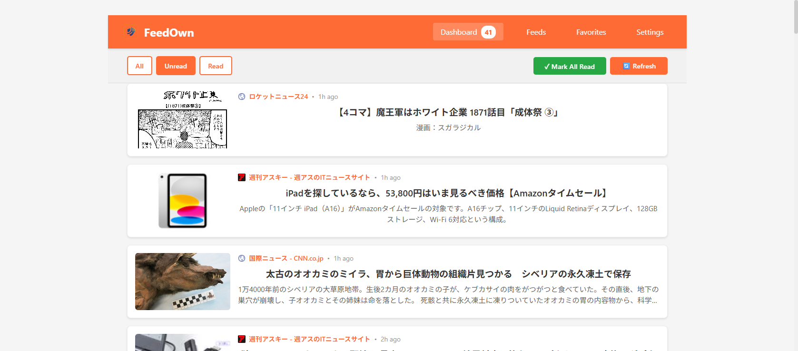
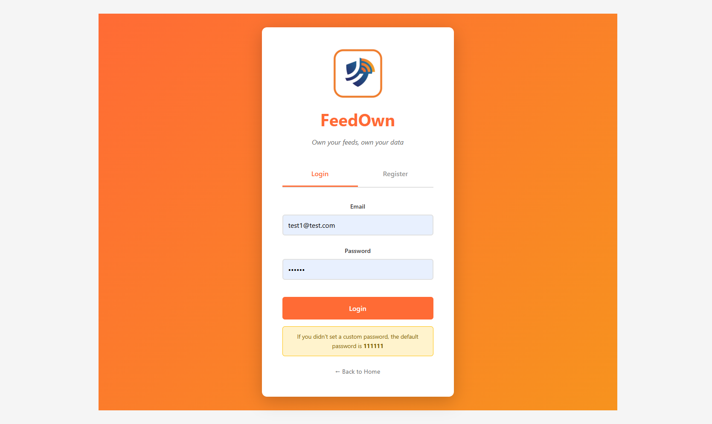
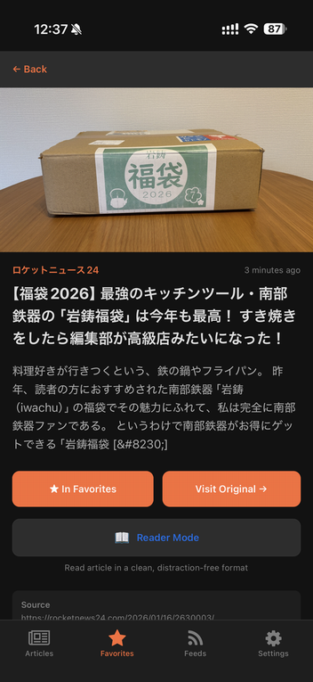
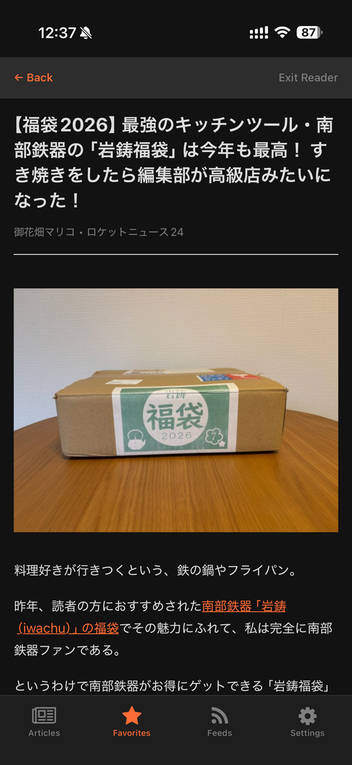
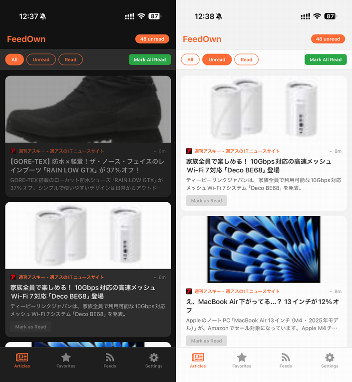
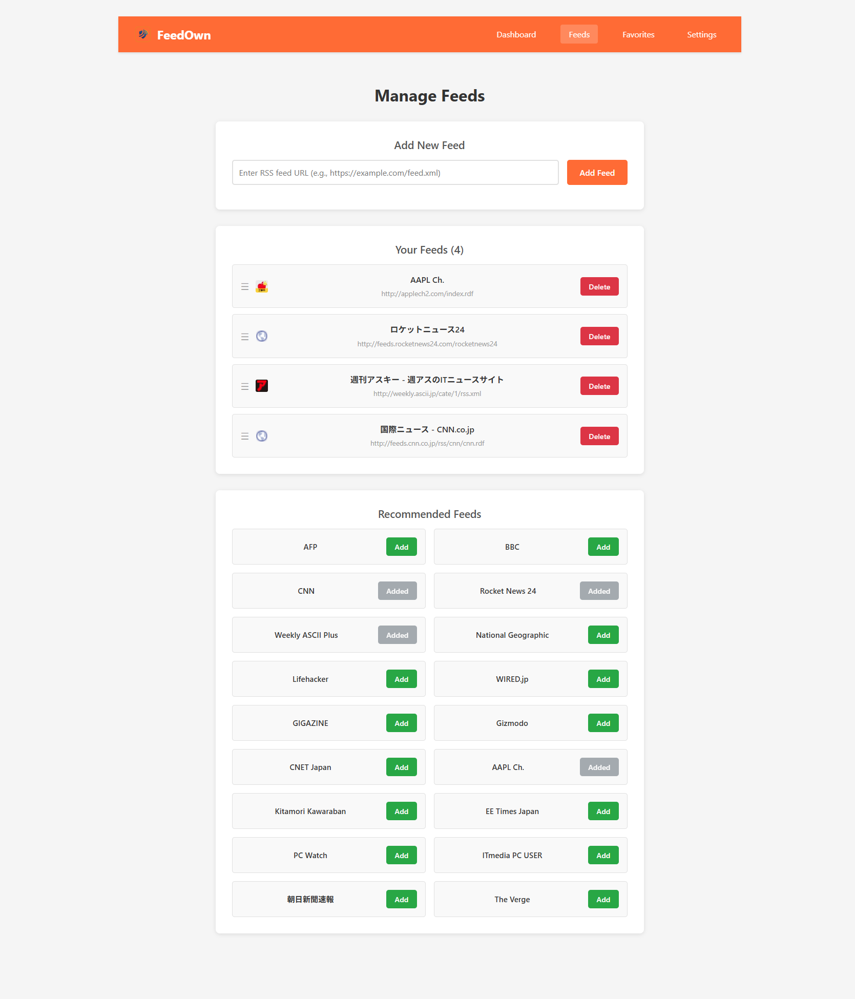
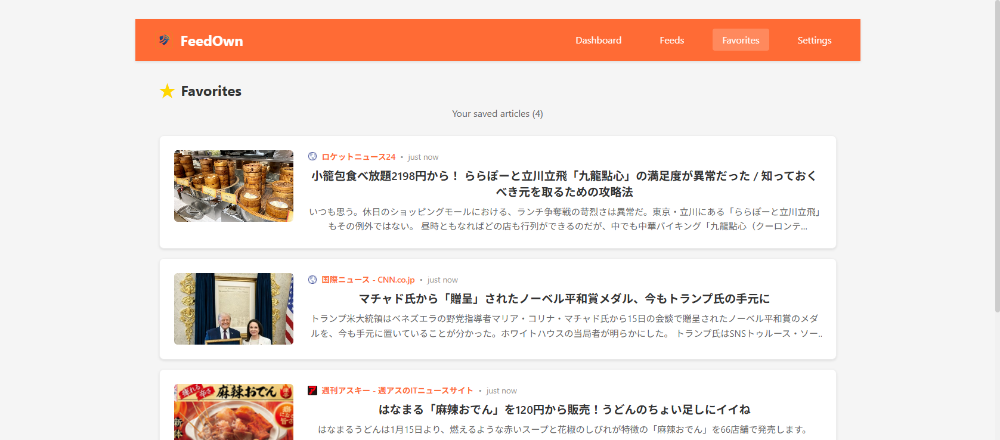

import { Link } from 'gatsby';

*RSSへのラブレター、そしてその日が来たときのためのバックアップ*

---

## 「あとで読む」の死

2025年、Pocketが正式にサービスを終了した。多くの人にとって、それは古い友人が去っていくのを見守るような気持ちだったと思う。Pocketは2007年から存在し（当初は「Read It Later」という名前だった）、モバイル時代への移行を乗り越え、Mozillaに買収され、そして最終的に持続可能な道を見つけられなかった。

私自身はPocketをそれほど使っていなかった。でも、このニュースは予想以上に心に刺さった。Pocket自体の問題ではない。それが象徴するもの——**オープンウェブの一部がまた死んでいく**——それが問題だった。

## 私のRSS遍歴：15年以上の付き合い

私は15年以上RSSリーダーを使い続けている。始まりは2008年のGoogle Readerだった。毎朝コーヒーを片手に開いて、テックブログやニュースサイト、メインストリームメディアが絶対に取り上げないニッチな出版物をチェックしていた。

そして2013年7月1日——GoogleがReaderを殺した日がやってきた。何百万人もの人と同様に、私はFeedlyに移行した。十分な代替品だったし、それ以来ずっと使い続けている。

でも、わかっている。**RSSは死にかけている**。

若い世代はRSSが何かを知らない。ほとんどのウェブサイトはトップページからRSSフィードへのリンクを削除している（探せばフィード自体はまだ存在するけれど）。ソーシャルメディアのアルゴリズムが、RSSが提供していた時系列のキュレーション体験に取って代わった。

*FeedOwnで毎日のニュースフィードを表示*

## このプロジェクトを始めた「恐怖」

Pocketの終了後、考え始めた。**Feedlyが終わったらどうする？** Inoreaderは？これらのサービスは慈善事業ではない——利益を出す必要があるビジネスだ。そしてRSSリーダー市場は、決して成長産業ではない。

気づいたのは、自分がコントロールできないサービスに完全に依存しているということだった。何年もかけて丁寧にキュレーションしたフィード購読、長年の読書習慣、保存した記事——すべてが、たった一つのサービス終了のお知らせで消え去る可能性がある。

その恐怖がFeedOwnの出発点になった。

## FeedOwn：フィードを自分のものに

FeedOwnは、自分のインフラにデプロイできるセルフホスト型RSSリーダーだ。サブスクリプション料金なし。倒産するかもしれない会社なし。何を読むべきか決めるアルゴリズムなし。あなたとフィードだけの関係。

*シンプルでクリーンなログイン画面*

### 主な機能

**クロスプラットフォーム対応**

FeedOwnはWebで動作し、iOSとAndroid両方のネイティブモバイルアプリも提供している。読書の進捗はすべてのデバイス間で同期される。

*モバイルアプリはネイティブで快適な操作感*

**リーダーモード**

PocketやSafariのリーダーモードのように、FeedOwnは記事の本文を抽出し、広告やポップアップ、邪魔なサイドバーのないクリーンな読書体験を提供する。

*リーダーモードで記事の本文だけを抽出*

**ダークモード**

もちろんダークモードもある。2026年だからね。

*深夜の読書にも優しい*

**フィード管理**

URLでフィードを追加したり、おすすめフィードから始めたり、購読を整理したり。

*フィード購読の管理*

**お気に入り**

後で読み返したい記事を保存できる。Pocketと違って、これらは自分のデータベースに保存される——会社がピボットを決めても消えたりしない。

*保存した記事は、永遠にあなたのもの*

## 技術スタック

FeedOwnはモダンなサーバーレス技術で構築されており、ホスティングコストを最小限に抑えている：

- **フロントエンド**: React (Web) + React Native/Expo (Mobile)
- **バックエンド**: Cloudflare Pages Functions（サーバーレス、寛大な無料枠）
- **データベース**: Supabase PostgreSQL（こちらも寛大な無料枠）

スタック全体が個人利用なら無料枠で動作する。自分のRSSリーダーをホストするのに**月額0円**だ。

## セルフホスティング：思ったより簡単

FeedOwnのセルフホスティングについて、包括的なドキュメントを書いた。チュートリアルに従って設定値をコピペできるなら、自分のインスタンスをデプロイできる。

セットアップの流れ：
1. Supabaseプロジェクトを作成（5分）
2. Cloudflare Pagesプロジェクトを作成（5分）
3. コードをデプロイ

管理するサーバーなし。面倒を見るDockerコンテナなし。毎月のVPS請求書なし。

## 試してみる

**セルフホストしたくない？** 公開インスタンスを使える：
- Web: https://feedown.pages.dev
- iOS: [App Store](https://apps.apple.com/us/app/feedown/id6757896656)
- Android: [Google Play](https://play.google.com/store/apps/details?id=net.votepurchase.feedown)

**セルフホストしたい？** ドキュメントをチェック：
- GitHub: https://github.com/kiyohken2000/feedown
- セットアップガイド: https://feedown.pages.dev/docs/setup

## RSSの未来（あるいはその不在）

RSSが復活するとは思っていない。このフォーマットはWeb 2.0時代にその役割を果たし、世界はアルゴリズムフィードとソーシャルメディアに移行した。

でも、コンテンツを購読して自分のペースで読むというシンプルさを今でも大切にしている私たちにとって、RSSは依然として最良のソリューションだ。アルゴリズムなし。エンゲージメント最適化なし。「こちらもおすすめ」の割り込みなし。

FeedOwnはRSSを救おうとしているわけではない。商用サービスがいつか終了したときに、まだRSSを使っている私たちが取り残されないようにしようとしているだけだ。

なぜなら、いつか終わる。必ず。そしてその日が来ても、私はまだ自分のフィードを持っている。

---

*FeedOwnはオープンソースで無料で使える。もしあなたも同じようにRSSを使い続けている仲間なら、ぜひあなたのストーリーを聞かせてほしい。GitHubで見つけるか、アプリを試してみてください。*

**リンク:**
- ライブデモ: https://feedown.pages.dev
- GitHub: https://github.com/kiyohken2000/feedown
- App Store: https://apps.apple.com/us/app/feedown/id6757896656
- Google Play: https://play.google.com/store/apps/details?id=net.votepurchase.feedown

---