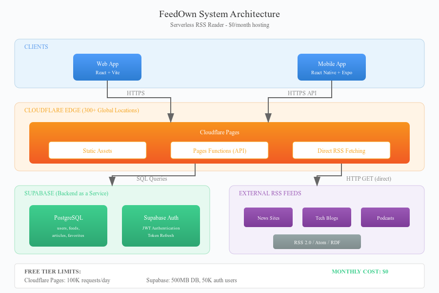

import { Link } from 'gatsby';

*FeedOwnの技術的な詳細解説*

---

## はじめに

自分のRSSリーダーを作ることを決めたとき、譲れない条件が一つあった：**運用コストがゼロであること**。「安い」ではなく、文字通り個人利用で月額0円。

この記事では、サーバーレスインフラだけで構築したRSSリーダー「FeedOwn」の技術的な詳細を解説する。


*FeedOwn システム構成図*

## アーキテクチャ概要

FeedOwnは3つの主要コンポーネントで構成されている：

```
┌─────────────────────────────────────────────────────────────────┐
│                         クライアント                              │
├─────────────────────────────────────────────────────────────────┤
│  ┌─────────────┐              ┌─────────────────────────────┐   │
│  │   Web App   │              │        Mobile App           │   │
│  │  (React)    │              │    (React Native/Expo)      │   │
│  └──────┬──────┘              └──────────────┬──────────────┘   │
└─────────┼────────────────────────────────────┼──────────────────┘
          │                                    │
          │         HTTPS API Calls            │
          ▼                                    ▼
┌─────────────────────────────────────────────────────────────────┐
│                    CLOUDFLARE EDGE                               │
├─────────────────────────────────────────────────────────────────┤
│  ┌───────────────────────────────────────────────────────────┐  │
│  │                   Cloudflare Pages                        │  │
│  │   ┌───────────────────┐    ┌───────────────────────────┐  │  │
│  │   │  Static Assets    │    │     Pages Functions       │  │  │
│  │   │  (React Bundle)   │    │     (API Endpoints)       │  │  │
│  │   └───────────────────┘    └─────────────┬─────────────┘  │  │
│  └──────────────────────────────────────────┼────────────────┘  │
└─────────────────────────────────────────────┼───────────────────┘
                                              │
                 ┌────────────────────────────┼────────────────┐
                 │                            │                │
                 │    SQL Queries             │  Fetch RSS XML │
                 ▼                            ▼                │
┌────────────────────────────────┐    ┌─────────────────────────┐
│         SUPABASE               │    │    External RSS Feeds   │
│  ┌──────────────────────────┐  │    │                         │
│  │      PostgreSQL          │  │    │  • ニュースサイト        │
│  │  ┌────────────────────┐  │  │    │  • ブログ               │
│  │  │ users, feeds,      │  │  │    │  • ポッドキャスト        │
│  │  │ articles, favorites│  │  │    │  • その他RSS/Atom       │
│  │  └────────────────────┘  │  │    │                         │
│  └──────────────────────────┘  │    └─────────────────────────┘
│  ┌──────────────────────────┐  │
│  │    Supabase Auth         │  │
│  │  (JWT Authentication)    │  │
│  └──────────────────────────┘  │
└────────────────────────────────┘
```

各コンポーネントの設計判断について解説していく。

## 1. Cloudflare Pages Functions：APIレイヤー

従来のサーバー（Express、FastAPIなど）を動かす代わりに、FeedOwnは**Cloudflare Pages Functions**を使っている。エッジで動作するサーバーレス関数だ。

### なぜPages Functionsか？

- **コールドスタートなし**：AWS Lambdaと違い、Cloudflare Workersは瞬時に起動する
- **グローバル分散**：世界300以上のデータセンターでコードが実行される
- **寛大な無料枠**：1日10万リクエストまで無料
- **Pagesと統合**：フロントエンドとバックエンドを一緒にデプロイ

### API構造

```
functions/
├── api/
│   ├── auth/
│   │   ├── login.ts      # POST /api/auth/login
│   │   ├── register.ts   # POST /api/auth/register
│   │   └── refresh.ts    # POST /api/auth/refresh
│   ├── feeds/
│   │   ├── index.ts      # GET/POST /api/feeds
│   │   └── [id].ts       # DELETE/PATCH /api/feeds/:id
│   ├── articles/
│   │   ├── index.ts      # GET /api/articles
│   │   └── [id]/
│   │       ├── read.ts   # POST /api/articles/:id/read
│   │       └── favorite.ts # POST/DELETE
│   ├── refresh.ts        # POST /api/refresh (新着記事取得)
│   └── article-content.ts # GET /api/article-content (リーダーモード)
├── lib/
│   ├── auth.ts           # JWT検証ミドルウェア
│   └── supabase.ts       # データベースクライアント
└── _middleware.ts        # CORSヘッダー
```

各ファイルは`onRequestGet`、`onRequestPost`などのハンドラーをエクスポートする。Cloudflareがファイル構造に基づいて自動的にルーティングしてくれる。

### 例：リフレッシュエンドポイント

最も複雑なエンドポイントは`/api/refresh`で、RSSフィードを取得して新着記事を保存する：

```typescript
export async function onRequestPost(context: any): Promise<Response> {
  // 1. 認証を検証
  const authResult = await requireAuth(request, env);

  // 2. ユーザーのフィードをデータベースから取得
  const { data: feeds } = await supabase
    .from('feeds')
    .select('*')
    .eq('user_id', uid);

  // 3. 各RSSフィードを直接取得
  for (const feed of feeds) {
    const controller = new AbortController();
    const timeoutId = setTimeout(() => controller.abort(), 10000);

    const rssResponse = await fetch(feed.url, {
      signal: controller.signal,
      headers: { 'User-Agent': 'FeedOwn/1.0 (RSS Reader)' },
    });
    clearTimeout(timeoutId);

    const xmlText = await rssResponse.text();

    // 4. RSS/Atom/RDF XMLをパース
    const parsedFeed = await parseRssXml(xmlText);

    // 5. 新着記事を保存（重複排除付き）
    await storeArticles(uid, feed.id, parsedFeed.items);
  }

  return Response.json({ success: true, stats });
}
```

### なぜPages FunctionsでRSSを直接取得できるのか？

当初は別のCloudflare WorkerをKVキャッシュ付きのRSSプロキシとして使っていた。これはブラウザがクロスオリジンのRSSリクエストをブロックする（CORS）ために必要だった。

しかしPages Functionsはブラウザではなくサーバーサイドで動作する。CORSの問題なくRSSフィードを直接取得できる。このシンプル化により：

- **複雑さを削減**：別のWorkerのデプロイが不要
- **コストを削減**：KVストレージ操作なし（日次制限がある）
- **鮮度を向上**：常に最新のRSSコンテンツを取得

## 2. Supabase：データベース + 認証

Supabaseは寛大な無料枠を持つPostgreSQLデータベースと認証システムを提供している。

### データベーススキーマ

```sql
-- ユーザー（Supabase Authで管理、プロファイルで拡張）
CREATE TABLE user_profiles (
  user_id UUID PRIMARY KEY REFERENCES auth.users(id),
  created_at TIMESTAMPTZ DEFAULT NOW()
);

-- RSSフィード
CREATE TABLE feeds (
  id UUID PRIMARY KEY DEFAULT gen_random_uuid(),
  user_id UUID REFERENCES auth.users(id) ON DELETE CASCADE,
  url TEXT NOT NULL,
  title TEXT,
  favicon_url TEXT,
  added_at TIMESTAMPTZ DEFAULT NOW(),
  last_fetched_at TIMESTAMPTZ,
  UNIQUE(user_id, url)
);

-- 記事（7日後に自動削除するTTL付き）
CREATE TABLE articles (
  id TEXT PRIMARY KEY,  -- feed_id + guid のSHA256ハッシュ
  user_id UUID REFERENCES auth.users(id) ON DELETE CASCADE,
  feed_id UUID REFERENCES feeds(id) ON DELETE CASCADE,
  title TEXT NOT NULL,
  url TEXT NOT NULL,
  description TEXT,
  published_at TIMESTAMPTZ,
  expires_at TIMESTAMPTZ,  -- 7日後に自動削除
  image_url TEXT
);

-- 既読状態とお気に入り
CREATE TABLE read_articles (
  user_id UUID REFERENCES auth.users(id) ON DELETE CASCADE,
  article_id TEXT,
  read_at TIMESTAMPTZ DEFAULT NOW(),
  PRIMARY KEY (user_id, article_id)
);

CREATE TABLE favorites (
  user_id UUID REFERENCES auth.users(id) ON DELETE CASCADE,
  article_id TEXT PRIMARY KEY,
  title TEXT,
  url TEXT,
  created_at TIMESTAMPTZ DEFAULT NOW()
);
```

### Row Level Security（RLS）

すべてのテーブルでRLSを有効にし、ユーザーが自分のデータにのみアクセスできるようにしている：

```sql
-- 例：feedsテーブルのポリシー
CREATE POLICY "Users can only see their own feeds"
  ON feeds FOR SELECT
  USING (auth.uid() = user_id);

CREATE POLICY "Users can only insert their own feeds"
  ON feeds FOR INSERT
  WITH CHECK (auth.uid() = user_id);
```

### なぜFirebaseではなくSupabaseか？

当初FeedOwnはFirebase/Firestoreで構築していたが、いくつかの理由でSupabaseに移行した：

| 観点 | Firebase Firestore | Supabase PostgreSQL |
|------|-------------------|---------------------|
| 課金 | 読み取り/書き込み操作ごと | ストレージ + 帯域幅 |
| 無料枠 | 5万読み取り/日、2万書き込み/日 | 寛大、操作数制限なし |
| クエリの柔軟性 | 限定的（NoSQL） | フルSQL |
| JOIN | サポートなし | ネイティブサポート |
| セルフホスティング | 不可能 | 完全にセルフホスト可能 |

多くの読み取りを行うRSSリーダーにとって、Firestoreの操作ごとの課金は懸念材料だった。

## 3. モバイルアプリ：React Native + Expo

モバイルアプリはExpoで構築している。React Native開発を簡素化してくれる：

```
apps/mobile/
├── src/
│   ├── contexts/
│   │   ├── UserContext.js    # 認証状態
│   │   ├── FeedsContext.js   # フィード + 記事状態
│   │   └── ThemeContext.js   # ダークモード
│   ├── scenes/
│   │   ├── home/Home.js      # 記事一覧
│   │   ├── article/ArticleDetail.js
│   │   ├── feeds/Feeds.js    # フィード管理
│   │   └── profile/Profile.js # 設定
│   └── utils/
│       └── api.js            # 自動リフレッシュ付きAPIクライアント
```

### トークンリフレッシュフロー

モバイルアプリはトークンの有効期限切れを適切に処理する必要がある。自動リフレッシュのロジック：

```javascript
class ApiClient {
  async request(endpoint, options = {}, isRetry = false) {
    const token = await getAuthToken();
    const response = await fetch(`${baseUrl}${endpoint}`, {
      ...options,
      headers: { 'Authorization': `Bearer ${token}` }
    });

    // 401かつリトライ中でなければ、トークンをリフレッシュ
    if (response.status === 401 && !isRetry) {
      const newToken = await this.refreshToken();
      if (newToken) {
        return this.request(endpoint, options, true);  // リトライ
      }
    }

    return response;
  }

  async refreshToken() {
    const refreshToken = await getRefreshToken();
    const response = await fetch(`${baseUrl}/api/auth/refresh`, {
      method: 'POST',
      body: JSON.stringify({ refreshToken })
    });
    const { token, refreshToken: newRefresh } = await response.json();
    await saveAuthToken(token);
    await saveRefreshToken(newRefresh);
    return token;
  }
}
```

## 4. リーダーモード：記事本文の抽出

FeedOwnにはSafariのリーダーやPocketのような「リーダーモード」がある：

```typescript
// functions/api/article-content.ts
import { parseHTML } from 'linkedom';
import { Readability } from '@mozilla/readability';

export async function onRequestGet(context: any): Promise<Response> {
  const url = new URL(context.request.url).searchParams.get('url');

  // 記事のHTMLを取得
  const response = await fetch(url);
  const html = await response.text();

  // linkedomでパース（jsdomはWorkersで動作しない）
  const { document } = parseHTML(html);

  // MozillaのReadabilityで記事を抽出
  const reader = new Readability(document);
  const article = reader.parse();

  return Response.json({
    title: article.title,
    content: article.content,      // クリーンなHTML
    textContent: article.textContent,
    byline: article.byline,
    siteName: article.siteName
  });
}
```

### なぜjsdomではなくlinkedomか？

Cloudflare WorkersはV8 isolateで動作し、Node.jsではない。`jsdom`はNode.js依存があり、この環境では動作しない。`linkedom`はどこでも動作する軽量なDOM実装だ。

## 5. RSSパース：複数フォーマットのサポート

RSSフィードには3つの主要フォーマットがある：

1. **RSS 2.0**：最も一般的、`<item>`が`<channel>`の中
2. **Atom**：多くのブログで使用、`<entry>`が`<feed>`の中
3. **RSS 1.0 (RDF)**：レガシーフォーマット、`<item>`が`<channel>`の**外側**

```typescript
async function parseRssXml(xmlText: string) {
  const isAtom = xmlText.includes('xmlns="http://www.w3.org/2005/Atom"');
  const isRdf = xmlText.includes('<rdf:RDF') ||
                xmlText.includes('xmlns="http://purl.org/rss/1.0/"');

  if (isAtom) {
    return parseAtomFeed(xmlText);
  } else if (isRdf) {
    return parseRdfFeed(xmlText);  // itemがchannelの外にある！
  } else {
    return parseRss2Feed(xmlText);
  }
}
```

RDFフォーマットは特に厄介だった——`<item>`要素が`<channel>`の子ではなく兄弟であることに気づくまで時間がかかった。

## コスト分析：本当に月額0円

個人利用でFeedOwnを運用する場合の内訳：

| サービス | 無料枠 | 私の使用量 | コスト |
|---------|--------|----------|------|
| Cloudflare Pages | 10万リクエスト/日 | 約1,000/日 | $0 |
| Supabase | 500MB DB、5万認証ユーザー | 約10MB、1ユーザー | $0 |
| **合計** | | | **$0** |

10人のユーザーがいても、無料枠内に十分収まる。何百人ものアクティブユーザーがいて初めて制限に達するレベルだ。

## デプロイ：ワンコマンド

FeedOwnのデプロイはプロジェクトルートからの1コマンド：

```bash
# ビルドとデプロイ
npm run build --workspace=apps/web
npx wrangler pages deploy apps/web/dist --project-name feedown
```

これで静的フロントエンドとAPI functionsの両方が一緒にデプロイされる。別々のバックエンドデプロイは不要。

## 学んだ教訓

### 1. Pages Functionsではファイル名が重要

同じ名前の`.js`と`.ts`ファイルがあるとルーティングが競合する。Cloudflareは`.js`ファイルを先に読み込むため、コンパイル済みファイルが残っているとAPIが壊れた。

### 2. 常にプロジェクトルートからデプロイ

サブディレクトリから`wrangler pages deploy`を実行すると、`functions`フォルダが含まれない。APIエンドポイントが存在しないため405エラーになる。

### 3. SupabaseのRLSは強力だが難しい

Row Level Securityポリシーはすべてのクエリで実行される。設定ミスがあると静かに空の結果を返すため、デバッグが難しい。

### 4. RSSは驚くほど一貫性がない

各フィードが仕様を異なる解釈で実装している。日付フォーマット、CDATAの処理、文字エンコーディング——至るところにエッジケースがある。

## まとめ

FeedOwnを構築して学んだのは、サーバーレスは「おもちゃプロジェクト専用」ではないということだ。適切なアーキテクチャがあれば、運用コストゼロで実際のアプリケーションを構築できる。

Cloudflare（エッジコンピュート + CDN）とSupabase（データベース + 認証）の組み合わせは特に強力だ。どちらも寛大な無料枠、優れた開発者体験を持ち、必要に応じて自動的にスケールする。

サイドプロジェクトを構築するなら、サーバーレスファーストを検討してみてほしい。月額0円でどこまでできるか、驚くかもしれない。

---

**リンク:**
- GitHub: https://github.com/kiyohken2000/feedown
- ライブデモ: https://feedown.pages.dev
- App Store: https://apps.apple.com/us/app/feedown/id6757896656
- Google Play: https://play.google.com/store/apps/details?id=net.votepurchase.feedown

---