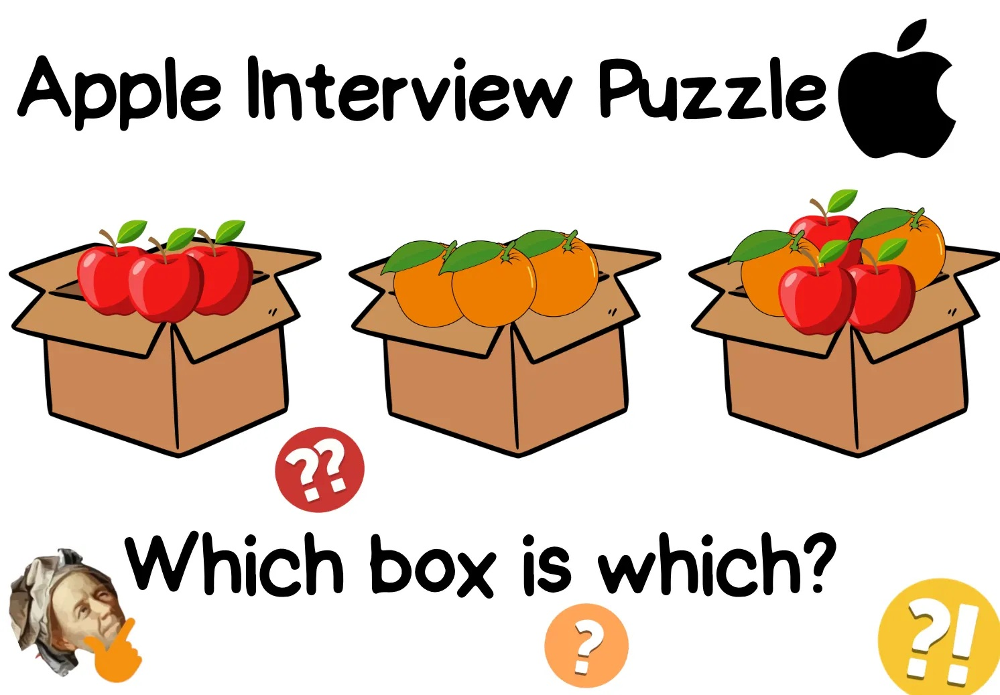

import { Link } from 'gatsby';

*出典: [Can You Solve This Math Puzzle From an Apple Interview?](https://medium.com/@RitvikNayak/can-you-solve-this-tricky-math-puzzle-from-an-apple-interview-e2d4a6963e3f)*

## 問題

3つの箱があります。1つにはリンゴだけ、1つにはオレンジだけ、もう1つにはリンゴとオレンジの両方が入っています。

それぞれの箱には「リンゴ」「オレンジ」「ミックス」というラベルが貼られていますが、**すべてのラベルが間違っています**。あなたは1つの箱から1つだけ果物を取り出すことができます（中を覗くことはできません）。そして、すべての箱に正しいラベルを貼らなければなりません。

さて、どうすればいいでしょうか？

下にスクロールする前に、少し考えてみてください。この状況で3つの箱すべてに正しいラベルを貼るには、どうすればよいでしょうか？

## 解答

答えは出ましたか？では、正解を見ていきましょう…

**「ミックス」とラベルされた箱から1つ果物を取り出します。** すべてのラベルが間違っているため、この箱は実際にはミックスではありません。つまり、リンゴだけかオレンジだけが入っているはずです。取り出した果物が、それを教えてくれます。

**リンゴを取り出した場合:**
「ミックス」の箱は実際にはリンゴです。次に「リンゴ」とラベルされた箱を考えます。この箱はラベルが間違っているのでリンゴではありません。また、ミックスでもありません（なぜなら、もしミックスなら「オレンジ」とラベルされた箱にオレンジが入っていることになり、それではラベルが正しくなってしまうからです）。

したがって、「リンゴ」とラベルされた箱にはオレンジが入っており、「オレンジ」とラベルされた箱にはミックスが入っています。

**オレンジを取り出した場合:**
「ミックス」の箱は実際にはオレンジです。「オレンジ」とラベルされた箱はオレンジではなく、また、今見つけたオレンジの箱でもありません。そしてミックスでもありません（なぜなら、もしミックスなら「リンゴ」の箱にリンゴが入っていることになり、すべてのラベルが間違っているという条件に反するからです）。

つまり、「オレンジ」とラベルされた箱にはリンゴが入っており、残りの「リンゴ」とラベルされた箱にはミックスが入っています。

## まとめ

常に「ミックス」とラベルされた箱から取り出すべきです。

- リンゴを取り出した場合：「ミックス」→リンゴ、「リンゴ」→オレンジ、「オレンジ」→ミックス
- オレンジを取り出した場合：「ミックス」→オレンジ、「オレンジ」→リンゴ、「リンゴ」→ミックス

あなたは解けましたか？コメント欄で教えてください :)

---