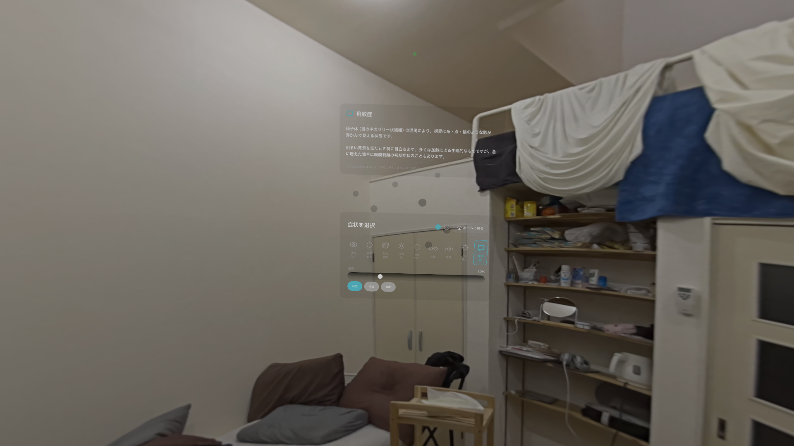
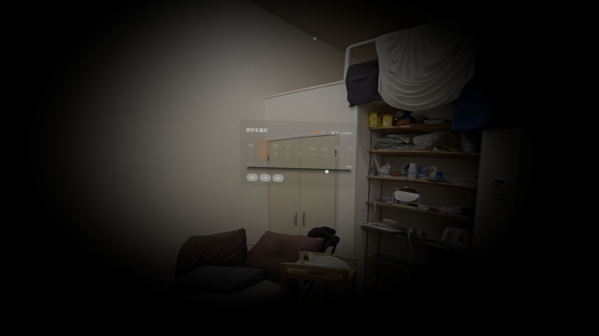
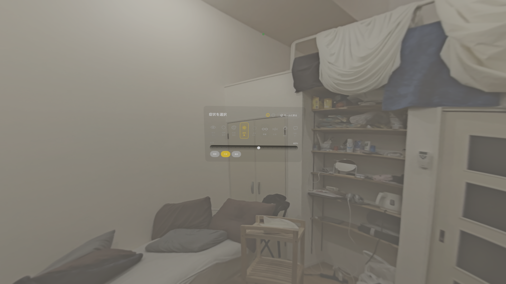

import { Link } from 'gatsby';

## はじめに

Apple Vision Pro 向けに **Through My Space** というアプリを作ってリリースしました。

視野狭窄・色覚異常・白内障・飛蚊症など8つの視覚症状を、**自分の空間写真**に適用して体験できる没入型シミュレーターです。

[Through My Space - App Store](https://apps.apple.com/jp/app/id6760091243)

> このアプリが提供する体験は近似的なシミュレーションです。医療診断・治療の代替として使用しないでください。

開発者の私は React Native (Expo) の経験はありますが、**Swift / visionOS / RealityKit はこのアプリが初めて**です。その分、ハマりポイントが多かったので、次の人のために全部書き残します。

---

## アプリの概要


「自分の部屋・職場・日常の空間を空間写真で撮影して、そこに視覚症状フィルターをかけて体験する」というコンセプトです。

他人が用意した素材ではなく「自分が毎日見ている空間」が変容することで、視覚障害への共感が生まれる、というのが狙いです。

### 対応している視覚症状（全8種）

| 症状 | 実装手法 |
|---|---|
| 視野狭窄（緑内障） | Core Image: CIVignetteEffect |
| 色覚異常（3タイプ） | Core Image: Brettel 1997 行列変換 |
| 白内障 | Core Image: CIGaussianBlur + Bloom + 黄変 |
| 網膜色素変性症 | Core Image: CIRadialGradient + CIBlendWithMask |
| 老眼 | Core Image: CIGaussianBlur + コントラスト調整 |
| 乱視 | Core Image: CIMotionBlur（30°）+ 輝度マスク |
| 中心暗点 | ARKit WorldTracking + RealityKit Entity オーバーレイ |
| 飛蚊症 | ARKit WorldTracking + RealityKit Entity オーバーレイ |

### 技術スタック

- **SwiftUI** — UI
- **RealityKit + ShaderGraph** — ドームメッシュ・左右テクスチャ切り替え
- **Core Image** — 視覚フィルター（6症状）
- **ARKit WorldTrackingProvider** — ヘッドトラッキング（2症状）
- **PhotosUI + PHAssetResourceManager** — 空間写真の完全 HEIC 取得

---

## 開発の流れ


### なぜ空間写真か

Vision Pro には「パススルー（現実映像のリアルタイム加工）」機能がありますが、これを使ったアプリを App Store で配布するには **Enterprise API** が必要で、一般向けには使えません。

空間写真は「撮影済みの画像データ」なので通常の API で自由に加工できます。

### アーキテクチャの全体像

```
空間写真（HEIC）
  ↓ PHAssetResourceManager で完全バイナリ取得
  ↓ CGImageSource で左目・右目の CGImage を分離
  ↓ Core Image でフィルター適用（症状ごと）
  ↓ TextureResource（左右別々）
  ↓ ShaderGraph StereoscopicMaterial（CameraIndexSwitch で左右を自動振り分け）
  ↓ ドームメッシュに投影
```

---

## 技術的なハマりどころ

### 1. 空間写真の取得：`PHPickerConfiguration` の選択肢が重要

#### 問題

`PHPickerConfiguration()` を使うと、NSItemProvider 経由で**単一フレームの通常 HEIC（約536KB）**しか取得できませんでした。空間写真なのに左目フレームしか取り出せない。

#### 原因と解決

`PHPickerConfiguration(photoLibrary: .shared())` を使うことで `result.assetIdentifier` が取得でき、`PHAssetResourceManager.requestData` で完全な HEIC バイナリが取得できます。

```swift
// ❌ これだと NSItemProvider 経由で単一フレームになる
var config = PHPickerConfiguration()

// ✅ これで assetIdentifier → PHAssetResourceManager が使える
var config = PHPickerConfiguration(photoLibrary: .shared())
```

取得フロー：

```swift
// result.assetIdentifier → PHAsset.fetchAssets → PHAssetResource
// → PHAssetResourceManager.requestData で完全 HEIC バイナリ
let options = PHAssetResourceRequestOptions()
options.isNetworkAccessAllowed = true

PHAssetResourceManager.default().requestData(
    for: resource,
    options: options
) { data in
    // 完全な HEIC バイナリ（空間写真は2～6MB程度）
}
```

---

### 2. 空間写真の左右フレーム抽出：`CGImageSource` の正しい使い方

これが一番ハマりました。

#### 問題

`CGImageSourceCopyPropertiesAtIndex`（インデックスごとのプロパティ）で `kCGImagePropertyGroups` を探しても常に `nil` が返ってくる。

#### 原因

`kCGImagePropertyGroups`（左右インデックス情報）は **インデックスごとのプロパティには存在しない**。ソース全体のプロパティ（`CGImageSourceCopyProperties`）にのみ格納されています。

#### Vision Pro の空間写真の内部構造

```
HEIC ファイル
├── compatible brands: MiHB  ← Apple 空間写真のマーカー
├── {Groups}
│   └── ster グループ
│       ├── GroupImageIndexLeft  = 0
│       └── GroupImageIndexRight = 1
├── index 0: 左目 2560x2560（25タイルの HEVC 合成）
└── index 1: 右目 2560x2560（25タイルの HEVC 合成）
```

#### 解決

```swift
// ❌ ここには kCGImagePropertyGroups が存在しない
let props = CGImageSourceCopyPropertiesAtIndex(imageSource, 0, nil)

// ✅ ソース全体のプロパティから取得する
guard let sourceProps = CGImageSourceCopyProperties(imageSource, nil) as? [CFString: Any],
      let groups = sourceProps[kCGImagePropertyGroups] as? [[CFString: Any]],
      let group = groups.first(where: {
          ($0[kCGImagePropertyGroupType] as? String)
              == (kCGImagePropertyGroupTypeStereoPair as String)
      }) else { /* フォールバック */ }

let leftIndex  = (group[kCGImagePropertyGroupImageIndexLeft]  as? Int) ?? 0
let rightIndex = (group[kCGImagePropertyGroupImageIndexRight] as? Int) ?? 1

let leftImage  = CGImageSourceCreateImageAtIndex(imageSource, leftIndex,  nil)
let rightImage = CGImageSourceCreateImageAtIndex(imageSource, rightIndex, nil)
```

---

### 3. ShaderGraph マテリアルのロード先

#### 問題

```swift
// ❌ .main バンドルからロードしようとするとエラー
let material = try await ShaderGraphMaterial(
    named: "/Root/StereoscopicMaterial",
    from: "Materials/StereoscopicMaterial",
    in: .main  // → invalidTypeFound エラー
)
```

#### 解決

`realityKitContentBundle` からロードする必要がありました。

```swift
// ✅ RealityKitContent の Bundle を使う
let material = try await ShaderGraphMaterial(
    named: "/Root/StereoscopicMaterial",
    from: "Materials/StereoscopicMaterial",
    in: realityKitContentBundle
)
```

---

### 4. ドームメッシュの UV V軸反転

ドームメッシュに空間写真を投影すると**上下逆**になりました。

```swift
// ❌ このままだと上下逆になる
uvs.append(SIMD2<Float>(ht, vt))

// ✅ V 軸を反転する
uvs.append(SIMD2<Float>(ht, 1.0 - vt))
```

---

### 5. 中心暗点・飛蚊症：Core Image ではリアルタイム追従できない

「視線を向けた場所に暗点が現れる」を実装しようとしたとき、最初は Core Image フィルターで実装しようとしました。

しかし**毎フレームのテクスチャ再生成**（`CGImage → TextureResource`）は処理が重く、60fps でのリアルタイム追従は不可能でした。

#### 解決：RealityKit Entity オーバーレイ方式

テクスチャを更新するのではなく、暗点そのものを **RealityKit の ModelEntity** として空間に配置し、ヘッドの向きに合わせて `position` を毎フレーム更新するアプローチに切り替えました。

```swift
// ARKit WorldTrackingProvider でヘッドの向きを 60fps で取得
while !Task.isCancelled {
    if let anchor = worldTracking.queryDeviceAnchor(atTimestamp: CACurrentMediaTime()) {
        let matrix = anchor.originFromAnchorTransform

        // ヘッドの前方ベクトル（-Z 軸）
        let rawForward = SIMD3<Float>(
            -matrix.columns.2.x,
            -matrix.columns.2.y,
            -matrix.columns.2.z
        )

        // スムージング（α=0.15）で視線の微振動を吸収
        smoothedForward = smoothedForward + (rawForward - smoothedForward) * 0.15
        let len = simd_length(smoothedForward)
        if len > 0.001 { smoothedForward = smoothedForward / len }

        let headPos = SIMD3<Float>(matrix.columns.3.x, matrix.columns.3.y, matrix.columns.3.z)

        // Entity をヘッド前方 1.5m に配置
        let pos = headPos + smoothedForward * 1.5
        scotomaEntity.position = pos
        scotomaEntity.look(at: headPos, from: pos, relativeTo: nil)
    }
    try? await Task.sleep(for: .milliseconds(16))
}
```

飛蚊症は `α=0.04`（より遅い追従）にすることで、硝子体の慣性による「追いかけても逃げる」感覚を再現しています。




---

### 6. CameraIndexSwitch による左右目テクスチャの自動切り替え

ShaderGraph の `ND_realitykit_geometry_switch_cameraindex_color3` ノードが、左目レンダリング時と右目レンダリング時で自動的に別のテクスチャを選択してくれます。

```
LeftTexture  → LeftImageSampler  → CameraIndexSwitch.left
RightTexture → RightImageSampler → CameraIndexSwitch.right
                                       ↓ 左目には left、右目には right を自動選択
                                    UnlitSurface
```

Swift 側からは以下でテクスチャを更新します：

```swift
try material.setParameter(
    name: "LeftTexture",
    value: .textureResource(leftTexture)
)
try material.setParameter(
    name: "RightTexture",
    value: .textureResource(rightTexture)
)
domeEntity.model?.materials = [material]
```

---

## Core Image フィルターの実装例





### 視野狭窄（緑内障）

```swift
let filter = CIFilter.vignetteEffect()
filter.inputImage = image
filter.center = CIVector(x: width / 2, y: height / 2)
filter.radius = shortSide * mix(1.0, 0.12, t: intensity)
filter.intensity = mix(0.0, 2.5, t: intensity)
filter.falloff = mix(0.5, 0.15, t: intensity)
```

### 白内障（Bloom 効果）

単純なぼかしではなく「光がにじむ」ハレーション効果を再現しています。

```swift
// Step 1: 霞み（彩度↓・コントラスト↓・輝度↑）
// Step 2: CIGaussianBlur でぼかす
// Step 3: 輝度マスクを使って明るい部分だけにぼかしを重ねる（Bloom）
// Step 4: わずかに黄みを加える（水晶体の黄変）

let luminanceMask = hazedImage.applyingFilter("CIColorControls", parameters: [
    kCIInputSaturationKey: 0.0,   // グレースケール化
    kCIInputContrastKey: 2.0,     // 明暗を二極化
    kCIInputBrightnessKey: -0.1
])

let bloomFilter = CIFilter(name: "CIBlendWithMask")!
bloomFilter.setValue(hazedImage,    forKey: kCIInputBackgroundImageKey)
bloomFilter.setValue(clampedBlur,   forKey: kCIInputImageKey)
bloomFilter.setValue(luminanceMask, forKey: kCIInputMaskImageKey)
```

### 色覚異常（Brettel 1997 行列変換）

医学論文に基づいた行列変換を Core Image の CIColorMatrix で実装しています。

```swift
// 第2型（緑が弱い）の例
let rVec = CIVector(x: 0.367, y: 0.861, z: -0.228, w: 0)
let gVec = CIVector(x: 0.280, y: 0.673, z:  0.047, w: 0)
let bVec = CIVector(x: -0.012, y: 0.043, z: 0.969, w: 0)
```

---

## React Native との対比（Swift 初学者向け）

React Native に慣れている方向けに、対応関係を整理します。

| React Native / Expo | Swift / visionOS |
|---|---|
| `Context` / `useState` | `@Observable` クラス（`AppModel.swift`） |
| `props` | `@Binding` / 関数引数 |
| コンポーネント | `View` プロトコルに準拠した `struct` |
| `useEffect` | `.onAppear` / `.task` modifier |
| `navigation.navigate` | `openImmersiveSpace` / `dismissImmersiveSpace` |
| Redux の Store | `@State private var` + `@Environment` |

---

## おわりに

React Native しか書いたことがない状態から visionOS アプリをリリースできました。

特に空間写真の取り扱い（`PHPickerConfiguration` の選択・`CGImageSourceCopyProperties` の使い方）は情報が少なく、かなり時間がかかりました。この記事が同じ問題にハマっている人の助けになれば幸いです。

ソースコードは GitHub で公開しています。

[https://github.com/kiyohken2000/ThroughMySpace](https://github.com/kiyohken2000/ThroughMySpace)

---