import { Link } from 'gatsby';

## はじめに

[爆サイ.com](https://bakusai.com) は日本最大級の地域密着型掲示板サイトです。月間PVは膨大ですが、ブラウザで見ると広告が多く、閲覧体験はお世辞にも快適とは言えません。

そこで、広告なし・ダークモード対応・ネイティブUIで快適に閲覧できる非公式ブラウザアプリ **「爆速（BakuSoku）」** を開発しました。5ch専ブラのような方向性で、爆サイをもっと快適に使えるアプリです。

「爆サイ」を「爆速」で見る。ダブルミーニングです。

**ランディングページ:** [https://bakusoku.pages.dev](https://bakusoku.pages.dev)

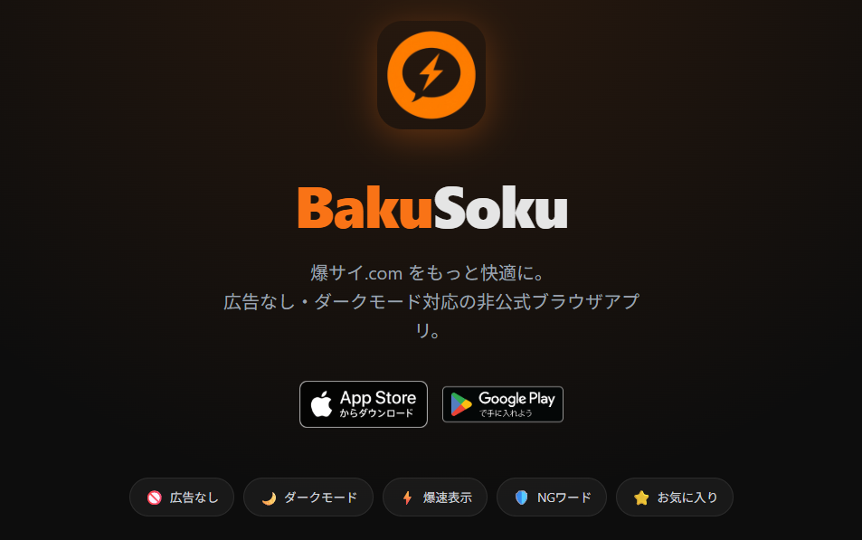

## 技術スタック

| 項目 | 技術 |
|------|------|
| フレームワーク | React Native (Expo) |
| ビルド | EAS Build |
| ナビゲーション | React Navigation (タブ + スタック) |
| 状態管理 | React Context (ThemeContext / SettingsContext) |
| データ永続化 | AsyncStorage |
| ランディングページ | Vite + React (Cloudflare Pages) |
| バックエンド | **なし** （bakusai.com に直接リクエスト） |
| 対応OS | iOS / Android |

### バックエンドなしのアーキテクチャ

```
Expo（モバイルアプリ）
    │
    │ 直接 HTTP リクエスト
    ▼
bakusai.com
```

自前のサーバーやプロキシは一切使っていません。アプリから bakusai.com に直接 HTTP リクエストを送り、レスポンスの HTML をパースしてネイティブ UI でレンダリングしています。以前開発した [スキキラ（好き嫌い.com ブラウザ）](https://github.com/kiyohken2000/sukikira) と同じ構成です。

bakusai.com は Cloudflare を使っておらず、WAF やボットスコアリングもないため、suki-kira.com と比べてスクレイピング環境は非常に素直です。

## 機能紹介

### 掲示板一覧

地域を選択して、その地域のカテゴリ・掲示板を一覧表示します。お気に入りの掲示板は上部にピン留め表示されます。

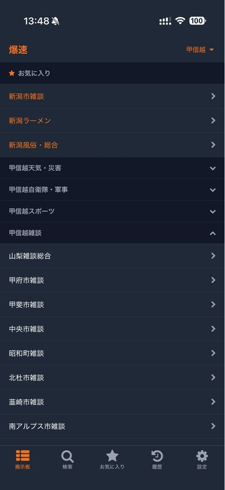

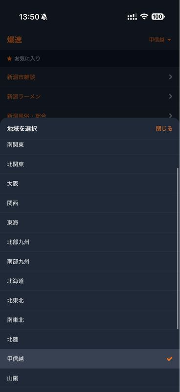

### スレッド一覧

各掲示板のスレッド一覧を表示します。スレタイ・経過時間・レス数を一目で確認でき、新着レスがある場合はバッジで通知します。長押しでコンテキストメニュー（お気に入り追加・削除・ブラウザで開く等）を表示できます。スレ内検索にも対応しています。

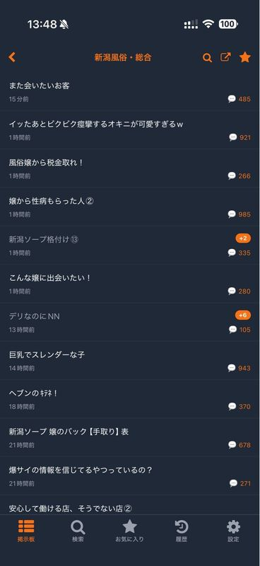

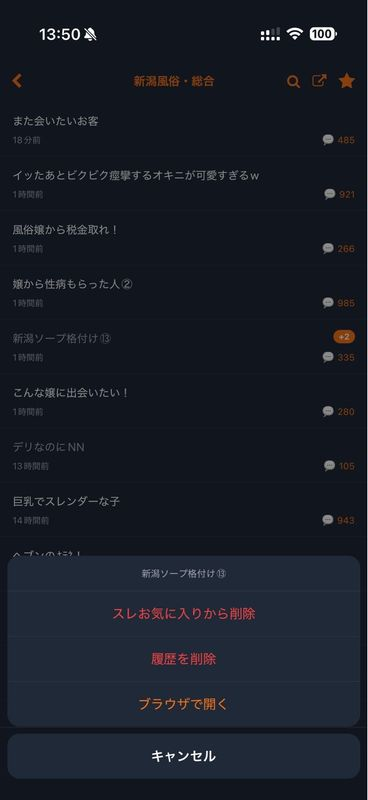

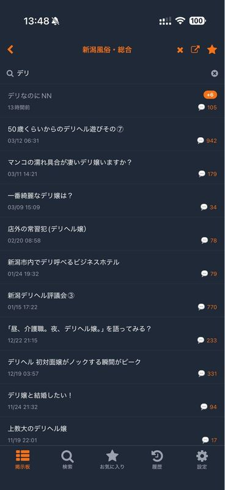

### スレッド閲覧

レスの閲覧はアプリの核となる画面です。主な機能:

- **2つの読み方向**: 「レス1から順に読む」モードと「最新レスから読む」モードを切り替え可能
- **アンカーポップアップ**: `>>NNN` をタップすると参照先のレスをポップアップ表示（ページ外のレスも自動フェッチ）
- **返信一覧**: 「N件の返信」をタップでそのレスへの返信をまとめて表示
- **スレタイポップアップ**: ヘッダーのスレタイをタップで全文表示、スレタイやURLのコピー
- **プルトゥリフレッシュ**: 上に引っ張って新着レスを追加読み込み
- **無限スクロール**: 下端到達で次のページを自動ロード
- **読み再開**: 前回読んだ位置を記憶して次回復元

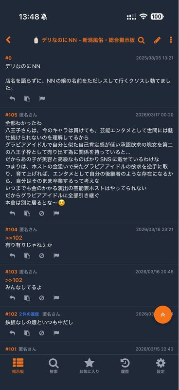

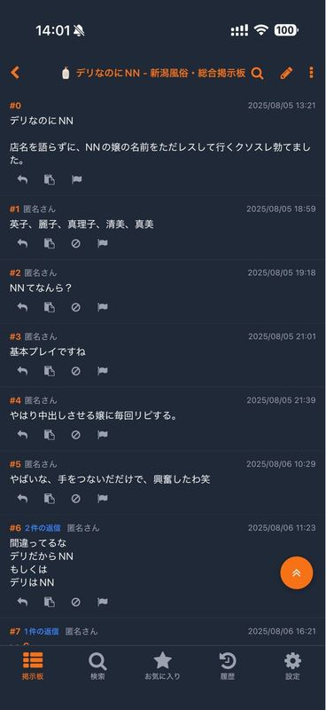

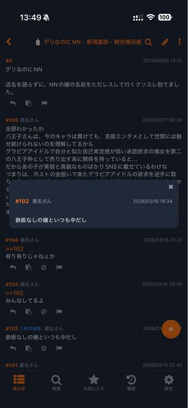

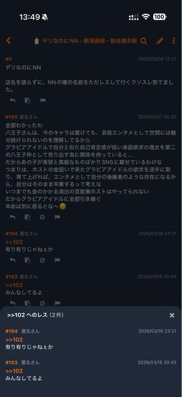

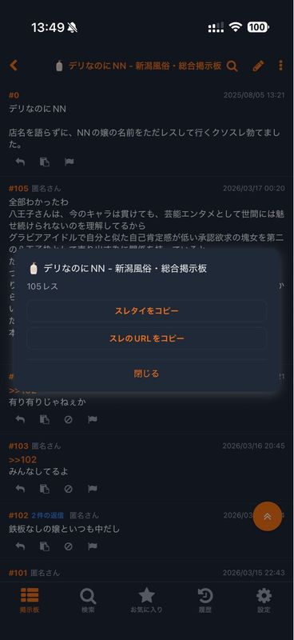

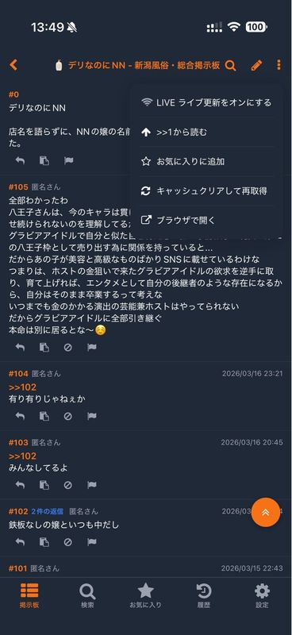

ヘッダーメニューからは以下の操作が可能です:

- LIVE ライブ更新をオンにする
- >>1から読む / 最新から読む の切り替え
- お気に入りに追加
- キャッシュクリアして再取得
- ブラウザで開く

### 投稿

スレッド詳細画面のペンアイコンをタップで投稿モーダルが開きます。名前（省略可）と本文を入力して投稿できます。レスへの返信は、レスの返信アイコンをタップすると `>>N` が自動挿入されます。

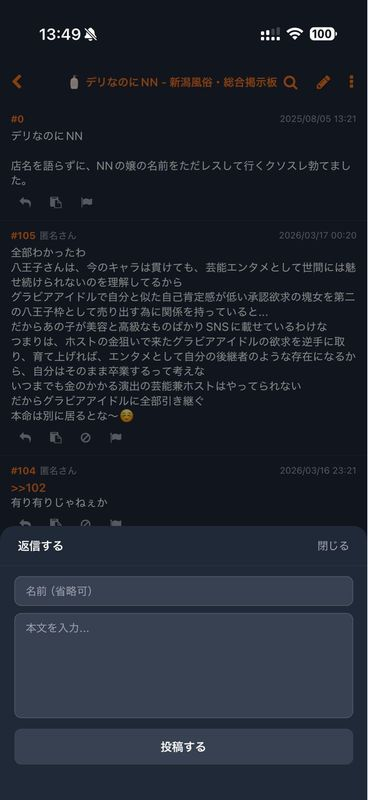

### 検索

地域を横断してスレッドを検索できます。検索結果には最終更新日時とレス数が表示されます。爆サイから取得した検索結果をローカルでさらにフィルタできます。

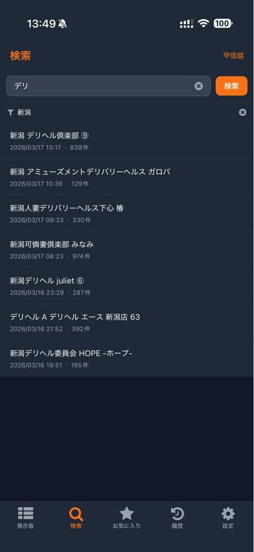

### お気に入り

掲示板とスレッドをそれぞれお気に入り登録できます。スレッドタブでは新着チェック機能があり、お気に入りスレに新しいレスがあるか一括確認できます。

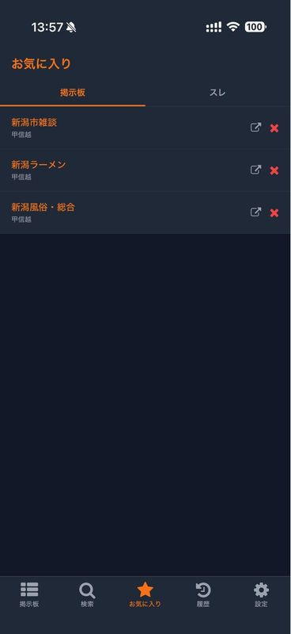


### 閲覧履歴

閲覧したスレッドの履歴を自動保存します。新着チェックで未読レスがあるか確認でき、長押しメニューからお気に入り追加やブラウザで開くこともできます。

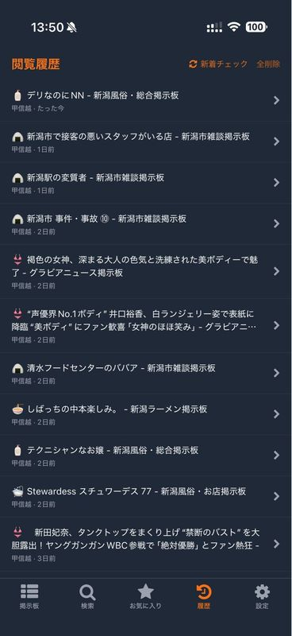

### 設定

ダークモード切り替え、読み方向の設定、地域選択、NGワード管理、メモ欄などを設定できます。

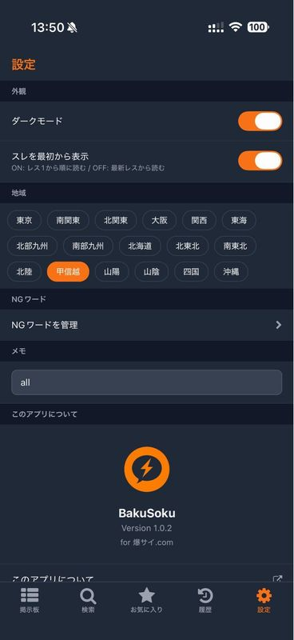

## 技術的なポイント

### HTML パーサーの実装

bakusai.com は完全にサーバーサイドレンダリング（SSR）で、APIは提供されていません。そのため、HTMLを正規表現でパースしてデータを抽出しています。

スレッド一覧、スレッド詳細、検索結果、カテゴリ一覧など、ページごとにHTML構造が異なるため、それぞれ専用のパーサーを実装しました。天気予報ボードや画像ボードなど、特殊なレイアウトのページにも対応しています。

### 既読管理と新着バッジ

各スレッドの既読レス数を AsyncStorage に保存し、スレッド一覧で新着レスがある場合にバッジ（`+N`）を表示します。お気に入りや閲覧履歴では、複数スレッドの新着を並列（5件ずつ）でチェックする機能も実装しました。

### ページネーションの工夫

bakusai.com のページネーションは少々厄介で、「最新レスから表示」と「レス1から表示（rw=1）」で挙動が異なります。rw=1 モードでは空ページが連続する場合があるため、最大3ページを自動スキップするロジックを入れています。

また、一部のページではページネーションリンクが HTML に含まれない場合があるため、同一スレッドの rw=1 リンクから次ページを推測するフォールバックも実装しました。

### スキキラとの比較

以前開発した [スキキラ](https://github.com/kiyohken2000/sukikira)（好き嫌い.com 非公式ブラウザ）と同じアーキテクチャですが、bakusai.com は Cloudflare を使っていないため、開発はずっとスムーズでした。

| | suki-kira.com | bakusai.com |
|---|---|---|
| CDN/WAF | Cloudflare（積極的ボット判定） | なし（nginx 直） |
| CAPTCHA | Turnstile | なし |
| UA ローテーション | 必須 | 不要 |
| リアルタイム更新 | なし | MQTT WebSocket（実装予定） |

## 開発後記

以前開発した [スキキラ](https://github.com/kiyohken2000/sukikira) は好き嫌い.com のブラウザアプリでしたが、Cloudflare の WAF に苦しめられ続けた開発でした。UA ローテーション、空ボディ問題への対処、Turnstile CAPTCHA の回避など、「サイトを見る」以前の戦いが大半を占めていました。

一方、爆サイ.com は Cloudflare を使っておらず、nginx から直接レスポンスが返ってきます。CAPTCHA もレートリミットもなく、既存の爆サイ専ブラ（爆リーII・ThreadMaster 等）が問題なく動作している実績もあります。おかげで「ボット対策との戦い」から解放され、UI/UX の作り込みに集中できました。

技術的に一番手間がかかったのは HTML パーサーです。bakusai.com は API を公開しておらず、全ページが SSR の HTML です。しかもページの種類（通常スレ・天気予報ボード・画像ボード等）によって HTML 構造が微妙に異なり、パーサーをひとつずつ書いていく地道な作業が続きました。Python スクリプトで HTML 構造を調査し、正規表現でパースするという泥臭い工程でしたが、API がない以上これが最も確実な方法です。

ページネーションにも苦労しました。「最新レスから表示」と「レス1から表示（rw=1）」でページ送りの仕組みが異なり、rw=1 モードでは空ページが連続したり、ページネーションリンク自体が HTML に含まれないケースもありました。フォールバックロジックを何段も重ねて、ようやく安定して動くようになっています。

アーキテクチャ的にはスキキラの流用が大きく、React Navigation のタブ＋スタック構成、ThemeContext / SettingsContext によるダークモードと設定管理、AsyncStorage による既読管理とお気に入りなど、骨格部分はそのまま活かせました。同じ「非公式ブラウザアプリ」というジャンルなので、一度型を作ればスムーズに横展開できるのは良い発見でした。

## 備考

初期状態では一部のカテゴリが表示されません。全カテゴリ表示するには以下の操作を行ってください。

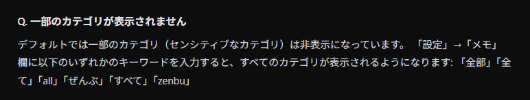

## リンク

- **ランディングページ:** [https://bakusoku.pages.dev](https://bakusoku.pages.dev)
- **GitHub:** [https://github.com/kiyohken2000/BakuSoku](https://github.com/kiyohken2000/BakuSoku)

---