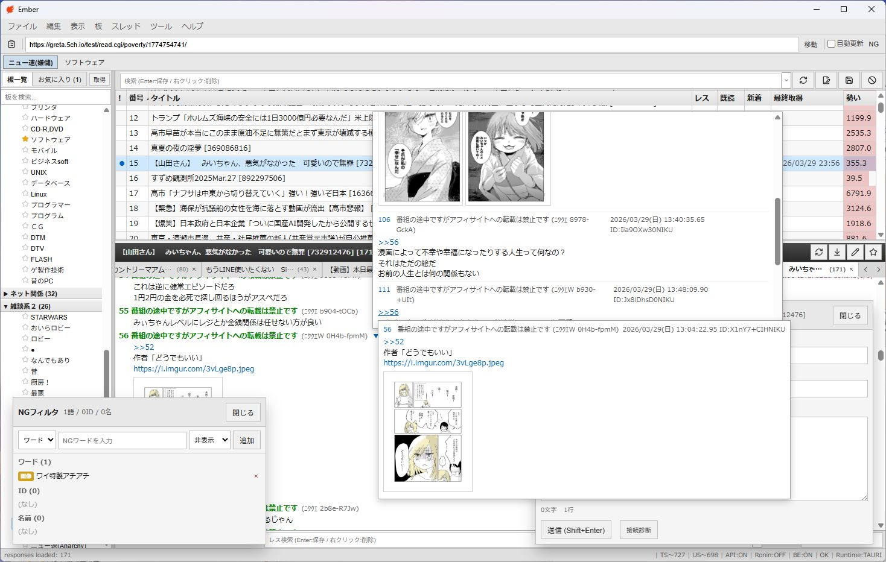
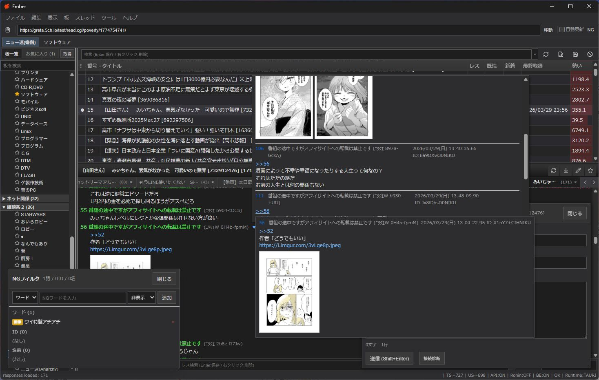
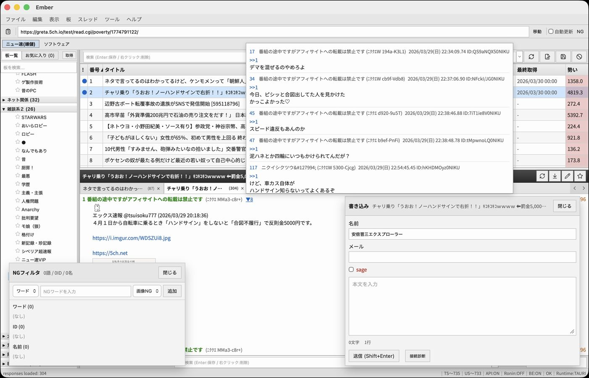
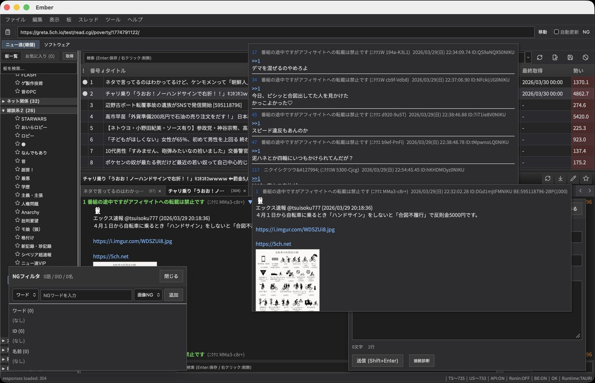

import { Link } from 'gatsby';

## はじめに

2026年3月、5chが `5ch.net` から `5ch.io` へドメインを変更しました。

[「5ちゃんねる」のドメイン「5ch.net」永久停止へ　動物虐待コンテンツ放置で](https://www.itmedia.co.jp/news/articles/2603/06/news112.html)

この変更により、多くの専用ブラウザが動作不能に陥りました。私もその影響を受けた一人です。

## 私の専ブラ遍歴

2003年からギコナビで5chにアクセスしていました。その後、2015年のAPI導入のタイミングでギコナビが使えなくなり、Live5chに乗り換えました。

2023年にはJaneStyleが5chから離反し、「Talk」へのリダイレクトを開始するという騒動もありました。

Live5chは公式のメンテナンスが止まった後も、有志によるバイナリ改造を適用してしのいでいました。しかし、2026年の5ch.ioへのドメイン変更で完全に使えなくなりました。

Sikiの存在はもちろん知っていて、非常時に使ってはいましたが、旧来の専ブラとあまりにUIが違うのでどうしても馴染めず、5ちゃんを見る頻度はかなり低くなっていました。Live5chが完全に使えなくなった後は一時的にOpenSSL版ギコナビを使っていましたが、Live5chからの出戻りだと**画像のインラインプレビュー**や**アンカー/ID/被アンカーでのレスポップアップ**がないのがつらい。

「じゃあ自分で作ろう」ということで、**Ember** という5ch.io専用ブラウザを作りました。

## Ember とは

Ember は Tauri v2 + React + Rust で構築した5ch.io専用ブラウザです。Windows / macOS に対応しています。

名前の「Ember」は英語で「残り火」の意味です。完全に斜陽になった5ちゃん（2ちゃん）の残り火——それでもまだ燃えているものを見るためのブラウザ、という気持ちで名付けました。

Live5chに慣れたユーザーが違和感なく使えることを最も重視して設計しました。

### Windows版（ライトモード）



### Windows版（ダークモード）



### macOS版（ライトモード）



### macOS版（ダークモード）



## 主な機能

### レイアウト

- **3ペイン構成**: 左に板ツリー、右にスレ一覧とレス表示（上下分割）
- **ドラッグリサイズ**: ペイン境界をドラッグして幅・高さを自由に調整
- **タブ式スレ閲覧**: 複数スレッドを同時に開いてタブで切り替え。タブのドラッグ並べ替え対応

### スレ一覧

- ソート（スレ番号 / タイトル / レス数 / 勢い / 既読状態）、昇順・降順切替
- スレタイ検索（検索ワード履歴つき）
- 未読管理 — スレごとに最終既読レス番号を記憶
- 勢いバーによるスレッド活性度の視覚化

### レスビューア

- **アンカーポップアップ**: `>>1` にマウスオーバーで参照先をポップアップ表示。入れ子対応
- **被参照表示**: あるレスを参照しているレスの一覧をポップアップ
- **ID色分け**: 投稿者IDごとに固有の色を割り当て
- **レス本文検索**: 本文内テキスト検索（ハイライト表示、検索ワード履歴つき）
- **新着マーカー**: 「ここから新着」セパレータ表示

### 画像

- **インラインサムネイル**: レス本文中の画像URLを自動検出してサムネイル表示
- **ライトボックス**: クリックで全画面表示
- **Ctrl+ホバープレビュー**: Ctrlを押しながらマウスオーバーで等倍プレビュー。マウスホイールでズーム

### 書き込み

- 送信ショートカットキー選択（Shift+Enter / Ctrl+Enter）
- 名前・メール・sage設定の永続化

### NGフィルタ

- ワード / ID / 名前 / スレタイの4種類
- 正規表現対応
- 画像のみ非表示モード

### お気に入り

- 板・スレのお気に入り登録
- ドラッグ&ドロップで並べ替え
- 板ボタンバー（お気に入り板をツールバーに表示してワンクリックアクセス）

### 認証

- BE / UPLIFT / どんぐりログイン対応
- ステータスバーからワンクリックでログイン切替

### その他

- **ダークモード**: タイトルバー連動、全コンポーネント対応
- **フォントサイズ調整**: ペインごとに個別設定
- **キーボードショートカット**: 20種以上（Ctrl+W, Ctrl+Tab, Ctrl+Shift+R 等）
- **5ch.net → 5ch.io 自動変換**: 旧ドメインURLを入力しても自動で新ドメインへ
- **単一インスタンス制御**: 多重起動を防止

## 技術スタック

| レイヤー | 技術 |
|---------|------|
| デスクトップフレームワーク | Tauri v2 |
| フロントエンド | React 18 + TypeScript |
| バックエンド | Rust |
| HTTP | reqwest (rustls-tls) |
| データベース | SQLite（スレキャッシュ） |
| ビルドツール | Vite 6 |
| テスト | Playwright |
| 配布 | GitHub Releases + Cloudflare Pages |

### なぜ Tauri か

Electronと比較して:

- **バイナリサイズが小さい**: Windows版で約5.6MB（ZIP）。Electronだと100MB超になりがち
- **メモリ使用量が少ない**: WebView2（Windows）/ WebKit（macOS）を利用するため、Chromiumをバンドルしない
- **Rustでバックエンドを書ける**: 5chの通信はShift_JISのデコード、Cookie管理、投稿フローなど複雑な処理が多い。Rustで書くことで安全かつ高速に処理できる

### アーキテクチャ

```
Tauri App (Ember)
├── core-auth   … BE / UPLIFT / どんぐり認証
├── core-fetch  … HTTP取得・投稿フロー → core-parse
├── core-parse  … dat / subject.txt / bbsmenu パーサ
└── core-store  … JSON永続化 / SQLiteキャッシュ
```

フロントエンドは `App.tsx` 単一ファイルのモノリス構成です。Reduxや外部UIライブラリは使わず、`useState` / `useEffect` だけで完結しています。

外部ランタイム依存は **react, react-dom, @tauri-apps/api, lucide-react** の4つだけです。

## 開発の経緯

初回リリース（v0.0.1）は2026年3月20日。5ch.ioのドメイン変更直後です。そこから機能を追加してきました。

開発はほぼ全てClaude Codeとのペアプログラミングで進めました。要件を日本語で伝えると、Claude Codeがコードを書き、テストし、リリースまでの一連の作業を実行します。実質的にAIとの共同開発です。

## ダウンロード

- **公式サイト**: https://ember-5ch.pages.dev
- **GitHub**: https://github.com/kiyohken2000/5ch-browser-template

ZIP形式で配布しています。インストーラーなし、展開して実行するだけです。

## おわりに

「使い慣れた専ブラがなくなったなら自分で作ればいい」という単純な動機で始めたプロジェクトですが、Tauri + Rust + React の組み合わせにより、軽量で高速な専用ブラウザを実現できました。

普段は自作デスクトップPC（Windows）で5ちゃんを見ていますが、出先ではMacBook Airを使っています。これまではWindows専用のLive5chに依存していたので、出先ではSikiのMac版を使っていましたが、どうしても馴染めず5ちゃんを見る頻度はかなり低くなっていました。Tauriのクロスプラットフォーム対応のおかげで、WindowsでもmacOSでも同じアプリ・同じUIで5ちゃんを見られるようになったのは、結果的に大きな収穫でした。

同じように5ch.ioドメイン変更で専ブラ難民になった方、あるいはLive5chのUIが好きだった方に使っていただければ幸いです。

---