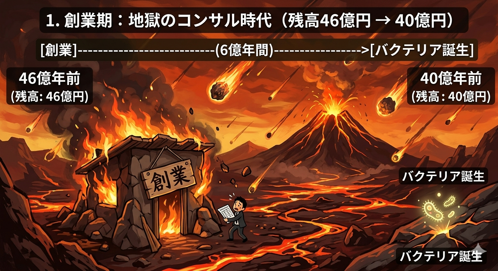
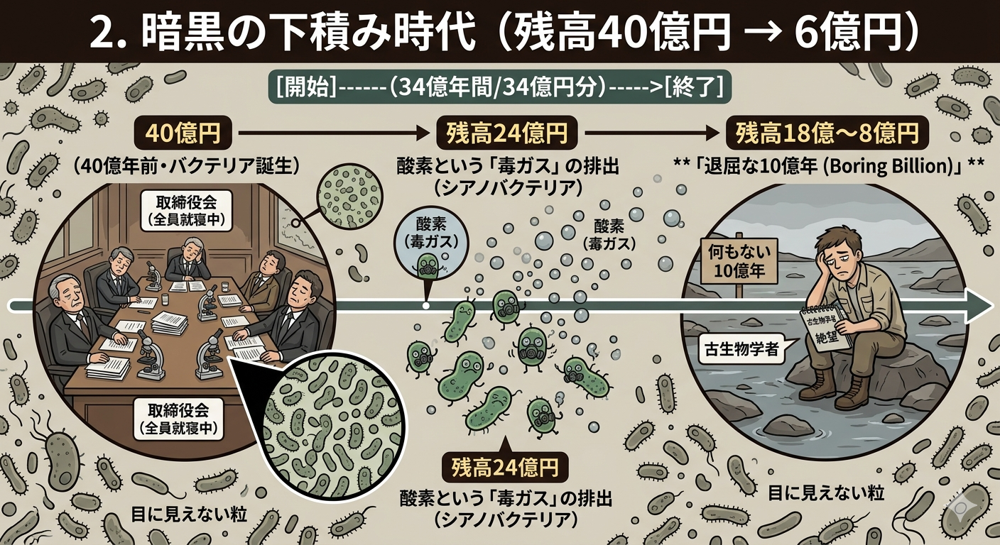
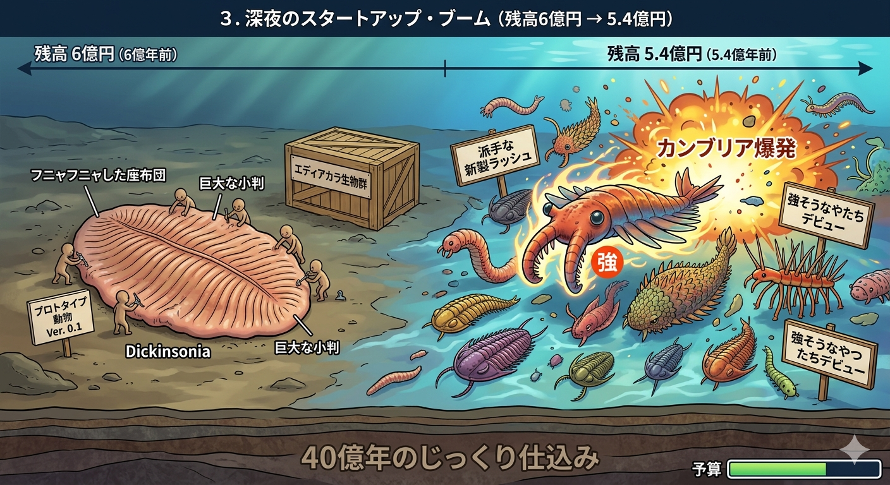
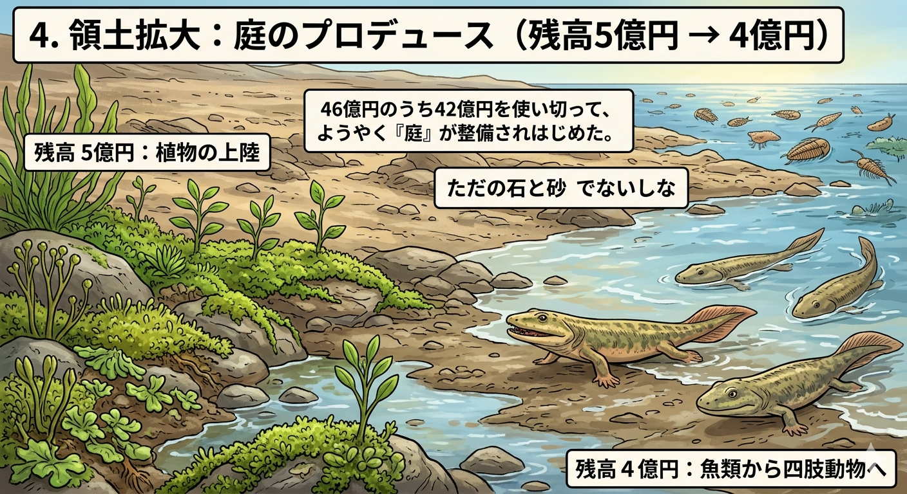
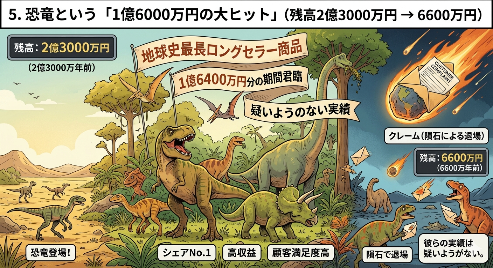
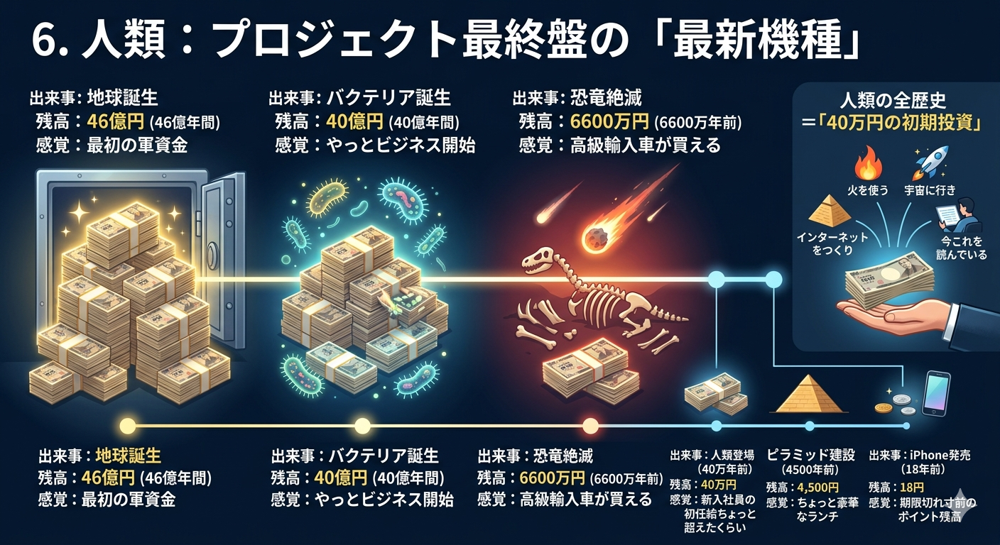

import { Link } from 'gatsby';

「昔のこと」という言葉は、あらゆる時間感覚を溶かしてしまう。ピラミッドも、恐竜も、最初のバクテリアも、全部まとめて「過去」という名の不燃ゴミ袋に押し込んで、なんとなくわかった気になれる、便利すぎる言葉だ。

だから今日は、**「46億円」という数字を使って、その感覚をぶっ壊してみたい。**

地球の歴史を**「46億円の軍資金」**と仮定する。1年＝1円。あなたは今、このプロジェクトのCEOだ。そして今この瞬間、口座の残高は「ほぼゼロ」に近づいている。

---

### 1. 創業期：地獄のコンサル時代（残高46億円 → 40億円）

46億円。壮大な出発だ。

しかし最初の6億円分（6億年間）は、使い道がない。空からは隕石が降り注ぎ、海は酸性で、地表はマグマがドロドロと流れている。「商品開発」どころか、社屋が毎日燃えている状態だ。

ところが残高が**40億円**を切ったあたりで、奇跡が起きる。最初の生命──バクテリア──が誕生する。

「思ったより早いスタートじゃないか」と思うだろう。しかしここからが、このプロジェクト最大の罠だ。

---

### 2. 暗黒の下積み時代（残高40億円 → 6億円）

バクテリアが誕生してから、なんと**34億円分（34億年間）**、地球はひたすら「目に見えない粒」を量産し続ける。

46億円という国家予算規模の軍資金を持ちながら、やっていることは「顕微鏡でしか見えないものを増やすだけ」。取締役会があったなら、全員が眠り込んでいただろう。

- **残高24億円：** 酸素という「毒ガス」を吐き出す変なやつ（シアノバクテリア）が現れる。後の地球環境を根本から書き換える大事件だが、見た目は相変わらず地味。
- **残高18億〜8億円：** 古生物学者が**「退屈な10億年（Boring Billion）」**と公式に命名するほど、何も起きない。学者が「退屈」と言うときの絶望感を、少し想像してみてほしい。

---

### 3. 深夜のスタートアップ・ブーム（残高6億円 → 5.4億円）

残高が1割強、**6億円**を切ったところで、ついに事態が動く。

**エディアカラ生物群**の登場だ。「ディッキンソニア」という、座布団とも巨大なフニャフニャした小判とも形容しがたい生き物が現れる。これが「動物」という新ジャンルのプロトタイプ。明らかに商品として粗削りだが、方向性は見えてきた。

そして**残高5億4000万円（5億4000万年前）**、ついに**カンブリア爆発**が炸裂する。アノマロカリスのような、見るからに「強そうなやつ」たちが一斉デビュー。46億円のうち40億円をじっくり"仕込み"に費やして、ようやく派手な新製品ラッシュが始まったのだ。

---

### 4. 領土拡大：庭のプロデュース（残高5億円 → 4億円）

カンブリアの興奮が落ち着いてきた頃、プロジェクトはフィールドを広げる。

それまで地球の陸地は、生命にとって「ただの石と砂」でしかなかった。

- **残高5億円：** 植物が陸に這い上がる。
- **残高4億円：** 魚に近いやつらが「陸、行けるんじゃね？」と四肢を使いはじめる。

46億円のうち42億円を使い切って、ようやく「庭」が整備されはじめた計算になる。新居を建てて、庭に手をつけるまで42年かかった、と思えばいい。

---

### 5. 恐竜という「1億6000万円の大ヒット」（残高2億3000万円 → 6600万円）

ここからが、みんな大好き恐竜のターンだ。

彼らは**残高2億3000万円（2億3000万年前）**に登場し、**残高6600万円（6600万年前）**に隕石で退場するまで、実に**1億6400万円分**もの期間、地球の頂点に君臨し続けた。

地球史における最長ロングセラー商品だ。クレームはあった（隕石という形で）が、それまでの実績は疑いようがない。

---

### 6. 人類：プロジェクト最終盤の「最新機種」

さて、いよいよ私たちの出番だ。

ここまでの残高推移を表にしてみると、人類という存在がいかに「ついさっきの話」かがよくわかる。

| 出来事 | 残高 | 感覚 |
|---|---|---|
| 地球誕生 | **46億円** | 最初の軍資金 |
| バクテリア誕生 | **40億円** | やっとビジネス開始 |
| 恐竜絶滅 | **6600万円** | 高級輸入車が買える |
| 人類登場（40万年前） | **40万円** | 新入社員の初任給ちょっと超えたくらい |
| ピラミッド建設（4500年前） | **4,500円** | ちょっと豪華なランチ |
| iPhone発売（18年前） | **18円** | 期限切れ寸前のポイント残高 |

46億円を注ぎ込んできたこのプロジェクトにおいて、人類の全歴史は**「40万円の初期投資」**に過ぎない。恐竜が1億6000万円分を謳歌した地球で、私たちはまだ40万円しか使っていない。そしてその40万円の中で、火を使い、宇宙に行き、インターネットをつくり、今これを読んでいる。

---

## 結論：私たちは「期間限定ポイント」の中でやりたい放題やっている

私たちが「歴史」と呼んで必死に勉強しているものは、46億円の壮大な決済の末に残った、期限切れ寸前のポイント残高のような時間の出来事だ。

でも、その残高の密度はすごい。

火の発見、文字の発明、産業革命、インターネット、AI。これだけのことが全部、46億円のうちの**4,500円のあいだ**に起きている。恐竜が1億6000万円かけてやったことより、よほど情報量が多い。

「昔」という言葉で世界を一括りにしそうになったら、一度この残高表を思い出してほしい。

私たちが生きているのは、46億円の壮大な決済の末に残った、有効期限不明の**「期間限定ポイントの時間」**だ。使わないと消える。そして今日あなたが生きた1日は、その残高から引き落とされた、たった**1円**だった。

---