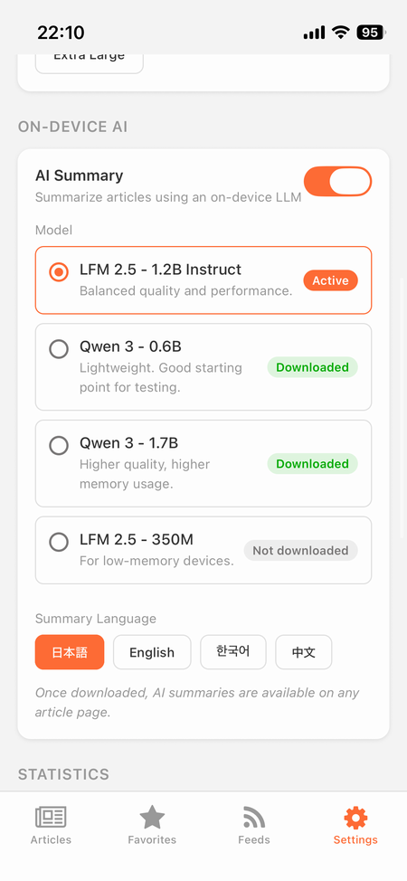
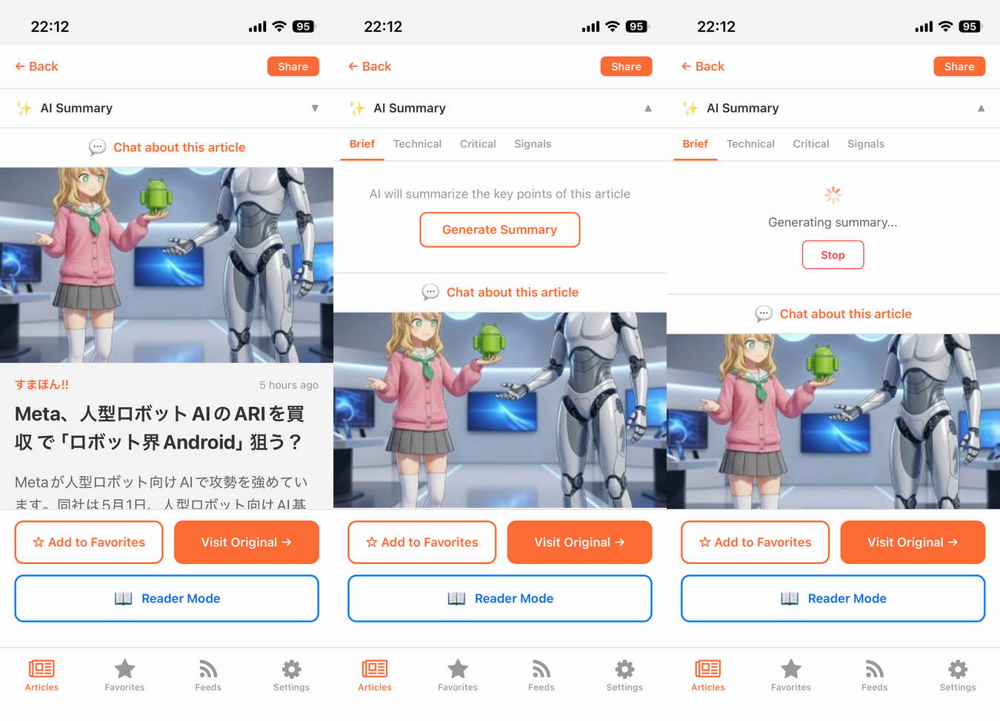
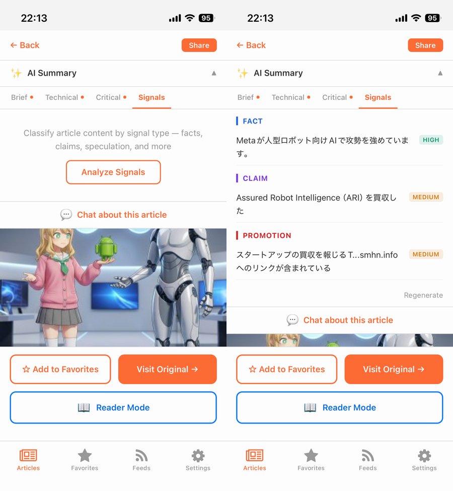
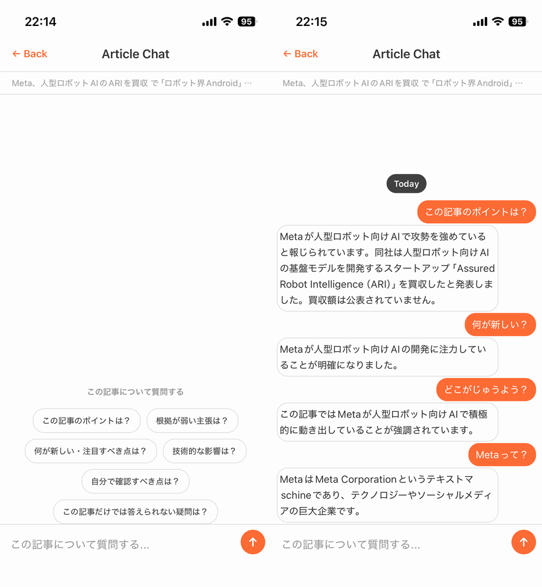

import { Link } from 'gatsby';

## TL;DR

- 以前作った[セルフホスト型RSSリーダー「FeedOwn」](https://qiita.com/votepurchase/items/047ae4d6922b9f3c150c)に、**完全オンデバイスのAI機能**を追加した
- ライブラリは [`react-native-executorch`](https://github.com/software-mansion/react-native-executorch)（Meta ExecuTorch の React Native バインディング）
- 機能は4つ：**3視点要約 / シグナル分離 / 記事チャット / 翻訳**
- LLM は LFM 2.5 (1.2B / 350M) と Qwen 3 (0.6B / 1.7B) から選択可
- 記事本文は端末外に一切出ない。OpenAI API も Anthropic API も使っていない
- iOS 17+ / Android 13+ 必須（New Architecture + ExecuTorch ランタイム要件）
- リポジトリ：https://github.com/kiyohken2000/feedown



---

## なぜクラウドAIではなくオンデバイスにしたか

FeedOwn にAI機能を足すこと自体は前から考えていた。素直にやるなら OpenAI API か Anthropic API を呼ぶだけで終わる。週末で作れる。

でもそれをやらなかった。

FeedOwn の出発点は **「読書履歴は誰のものでもなく自分のもの」** という前提だった。それなのに記事本文をホスト型LLM APIに送るのは、自分でやっていることと矛盾する。Pocket が死んだのを見て自前のRSSリーダーを作った人間が、AI部分だけ他人のサーバーに依存するのは、構造的におかしい。

加えて、FeedOwn は月額0円で動かしている。トークン課金 API を生やすとそれが崩れる。

そういうわけで、モデルを端末側に置く方向に振った。

---

## 技術スタック

| レイヤー | 技術 |
|---------|------|
| 推論ランタイム | Meta ExecuTorch |
| RN バインディング | `react-native-executorch@0.8.4` |
| モデル取得 | `react-native-executorch-expo-resource-fetcher@0.8.0` |
| LLM 候補 | LFM 2.5 (350M / 1.2B), Qwen 3 (0.6B / 1.7B) — すべて量子化済み |
| キャッシュ | AsyncStorage（記事 × contentHash × model × perspective × language キー） |
| チャットUI | `react-native-gifted-chat@2.8.1` + Stack ナビゲーション |
| 触感FB | `expo-haptics`（成功/失敗時） |

ExecuTorch は iOS Simulator / Android Emulator では動作しない。**Phase 0 として「実機でモデルが load できるか」だけを先に検証する**フェーズを切ったのが、結果的に正解だった。

---

## 機能1：3視点要約

普通の「要約」ボタンは1種類しか出さないが、同じ記事を**3つの視点で要約**できるようにした。

| 視点 | 何を抽出するか |
|------|---------------|
| `brief` | 中立的な3〜5項目の要点 |
| `technical` | 技術スタック・実装詳細・トレードオフ・依存関係 |
| `critical` | 根拠の弱い主張・欠けている文脈・誇張・未検証の主張 |

ニュースを流し読みしたいときは `brief`、リリース告知を読むなら `technical`、マーケ寄りのテック記事を読むなら `critical` で「どこを疑うべきか」を出させる、という使い分けを想定している。



出力は箇条書き。日本語記事も英語記事も同じフローで動く：


### プロンプト設計

JSON のみを返すよう、システムプロンプトで明示的に縛る：

```js
const BASE_SYSTEM = `You are an RSS article summarization assistant.
Follow these rules strictly:
- Base your answer only on the provided article
- Distinguish speculation from facts
- Write "unknown" when information is unclear
- Return JSON only — no Markdown code blocks, no extra text`

export function buildBriefSummaryMessages(articleCtx, outputLanguage = 'ja') {
  const langName = getLanguageName(outputLanguage)
  const userContent = `Summarize the following article in 3–5 bullet points in ${langName}.

${buildArticleBlock(articleCtx)}

Output format (JSON only, no code block):
{"summary":["point 1","point 2","point 3"],"caveats":["note 1"]}`

  return [
    { role: 'system', content: `${BASE_SYSTEM}\n- Output language: ${langName}` },
    { role: 'user', content: userContent },
  ]
}
```

ポイント：

- 「JSON以外を返すな」と明示しても、小型モデルは Markdown コードフェンスや前置き文を返してくることがある。**パーサ側で吸収する前提でプロンプトを書く**
- 出力言語は `Output language:` でシステムメッセージに入れる。プロンプト本文を全部翻訳するより安定する
- 「不明なら unknown と書け」も明示。これがないと小型モデルが推測で埋めてくる

---

## 機能2：シグナル分離

これが個人的に一番気に入っている機能。要約ではなく、**記事の各記述を「種別」で分類**する。

| シグナル種別 | 対応する記述 |
|--------|------|
| `fact` | 確定した日付・数値・リリース・仕様・検証された出来事 |
| `claim` | 著者・企業の解釈・意見・主張 |
| `speculation` | 予測・不確実な見通し・「〜と思われる」 |
| `quote` | 特定の人・ソースに帰属する直接引用 |
| `promotion` | 製品売り込み・登録誘導・スポンサー文言 |
| `unclear` | 根拠が弱い・出典がない・意味が曖昧 |

各項目に `confidence`（high / medium / low）が付く。記事に存在しない種別はスキップ。短すぎて分類できない場合は `insufficient: true` で空配列を返す設計にした。



ファクトチェックをする機能ではない（小型モデルにそんな能力はない）。**「ニュース記事に見えるものが実は claim と promotion で7割埋まっている」とか、「技術発表に見えるものが実は speculation だらけ」みたいなことを一目で見えるようにする**機能だ。

### プロンプトの抜粋

```js
export function buildSignalsMessages(articleCtx, outputLanguage = 'ja') {
  const userContent = `Analyze the following article and classify its content by signal type in ${langName}.

Signal types to detect:
- "fact": confirmed dates, numbers, releases, specifications, verified events
- "claim": author's or company's interpretations, opinions, or assertions
- "speculation": predictions, uncertain conclusions, unconfirmed outlooks
- "quote": direct quotes or statements attributed to a specific person or source
- "promotion": product pitches, sign-up prompts, calls-to-action, sponsor language
- "unclear": statements with weak evidence, missing sources, or ambiguous meaning

Rules:
- Extract up to 3 items per signal type that is present in the article
- Omit signal types that are not present
- Keep each item concise (1–2 sentences)
- Assign confidence: "high", "medium", "low"
- If the article is too short to classify, set "insufficient": true and return an empty signals array

${buildArticleBlock(articleCtx)}

Output format (JSON only, no code block):
{"signals":[{"type":"fact","text":"...","confidence":"high"}],"insufficient":false}`
  // ...
}
```

「種別ごとに最大3件」「無い種別は出すな」「短すぎたら insufficient」の3つを明示しないと、小型モデルは全種別を埋めようとして無理やり捏造してくる。

---

## 機能3：記事チャット

開いている記事1つにスコープしたチャット画面。システムプロンプトは固定：

```
You are an article reading assistant. Answer questions strictly based on the article provided below.

Rules:
- Answer only using information from this article
- If the article does not contain enough information to answer, say so clearly
- Distinguish between what the article states as fact vs opinion or speculation
- Keep answers concise and focused
- Do not make up or infer information not present in the article
```



### 実装上のポイント

- UI は `react-native-gifted-chat@2.8.1`
- **画面遷移は Modal ではなく Stack を使う**。Modal だとキーボード周りの挙動が崩れる（これでハマった）
- 記事コンテキストは初回のシステムメッセージに1度だけ注入。以降は会話履歴を append するだけ
- 会話履歴はコンポーネント state のみ。画面を抜けると消える（履歴同期もアナリティクスも一切なし）
- メッセージ送信時に `Haptics.impactAsync` で触感フィードバック

ChatGPT を再現する目的ではない。1.2B のモデルで小説は書けない。が、「**さっきの記事、Xについてはどう書いてあった？**」みたいな確認用途には十分使える。

---

## 機能4：翻訳

記事のソース言語と設定の出力言語が異なる場合のみ、Reader Mode のヘッダに「Translate」ボタンが出る。段落単位で JSON 配列に翻訳させる。


### プロンプトとパーサ

```js
export function buildTranslationMessages(paragraphs, targetLanguage) {
  const langName = getLanguageName(targetLanguage)
  const systemContent = `You are a translation assistant. Translate text to ${langName}.
Rules:
- Translate each paragraph faithfully, preserving meaning and tone
- Return JSON only — no Markdown code blocks, no extra text`
  const userContent = `Translate each paragraph to ${langName}. Return a JSON array with the same number of elements in the same order.

Input:
${JSON.stringify(paragraphs)}

Output format (JSON array only, no code block):
["translated paragraph 1","translated paragraph 2",...]`
  return [
    { role: 'system', content: systemContent },
    { role: 'user', content: userContent },
  ]
}
```

### コンテキスト窓制限ではまった話

最初は段落配列をそのまま渡していたら、長い記事で `Error: Failed to generate text` が出続けた。原因は**コンテキスト窓を超えていたのにエラーがそれっぽくない**こと。

修正：合計 2,500 文字でカットする `limitParagraphsForTranslation` を追加した。

```js
function limitParagraphsForTranslation(paragraphs, maxChars = 2500) {
  const result = []
  let total = 0
  for (const p of paragraphs) {
    if (total + p.length > maxChars) break
    result.push(p)
    total += p.length
  }
  return result.length > 0 ? result : paragraphs.slice(0, 1)
}
```

要約側は `articleContext.js` で記事本文を 4,000 文字にカットしているので問題なかったが、翻訳は段落配列をそのまま投げていたのが盲点だった。

---

## JSON出力を信頼可能にするパイプライン

小型量子化LLMで一番つらいのは **「JSON で返せ」と言っても綺麗な JSON が返ってこない** こと。Markdown コードフェンスで包んでくる、前後に「Here is the JSON:」みたいな前置きがついてくる、たまに JSON 配列の途中で切れる。

そこで以下のパイプラインを組んだ：

### 1. 抽出（コードフェンス除去 + ブラケット推定）

```js
export function extractJson(rawText) {
  if (!rawText) return ''
  // ```json ... ``` または ``` ... ``` ブロックを除去
  const fenced = rawText.match(/```(?:json)?\s*([\s\S]*?)```/)
  if (fenced) return fenced[1].trim()
  // 最初の { と最後の } を探して切り出す
  const start = rawText.indexOf('{')
  const end = rawText.lastIndexOf('}')
  if (start !== -1 && end !== -1 && end > start) {
    return rawText.slice(start, end + 1)
  }
  return rawText.trim()
}
```

### 2. 形状検証

```js
export function parseSummaryOutput(rawText) {
  const jsonStr = extractJson(rawText)
  let parsed
  try {
    parsed = JSON.parse(jsonStr)
  } catch (e) {
    return { ok: false, error: `JSON parse error: ${e.message}`, raw: rawText }
  }
  if (!parsed || !Array.isArray(parsed.summary) || parsed.summary.length === 0) {
    return { ok: false, error: 'Missing or empty summary array', raw: rawText }
  }
  // 文字列フィルタリング
  const data = {
    summary: parsed.summary.filter((s) => typeof s === 'string' && s.trim()),
    caveats: Array.isArray(parsed.caveats)
      ? parsed.caveats.filter((c) => typeof c === 'string' && c.trim())
      : [],
  }
  return { ok: true, data }
}
```

### 3. 失敗時の修復リトライ（1回だけ）

```js
export function buildRepairPromptMessages(originalMessages, brokenRaw) {
  return [
    ...originalMessages,
    { role: 'assistant', content: brokenRaw },
    {
      role: 'user',
      content: 'Your previous response was not valid JSON. Please output only {"summary":[...],"caveats":[...]} with no code block or explanation.',
    },
  ]
}
```

ホスト側からの実装観点では `useArticleAi` 内でこんな感じ：

```js
function handleGenerationComplete(rawResponse) {
  const parsed = parseSummaryOutput(rawResponse)
  if (parsed.ok) {
    saveSummaryCache(...)
    setSummaryResults((prev) => ({ ...prev, [perspective]: parsed.data }))
  } else if (!pendingRef.current.retrying) {
    // 1回だけ修復プロンプトでリトライ
    const repairMessages = buildRepairPromptMessages(pendingRef.current.messages, rawResponse)
    pendingRef.current = { ...pendingRef.current, retrying: true }
    llm.generate(repairMessages).catch(handleError)
  } else {
    setError('要約の生成に失敗しました。再試行してください。')
  }
}
```

体感では LFM 2.5 1.2B で **95%程度は1発で正しいJSONが返る**。残りの5%のうちさらに大半がリトライで回収できる。

---

## キャッシュ設計

毎回再生成すると遅いし電池を食うので、AsyncStorage に積極的にキャッシュする。

キーの構造：

```
feedown:ai:summary:<articleId>:<contentHash>:<modelId>:<perspective>:<outputLanguage>
feedown:ai:summary:<articleId>:<contentHash>:<modelId>:signals:<outputLanguage>
feedown:ai:translation:<articleId>:<readerHash>:<modelId>:<targetLanguage>
```

`contentHash` は記事本文の djb2 ハッシュ。Reader Mode で本文が差し替わると hash が変わって自動的に再生成される。`modelId` をキーに含めているので、ユーザーがモデルを切り替えると自然に新しい結果が生成される。

```js
function buildSummaryCacheKey(articleId, contentHash, modelId, perspective, outputLanguage) {
  return `${articleId}:${contentHash}:${modelId}:${perspective}:${outputLanguage}`
}

function isRecordValid(record, contentHash) {
  if (!record) return false
  if (record.modelDefinitionVersion !== MODEL_DEFINITION_VERSION) return false
  if (record.contentHash !== contentHash) return false
  return true
}
```

`MODEL_DEFINITION_VERSION` を上げると全キャッシュが自動で無効化される仕組みも入れてある。プロンプトを大きく変えたときに古いキャッシュを掃除するため。

---

## グローバル LLM コンテキスト：`useLLM` を1つだけ持つ

`react-native-executorch` の `useLLM` を**画面ごとに呼ぶと、画面遷移のたびにモデルがロードし直される**。1.2B モデルで毎回数十秒待たされる。

なので `AiContext` というグローバルコンテキストに `useLLM` を1つだけ置き、全画面・全機能でそれを共有する設計にした：

```js
export function AiProvider({ children }) {
  const [settings, setSettings] = useState(DEFAULT_AI_SETTINGS)
  const [initialized, setInitialized] = useState(false)

  useEffect(() => {
    getAiSettings().then((loaded) => {
      setSettings(loaded)
      setInitialized(true)
    })
  }, [])

  const selectedModel = useMemo(
    () => getModelById(settings.selectedModelId) ?? getModelById(FEEDOWN_DEFAULT_LLM_ID),
    [settings.selectedModelId],
  )

  // preventLoad: AI 無効 / 初期化未完了 / ユーザーが Download を押していない
  const llm = useLLM({
    model: selectedModel?.executorchModel,
    preventLoad: !initialized || !settings.enabled || !settings.downloadEnabled,
  })

  return (
    <AiContext.Provider value={{ llm, settings, selectedModel, ... }}>
      {children}
    </AiContext.Provider>
  )
}
```

`preventLoad` を **「ユーザーが Download ボタンを押すまで true」** にしておくのが地味に重要。AsyncStorage から settings を読むまで何も始めない、`enabled` フラグが false なら何もしない、ダウンロードを明示的に許可するまで何もしない。これがないと初回起動時に勝手に1GBダウンロードが始まる。

### 並行実行を防ぐための pendingRef パターン

`useLLM` は1度に1つしか生成できない。要約生成中に「シグナル」ボタンを押されたらどうするか。

`useRef` でどの操作が走っているかを追跡し、`useEffect` で `llm.isGenerating` の変化を監視して完了を検知する：

```js
const pendingRef = useRef(null)
// 例: { feature: 'summary', perspective: 'brief', articleCtx, messages, outputLanguage, retrying: false }

useEffect(() => {
  if (!llm.isGenerating && pendingRef.current) {
    handleGenerationComplete(llm.response)
  }
}, [llm.isGenerating])
```

要約・シグナル・チャット・翻訳すべてで同じパターンを使っている。

---

## ハマったポイントまとめ

### 1. 実機必須

ExecuTorch は iOS Simulator / Android Emulator で動かない。Phase 0 として「実機 dev client でモデルが ready になることだけを検証する」フェーズを切ったのが正解だった。これをサボると後半で死ぬ。

### 2. JSON出力は信用しない

小型LLMは「JSONで返せ」と言っても Markdown コードフェンスで包んだり前置きを付けたりする。**抽出 → 検証 → 修復リトライ**のパイプラインを最初から組んでおく。

### 3. コンテキスト窓は明示的にカット

「Failed to generate text」というエラーが出たら、まずはコンテキスト窓超過を疑う。記事本文・段落配列ともに**入力を明示的にカット**しておく（要約は4,000文字、翻訳は2,500文字）。

### 4. `llm.generate(messages)` は必ず `.catch()`

Promise が reject されると React Native の Unhandled Promise Rejection になる。**全ての `llm.generate` 呼び出しに `.catch()` を付ける**。これがないとアプリ全体で謎の赤画面が出る。

```js
llm.generate(messages).catch((err) => {
  console.error(err)
  setError('生成に失敗しました')
  setIsLoading(false)
  pendingRef.current = null
})
```

### 5. ナビゲーションは Stack で

チャット画面のように**キーボード入力がある画面**は Modal で出すと Android で挙動が崩れる。素直に Stack ナビゲーションを使う。

### 6. モデル選択は `Profile` でユーザーに任せる

「どれが最速か」を勝手に決めない。デバイスの RAM・空きストレージ・好みは人それぞれ。デフォルトは LFM 2.5 1.2B（バランス重視）、低RAM用に 350M、より高品質を求める人向けに Qwen 3 1.7B、軽量試用に Qwen 3 0.6B、と選択肢を出している。

---

## 試してみる

iOS / Android のどちらも公開済み：

- iOS: [App Store](https://apps.apple.com/us/app/feedown/id6757896656)
- Android: [Google Play](https://play.google.com/store/apps/details?id=net.votepurchase.feedown)
- ソース: [GitHub](https://github.com/kiyohken2000/feedown)

Settings → On-Device AI からトグル → モデル選択 → Download。初回 1GB 程度のダウンロードがあるので Wi-Fi 推奨。

---

## まとめ

クラウドAI全盛のいま、**手元のスマホで小さなLLMを動かす**選択肢は、思ったより実用的になっている。OpenAI / Anthropic API を呼ぶより遅いし、品質も劣る。でも：

- 記事本文が端末外に出ない（プライバシーが構造的に保証される）
- API コストがゼロ
- オフラインで動く

という3点が成立するのは、用途によっては圧倒的な価値がある。RSSリーダーのように「自分の読書習慣を扱う」アプリなら、**オンデバイスLLMが唯一一貫性のある選択肢**だと思っている。

`react-native-executorch` のエコシステムはまだ若いが、伸びている領域だと思う。この記事が誰かの参考になれば嬉しい。

---

## 関連記事

- [Feedlyがいつか終わるのが怖いので、月額0円で動くRSSリーダーを自作した](https://qiita.com/votepurchase/items/047ae4d6922b9f3c150c)

---

**リンク：**
- GitHub: [https://github.com/kiyohken2000/feedown](https://github.com/kiyohken2000/feedown)
- Web: [https://feedown.pages.dev](https://feedown.pages.dev)
- App Store: [https://apps.apple.com/us/app/feedown/id6757896656](https://apps.apple.com/us/app/feedown/id6757896656)
- Google Play: [https://play.google.com/store/apps/details?id=net.votepurchase.feedown](https://play.google.com/store/apps/details?id=net.votepurchase.feedown)

---