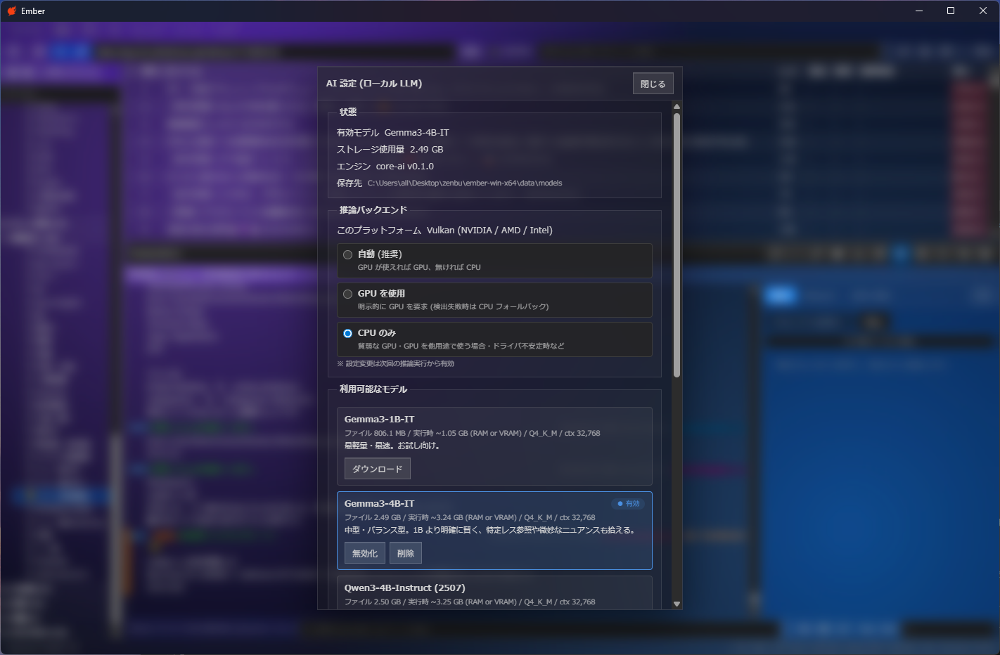
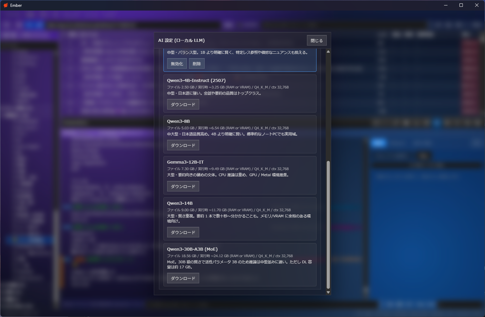
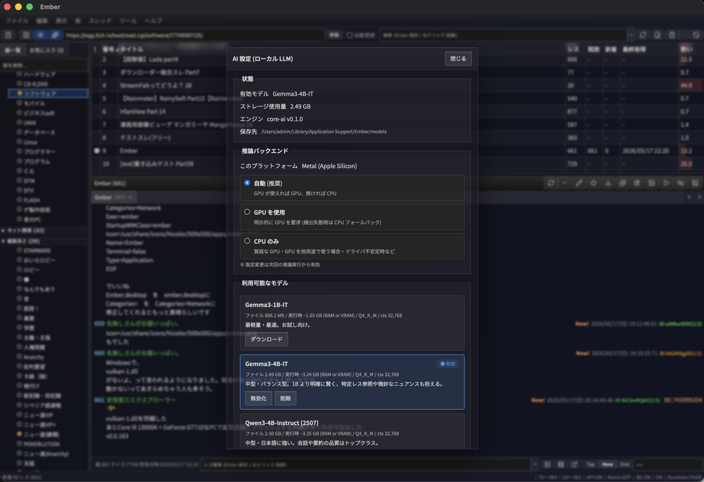
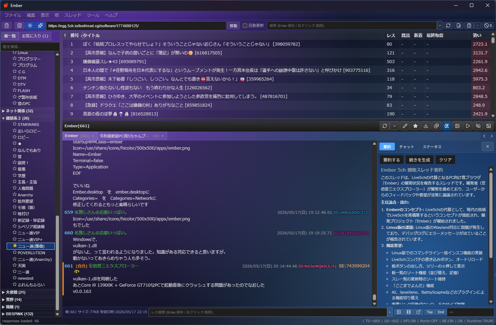
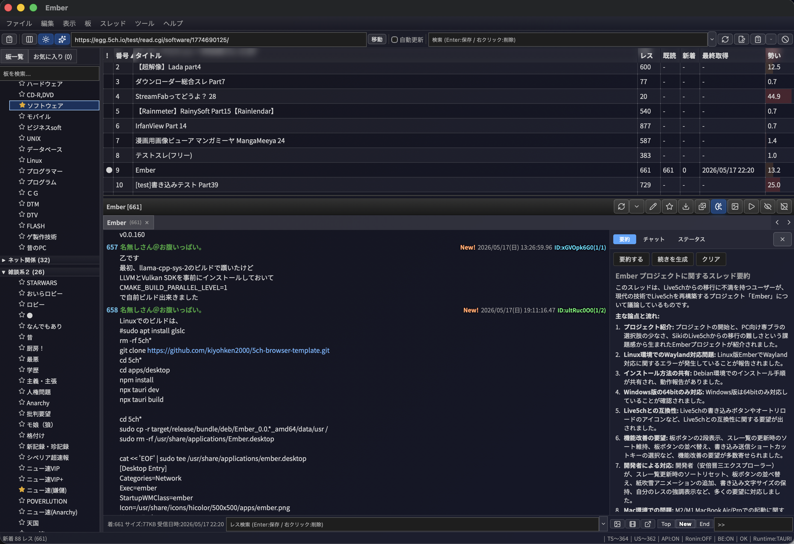
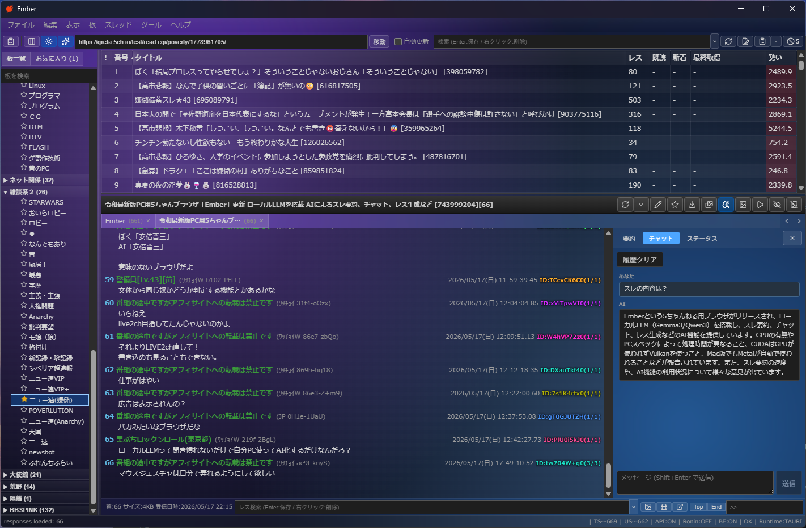
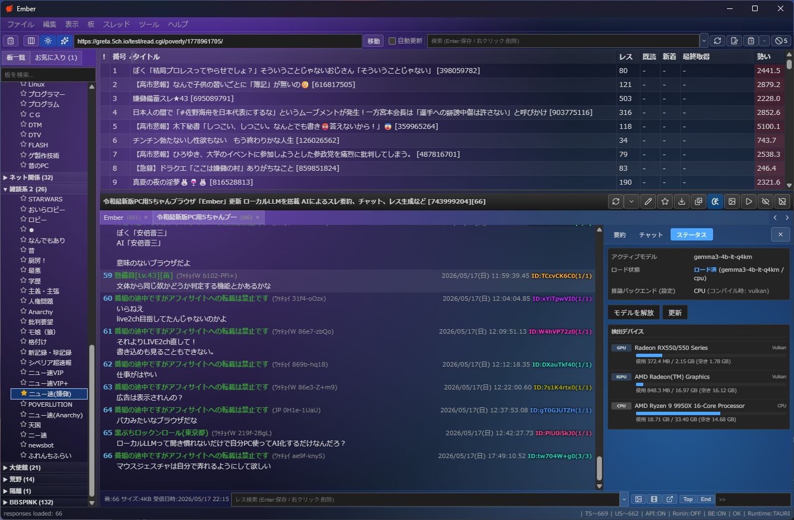
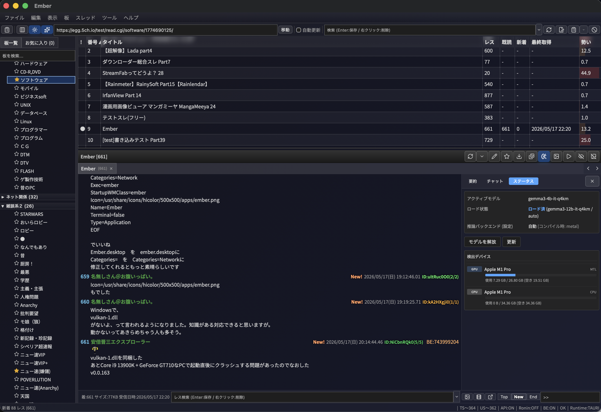

import { Link } from 'gatsby';

## はじめに

<Link to="/blog/2026-04-01">前回の記事</Link>で、5ch.ioドメイン変更で専ブラ難民になり Tauri + React + Rust で Ember という5ch.io専用ブラウザを自作した話を書きました。

その後 Ember に **ローカル LLM (大規模言語モデル) によるスレ要約とチャット機能** を追加したので、その実装の話をします。

クラウド API は一切使わず、すべてユーザーの端末内で完結する設計です。

## なぜローカル LLM か

最初は OpenAI / Anthropic の API を呼ぶ素朴な実装も検討しました。実装は圧倒的に楽です。ただ、5ちゃんねるとの組み合わせを考えると以下が引っかかりました。

- **API キーの配布が必要** — 「ZIP 展開して exe を叩くだけ」という配布形態とは相性が悪い
- **プライバシー** — 5ch のスレ本文をそのまま外部 API に投げるのは、内容によっては抵抗のあるユーザーが多そう
- **コスト** — 「気になったスレをとりあえず要約に投げる」という使い方をすると地味に積み上がる
- **ネット接続前提** — ユーザーが「家で重いスレをまとめて要約」というユースケースを想定すると、ローカル完結のほうが気楽

結論として、**llama.cpp ベースのローカル推論** を Tauri アプリに同梱する方針にしました。モデルファイルだけはユーザーの端末にダウンロードしてもらいます。

## 主な機能

ローカル LLM を使った機能は次の3つです。

### 1. モデル管理 (AI 設定タブ)





アプリ内蔵のモデルカタログから1クリックで GGUF モデルをダウンロードします。

カタログには Gemma3 (1B/4B/12B)、Qwen3 (4B/8B/14B) など複数モデルを登録しており、サイズ・量子化・推奨用途 (要約 / 返信生成) が見える形にしています。各モデルは **SHA256 ハッシュ検証必須** にしているので、ダウンロード中に壊れたら破棄します。

モデルファイルは `<app_data_dir>/models/` に保存されます。アプリをアンインストールしても残るので再インストール時に再 DL は不要です。

#### Mac でも同じ UI



Windows / macOS で完全に同じ UI です。クロスプラットフォームで設定や永続化のフォーマットも揃えています。

### 2. スレ要約



開いているスレを丸ごと LLM に投げて要約させます。ストリーミング出力なので、生成途中からトークンが流れてきます。

長いスレ (1000レス級) も扱えるよう、context length は 32K に統一しています。Gemma3-1B でも実用速度で動きますが、内容の理解度を求めるなら 4B 〜 8B を推奨しています。

#### Mac の要約



Mac (Apple Silicon) では Metal バックエンドが効くので、Windows の CPU 推論より明確に速いです。

### 3. チャット



スレの内容を文脈に乗せて、LLM と対話できます。「このスレの結論は何?」「この >>123 の人は何を主張している?」のような質問ができます。

完全ローカルなので、外に出したくない話題のスレでも気兼ねなく使えます。

### 4. ステータスタブ — バックエンド情報



検出された GPU / 計算バックエンド (Vulkan / Metal / CPU)、ロード中のモデル、コンテキスト使用量、トークン/秒などを表示するタブです。



Mac では Apple Silicon の統合 GPU が Metal として認識されます。

## 技術スタック

| レイヤー | 採用 |
|---------|------|
| 推論エンジン | [`llama-cpp-2`](https://crates.io/crates/llama-cpp-2) (llama.cpp の Rust バインディング) |
| モデル形式 | GGUF (Q4_K_M を中心に登録) |
| GPU バックエンド | Vulkan (Windows / Linux) / Metal (macOS) / CPU フォールバック |
| モデル DL | `reqwest` ストリーミング + SHA256 検証 |
| カタログ | ランディングの `ai-models.json` を起動時取得 (失敗時はバンドル版にフォールバック) |
| 永続化 | `<app_data_dir>/models/*.gguf` |

### crate 分離

Ember の Rust 側は AI 機能を `core-ai` という独立 crate に切り出しています。

```
Tauri App (Ember)
├── core-ai     … LLM 推論 (llama-cpp-2 / モデル管理 / ストリーミング)
├── core-auth   … BE / UPLIFT / どんぐり認証
├── core-fetch  … HTTP取得・投稿フロー → core-parse
├── core-parse  … dat / subject.txt / bbsmenu パーサ
└── core-store  … JSON永続化 / SQLiteキャッシュ
```

`core-ai` だけが llama-cpp-2 に依存しており、AI 機能を使わないビルドを切り出すのも理論上は容易です (今は単一ビルドにしています)。

### ビルド要件

`llama-cpp-2` は C++ の llama.cpp を内部でビルドするため、開発環境に **LLVM (libclang) と CMake** が必要です。Windows なら `winget install LLVM.LLVM Kitware.CMake` + `LIBCLANG_PATH` の指定、Mac なら `brew install llvm cmake` です。

Vulkan を有効にする場合はさらに Vulkan SDK が必要です:

- **Windows**: `winget install KhronosGroup.VulkanSDK` (~600MB)
- **Linux**: `apt install libvulkan-dev glslang-tools`
- **macOS**: Metal は CMake が自動検出するので追加導入不要

ここはユーザー (アプリ利用者) には関係なく、ビルド時の話です。ユーザーは ZIP を展開して exe を叩くだけです。

## ハマったポイント — Vulkan ICD クラッシュ

ここが一番きつかった話です。**結局完全には解決できず、ランディングページに「サポート外環境」として明記する形で決着** しました。

### 症状

v0.0.162 を出した直後、Windows + 古い NVIDIA GPU (GeForce 700 系) のユーザーから「起動して数秒でクラッシュする」という報告が来ました。

調査すると、`llama-cpp-2` の `LlamaBackend::init()` が Vulkan loader を起動して ICD (Installable Client Driver) を列挙する段階で、**Kepler 世代 (GeForce 600/700)** の壊れた Vulkan ICD ドライバがプロセスごと巻き込んで落ちていました。NVIDIA が Kepler のドライバを 2024年10月で EOL にしたあと、Vulkan 1.2+ に対応しきれていない古い ICD だけが残っているケースがあるようです。

### 起動時クラッシュは解決、しかし…

v0.0.162 では AI ステータスタブ表示のため startup useEffect から `ai_list_backend_devices` を呼んでおり、これが起動直後の ICD 列挙クラッシュを引き起こしていました。v0.0.163 でこの呼び出しを削除し、**起動時クラッシュは解決** しました (ステータスタブを開いた時のみ呼ぶように変更)。

しかし問題はそれだけではありませんでした。**モデルロード時と、ステータスタブを開いた時のデバイス検出** でも同じ ICD 列挙が走るため、ユーザーが要約を試みたりステータスタブを開いた瞬間に落ちる、という症状が残ったのです。これを潰そうと v0.0.164 〜 v0.0.166 で 3 回ホットフィックスを出しましたが、すべて失敗しました。

| Ver | やったこと | 結果 |
|-----|---------|------|
| v0.0.164 | 「GPU を無効化」トグル追加 + `VK_LOADER_DRIVERS_DISABLE=*` 環境変数を main() で設定 | **`*` は Khronos Loader の正しい特殊値ではない** (正しくは `~all~`) — 効かず |
| v0.0.165 | `~all~` に修正 + 推論バックエンドを CPU に強制上書き | やはりクラッシュ |
| v0.0.166 | 同梱した vulkan-1.dll をリネームして volk の LoadLibrary を失敗させる | リネーム成功ログ確認、しかし**クラッシュ継続** |

「DLL リネームすら効かない」のは最初理解できませんでした。

### 原因 — vulkan-1.dll は PE import

`llvm-objdump -p ember.exe` で実行ファイルの import テーブルを覗くと、**vulkan-1.dll は `vkGetInstanceProcAddr` を PE import (静的インポート)** していることが判明しました。

つまり Windows のプロセスローダが ember.exe を起動する時点で、**main() が走るより前に** vulkan-1.dll がプロセス空間にロードされてしまう。

main() の中で環境変数を立てたり、DLL ファイルをリネームしても、**メモリには既に loader が常駐済み** で、どうしようもありません。原理的に手遅れだったわけです。

ここで重要なのは、**起動時クラッシュ (v0.0.163 で修正済み) と、モデルロード / デバイス検出時のクラッシュは、根は同じ ICD 列挙だが Trigger 経路が違う** ということです。起動時は「私たちが起動時に呼んでいる」ので呼ばないように直せば解決します。しかしモデルロードやデバイス検出は、ユーザーが AI 機能を使うためにそもそも呼ばないわけにいかない経路で、かつそこで呼ばれる llama.cpp 内部の Vulkan 初期化は vulkan-1.dll が既にロード済みであることを前提に動くため、process 起動後にどう抑制しようとしても手遅れだった、という構図です。

### 対応

きちんと旧 GPU をサポートするには、大規模改修が必要になります:

1. **2 ビルド方式** — Cargo.toml に `gpu` feature を追加し、CI で「Vulkan あり版」と「CPU 専用版」を両方ビルドして GitHub Release に並べる
2. **サブプロセス分離** — AI 推論を `ember-ai-helper.exe` のような子プロセスに切り出し、クラッシュをアプリ本体から隔離

両方とも実装コストが大きいため、影響範囲 (Steam Hardware Survey ベースで Kepler シェア < 0.5%、減少傾向) と相談して、v0.0.167 で safe mode UI と関連ロジックを全削除し、**ランディングページに「Vulkan 1.2+ 対応 GPU が必要 (Kepler 世代以前は AI 機能非対応)」と明記する** 方針に転換しました。

つまり「アプリ起動自体は誰でもできる (v0.0.163 で解決済み)、ただし AI 機能を触ると古い GPU では落ちる、という状態を許容して文書で告知」というラインで決着させた形です。「アプリの責任なのか、Vulkan ドライバの責任なのか」が一見ユーザーに見えにくい領域なので、ドキュメント側で先回りして明示するのは重要だったと思います。

## 設計判断のメモ

実装中に決めた、わりと地味だけど効いている方針です。

### モデルカタログはランディング配信 + バンドル fallback

`ai-models.json` (モデル一覧 / DL URL / SHA256) は **ランディングページ (`https://ember-5ch.pages.dev/ai-models.json`) から起動時に取得** し、ネットワーク失敗・パース失敗時のみ **バイナリに同梱した版にフォールバック** する 2 段構えです。

```rust
const AI_BUNDLED_CATALOG: &str = include_str!("../ai-models.json");
const AI_REMOTE_CATALOG_URL: &str = "https://ember-5ch.pages.dev/ai-models.json";
```

完全埋め込みも検討しましたが、

- **モデル追加にバイナリ再リリースが要らない** — Hugging Face に新しい量子化が上がった時、カタログ JSON を Cloudflare Pages に push するだけで全ユーザーに反映される
- **オフラインでも使える** — 取得は 5 秒タイムアウト、失敗したら同梱版にそのままフォールバック
- **バンドル版があるのでカタログ配信が止まっても致命傷にならない**

という性質が両取りできるので、ハイブリッド方式にしました。

### ストリーミングは Tauri の `Channel<T>`

llama-cpp-2 のトークン生成は同期的なループです。これを Tauri の [`Channel<T>`](https://tauri.app/develop/calling-rust/#channels) でフロントに流し込んでいます。

`emit` でもいいのですが、Channel は型付き + 1対1 で、要約とチャットを同時に走らせても混線しないので採用しました。

### context length は 32K 統一

5ch のスレは最大 1000 レス + コテハン署名等で、ざっくり 50〜200K トークンになります。さすがに全部は乗らないので、

- 要約: 古い方から優先で詰めて 28K 程度まで
- チャット: 直近 N レス + ユーザー指示

という形で前処理しています。モデル側を 32K 統一にしておくことで前処理ロジックが安定しました。

## おわりに

「専ブラに AI を載せる」という発想は最初なかったのですが、ローカル LLM を入れたことで「気になったスレを開いてとりあえず要約させる」という使い方が定着して、自分自身の 5ch 体験がそこそこ変わりました。クラウド API ではなくローカル LLM だからこそ、雑に何度も叩けるのが効いていると思います。

実装は llama-cpp-2 / Vulkan / Metal といった既存資産にかなり乗っかっていて、自前で書いたのはモデルカタログ・ダウンローダ・前処理・UI 層くらいです。とはいえ「ICD 列挙で落ちる」のような OS / GPU 寄りのハマりは想定外で、結局完全には倒せないままドキュメント側で対応する判断をしました。

このあたりの実装も全工程ほぼ Claude Code とのペアプログラミングで進めています。Rust + GPU 周りはハマりどころが多くて、原因特定 (PE import を疑って `llvm-objdump` で確認、など) のような手数の多い調査でも、AI に並走してもらえると体感の負担がだいぶ違います。

### ダウンロード

- **公式サイト**: https://ember-5ch.pages.dev
- **GitHub**: https://github.com/kiyohken2000/5ch-browser-template

AI 機能は無効化できるので、不要な方は触らないままでも普通の専ブラとして使えます。

---