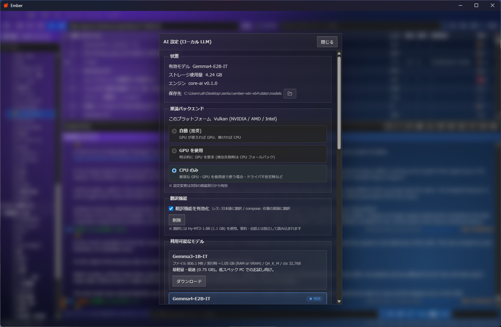
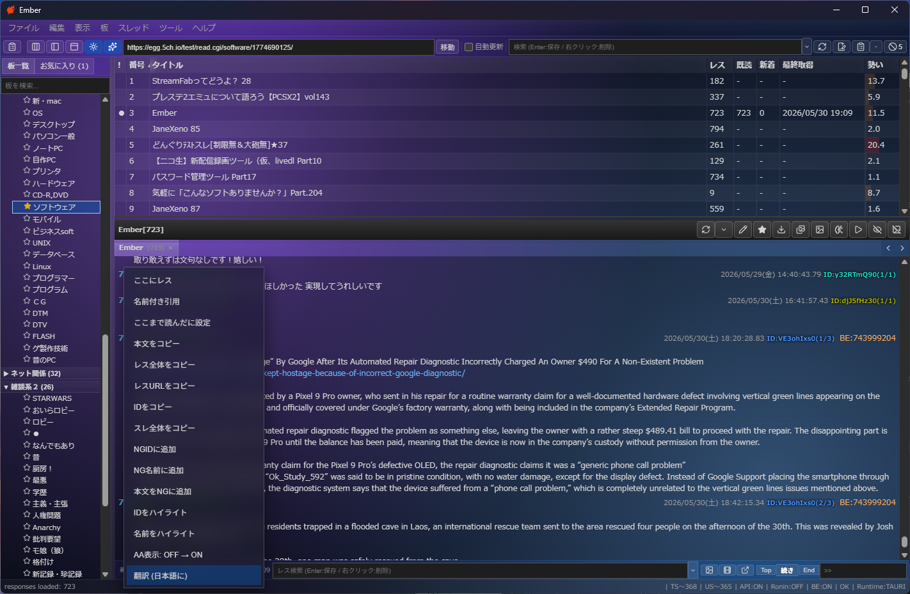
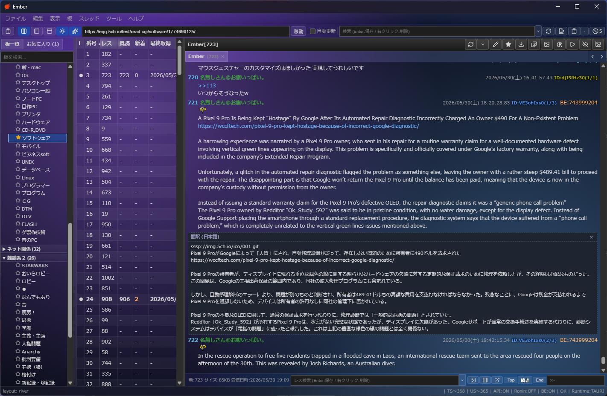
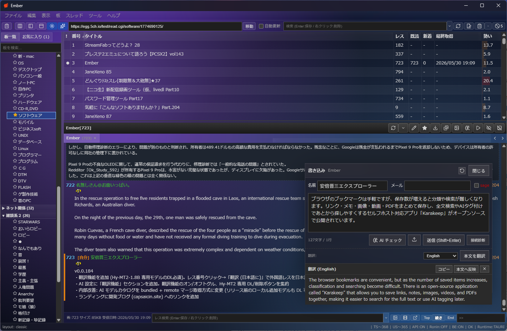

import { Link } from 'gatsby';

## TL;DR

- 自作の 5ch.io 専用ブラウザ **[Ember](https://github.com/kiyohken2000/5ch-browser-template)** (Tauri v2 + React) に**ローカル翻訳機能**を追加しました
- 翻訳エンジンは Tencent の翻訳特化 LLM **[Hy-MT2-1.8B](https://huggingface.co/tencent/Hy-MT2-1.8B-GGUF)** (Apache 2.0 / 33 言語対応 / Q4_K_M で 1.13 GB)
- mainline llama.cpp で動く GGUF を `llama-cpp-2` (Rust binding) 経由で呼んでいるので**完全ローカル・無料・オフライン可**
- 用途は 2 つ:
  - **レス翻訳**: 外国語レスを「日本語で読む」ため (英・中・韓 → 日本語 always)
  - **投稿前翻訳**: 自分の日本語下書きを任意の外国語へ (英 / 中簡 / 中繁 / 韓)

## なぜ専用翻訳モデルを別途用意したか

Ember には元々 Gemma3 / Gemma4 / Qwen3 が選べる**スレッド要約・投稿レビュー用の AI 機能**があります。素朴に「これに翻訳もさせればよくない？」と思ったのですが、汎用 LLM の翻訳は基本的に **「説明が混じる」「丁寧すぎる」「冗長」**で、5ch のレス感覚に合いません。

たとえば Qwen3-4B に「次の英文を日本語に: ...」と頼むと、`<think>` ブロックで思考が漏れたり、訳の前後に "もちろんです、以下が翻訳結果です:" みたいな前置きがつきます。Qiita 記事の翻訳なら親切ですが、レスの 1 行に被せて出すには邪魔。

そこで **翻訳タスクのみに finetune された軽量モデル**を別系統で導入することにしました。条件:

| 要件 | 理由 |
|------|------|
| 翻訳特化 (instruction tuning が翻訳ドメイン) | 余計な前置き・思考漏れがない |
| mainline llama.cpp 対応アーキ | フォーク管理したくない |
| Apache 2.0 等の許容ライセンス | バンドル/再配布の余地 |
| Q4_K_M で 1 〜 1.5 GB 程度 | 別系統で常駐させても許容できる重さ |
| 日本語・英語・中国語・韓国語が揃う | 5ch.io 周辺の言語カバレッジ |

満たすものは多くないですが、2026 年 5 月 22 日に Tencent が公開した **Hy-MT2** はど真ん中でした。

- 1.8B / 7B / 30B-A3B (MoE) の 3 サイズ
- アーキテクチャは **Hunyuan-Dense** (mainline llama.cpp の PR #14878 で 2025-08 にマージ済)
- 33 言語、Apache 2.0
- 公式ベンチで 1.8B でも Microsoft Translator API を上回るスコア
- 1.25 bit `STQ1_0` 量子化なら**わずか 440 MB** (※ ただし量子化カーネルは現状 PR #22836 が未マージ、Q4_K_M 等の標準形式は問題なし)

実機で 5ch 風の文を投げて「草」が "funny" になることや、「ワイ将」のような難物は手こずるが意味は通ること等を確認してから本実装に入りました。

## 何ができるか

### 1. AI 設定の「翻訳機能」セクション



- チェックボックスで機能のオン/オフ
- Hy-MT2 未 DL 時は専用のダウンロードボタンが出る (進捗バー・SHA256 検証・キャンセル・削除まで同じ場所で完結)
- DL 完了後にチェックボックスが有効化される
- 設定は `localStorage` (`desktop.aiPrefs.v1`) に永続化

要約・会話用モデルとは**完全に独立**して扱うので、Gemma3-12B で要約しつつ Hy-MT2 で翻訳、といった併用が前提です。

### 2. 外国語レスを日本語で読む

外国語板や英文ニュースのコピペレスはレス番号クリック→**「翻訳 (日本語に)」**で日本語化します。



選択言語のピッカーは出しません (Hy-MT2 は source 言語を自動判定するので、ユーザは「日本語で読みたい」だけ伝えればよい)。

クリックすると原文の下に翻訳結果が並記されます (置換ではなく並記)。



ストリーミングで段階的に出てくるので、英文の長レスでも読み始めが早いです。`[×]` ボタンで個別に閉じられます。

### 3. 外国語で書き込みたい

書き込みウィンドウには 2 段目のアクション行を追加し、**言語セレクタ + 「本文を翻訳」ボタン**を置きました。



日本語で書いたものを英 / 中簡 / 中繁 / 韓 に翻訳して、`[コピー]` か `[本文へ反映]` で投稿用テキストに変換。誤訳に気付いたら原文に戻せます。

## 実装メモ

### Hunyuan-Dense の chat template

Hy-MT2 の `tokenizer_config.json` には `chat_template` フィールドがなく、別途 `chat_template.jinja` で定義されていました。要点を抜くとこんな形:

```
<｜hy_begin▁of▁sentence｜><｜hy_User｜>{prompt}<｜hy_Assistant｜>
```

`core-ai` の推論ループは `AddBos::Always` で BOS を自動付与するため、フロント側で組み立てるのは User / Assistant の囲みだけです。

```ts
function buildTranslationPrompt(text: string, targetLangNativeName: string): string {
  const inst = `Translate the following text into ${targetLangNativeName}. Note that you should only output the translated result without any additional explanation:\n\n${text}`;
  return `<｜hy_User｜>${inst}<｜hy_Assistant｜>`;
}
```

text パラメータには「これを **日本語に**」「これを **English に**」のように方向を明示する英文インストラクションを入れます。同じテンプレートでレス翻訳 (→ ja 固定) と compose 翻訳 (→ 任意) を共有しています。

### モデルカタログのマージ取得

Ember は `apps/desktop/src-tauri/ai-models.json` を `include_str!` でバイナリ同梱しつつ、起動時に `https://ember-5ch.pages.dev/ai-models.json` (Cloudflare Pages) も fetch して、**remote 優先**で利用可能モデル一覧を構築する設計です。アプリのリリースを通さずに新モデルを追加できるのが狙い。

ところが今回 Hy-MT2 を bundled だけに追加した状態で動作確認したところ、remote には未デプロイなので**ローカル追加したモデルが見えない**という現象に遭遇しました。チキンエッグ。

```rust
async fn ai_load_merged_catalog() -> Result<core_ai::ModelCatalog, String> {
    let bundled = core_ai::parse_catalog(AI_BUNDLED_CATALOG).map_err(|e| e.to_string())?;
    let Some(body) = ai_fetch_remote_catalog().await else { return Ok(bundled); };
    let Ok(remote) = core_ai::parse_catalog(&body) else { return Ok(bundled); };

    let mut models = remote.models;
    let known: HashSet<String> = models.iter().map(|m| m.id.clone()).collect();
    for entry in bundled.models {
        if !known.contains(&entry.id) {
            models.push(entry);
        }
    }
    Ok(core_ai::ModelCatalog { version: remote.version, models })
}
```

「remote 優先・bundled で穴埋め」のマージ取得に変えました。これで:

- 既存挙動 (remote だけでカタログ更新) は維持
- リリース前に bundled へ追加したモデルも dev で動作する
- 重複 ID は remote 優先 (運用上の安全弁)

### 翻訳専用モデルを active モデルと独立に動かす

`ai_run_inference` は active model id を manifest から引いてくる前提でしたが、翻訳呼び出しでは Hy-MT2 を**明示指定**したかったので optional な `modelId` 引数を追加:

```rust
async fn ai_run_inference(
    app: AppHandle,
    session_id: String,
    prompt: String,
    max_tokens: Option<u32>,
    backend: Option<core_ai::InferenceBackend>,
    model_id: Option<String>,  // ← 追加
) -> Result<(), String> {
    let dir = ai_models_dir()?;
    let manifest = core_ai::load_manifest(&dir).map_err(|e| e.to_string())?;
    let target_id = model_id
        .or_else(|| manifest.active_model_id.clone())
        .ok_or_else(|| "no active model".to_string())?;
    // ... 以下従来通り
}
```

既存の要約・会話・レビュー呼び出しは `modelId` 未指定 (= active) で従来挙動、翻訳だけ `modelId: "hy-mt2-1.8b-q4km"` を渡します。`llama-cpp-2` 内部のモデルキャッシュが要約モデルと翻訳モデルで切り替わるため、頻繁な切替には注意が必要ですが、`Hy-MT2-1.8B` は 244 MiB の compute buffer で済むので RX550 のような古い GPU でも乗ります。

## 制限と今後

- **なんJ語・草・ネットスラング**は翻訳特化モデルでも完璧ではない。「ワイ将、本日も無事に出勤」は "My general, got to work safely today" と訳されます (ワイ = "I" の方言ですが、将官と誤読)
- **440 MB の STQ1_0 (1.25bit) 量子化版**は llama.cpp の [PR #22836](https://github.com/ggml-org/llama.cpp/pull/22836) 待ち。マージされ次第バンドル候補に切替予定 (※ クラウドエージェントで毎日監視中)
- **Hy-MT2 アクティブ化中は要約・会話用モデルが context から外れる**ので、頻繁に行き来する用途では mainline llama.cpp のマルチモデル context 改善待ち

## まとめ

- 5ch ブラウザに**翻訳特化 LLM の専用枠**を入れると、汎用 LLM のお作法で困っていた問題 (前置きが付く、思考が漏れる) が一気に解決
- Hy-MT2-1.8B / Q4_K_M は 1.13 GB で実用速度、Vulkan/Metal どちらも問題なし
- カタログ管理を **bundled + remote マージ**にすると、リリース前の dev でも new モデルが普通に試せるようになる

完成版は v0.0.184 として配布中です:

- リポジトリ: https://github.com/kiyohken2000/5ch-browser-template
- リリース: https://github.com/kiyohken2000/5ch-browser-template/releases/tag/v0.0.184
- 開発ブログ: https://capsaicin.site

ローカル LLM を「特化モデルを別枠で常駐」させる方向、もっとあちこちのアプリで広がってほしいなと思う設計でした。

---