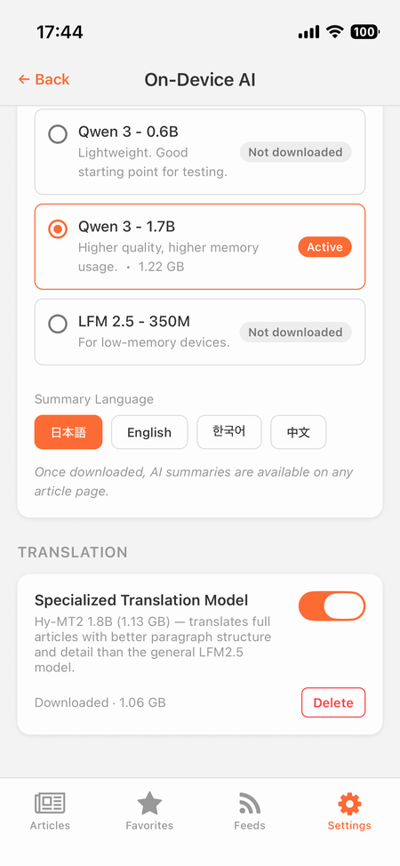
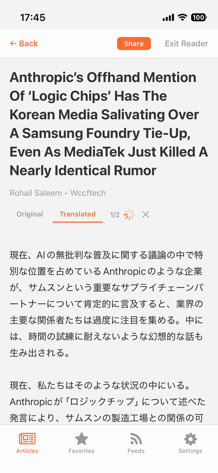
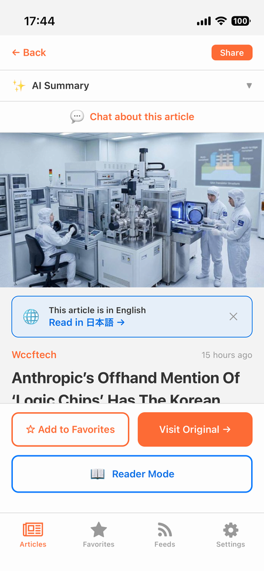
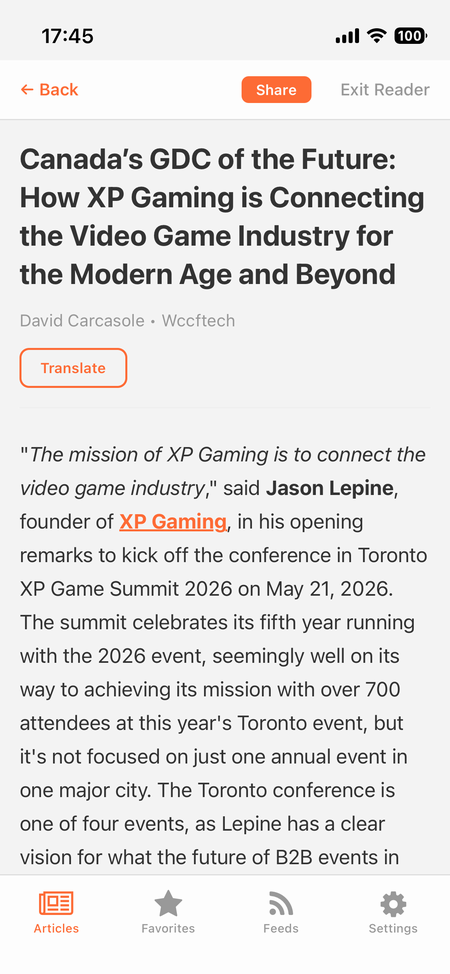
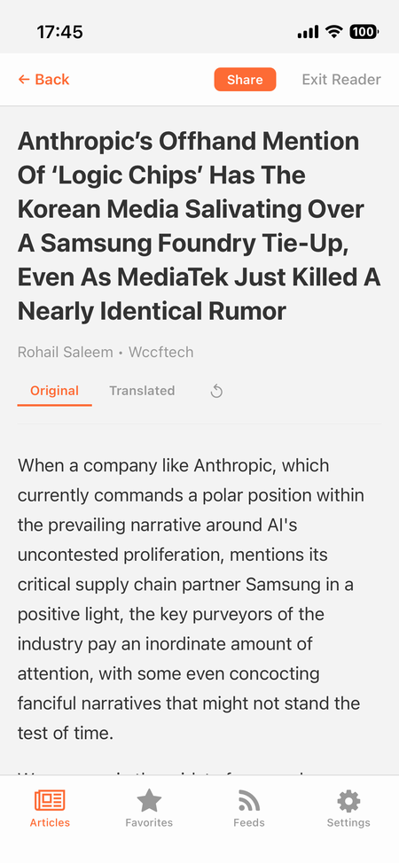

import { Link } from 'gatsby';

## TL;DR

- 以前作った[完全オンデバイスAI付きRSSリーダー「FeedOwn」](https://qiita.com/votepurchase/items/dec88329e5ec5d5a46fe)に、翻訳機能を強化として追加した
- 既存の汎用LLM（LFM 2.5 1.2B）で翻訳もできていたが、**長文記事だと段落が崩壊・情報が欠落していた**
- 解決策：**翻訳のときだけ Tencent の翻訳特化モデル Hy-MT2 1.8B を llama.rn で動的にロード**。要約・チャットは引き続き executorch + LFM2.5
- 1端末で2つの推論エンジン（executorch + llama.rn）を**競合させず**動かすため、AiContext に GPU 占有を切り替える orchestrator を実装
- 4GB端末でも動かすため、`Device.totalMemory` を使った tier gating と「翻訳時だけアンロード/スワップ」アーキテクチャを採用
- UI 側は **「この記事は英語です。日本語で読む →」banner** で発見性を上げ、**Translated タブにも画像を元位置で挿入**
- 結果：iPhone 13 mini (A15/4GB) で 1.13GB の翻訳モデルが安定動作、翻訳品質は段落構造を保持したまま自然な日本語
- リポジトリ：https://github.com/kiyohken2000/feedown



---

## 経緯：要約はうまくいったのに、翻訳だけはダメだった

前回の Qiita 記事で、FeedOwn に `react-native-executorch` 経由でオンデバイス LLM を載せた話を書いた。要約・シグナル分離・チャット・翻訳の4機能を、すべて端末内で完結させる構成。

LLM は LFM 2.5 1.2B / Qwen 3 0.6B-1.7B / LFM 2.5 350M から選べるようにして、デフォルトは LFM 2.5 1.2B。これが**要約・チャットでは想定以上に優秀**だった。1.2B というサイズで日本語要約として実用十分。

ただ、**翻訳だけは別問題**だった。

LFM2.5 にJSON 配列形式の翻訳プロンプトを投げる現行方式で、短い記事（〜2,500字）はそれなりに訳せていた。しかし長文記事だと:
- 段落構造が崩れる（段落が連結されたり消えたりする）
- 中盤以降の情報が欠落する
- JSON フォーマットが時々破綻する

これは 1.2B 汎用モデルに「JSON で長文翻訳しろ」と要求している以上、避けられない品質ギャップだった。

## 解決の方向性：翻訳特化モデル + 動的スワップ

選択肢は2つあった:

1. もっと大きい汎用モデル（Qwen 3 4B / Phi-4 Mini 4B 等）に置き換えて翻訳品質を底上げする
2. **翻訳のときだけ翻訳特化モデルをロード**し、要約・チャットは LFM2.5 のまま維持する

1 は executorch のモデル選択肢を上げるだけで実装は楽だが、要約・チャットも一緒に遅く・重くなる副作用がある。後述するベンチで、LFM 2.5 1.2B は同サイズの汎用モデル比でかなり高速だと分かったので、これを差し替えるのは惜しかった。

2 はアーキテクチャが面倒。**executorch には翻訳特化モデルが存在しない**ので、別ランタイム（llama.rn = llama.cpp の React Native バインディング）を引っ張ってくる必要がある。これは要するに**2つの推論エンジンを1つのアプリに同居させる**話で、iOS の Metal working set 問題（後述）がある中で結構な決断だった。

最終的に 2 を選んだ。理由は次の実測結果。

---

## 検証1：翻訳特化モデル Hy-MT2 のベンチ

候補は **Tencent の Hy-MT2 1.8B（33言語の翻訳特化 "fast-thinking" モデル）の GGUF 量子化版**。GGUF なので llama.rn 経由で動かす。

iPhone 13 mini (A15/4GB) で Q4_K_M (1.13GB) をロードして、同じ英語記事（〜1.1k字、iOS 27 発表記事）を LFM2.5 1.2B と Hy-MT2 1.8B で翻訳して並べた。

### 速度

| モデル | サイズ | loadMs | tok/s |
|--------|--------|--------|-------|
| Hy-MT2 1.8B Q4_K_M | 1.13 GB | ~2300 | 20.7 |
| LFM2.5 1.2B（executorch） | ~700 MB | - | - |

llama.rn + Hy-MT2 が A15 Metal working set（2863MB）内に余裕で収まることが確認できた。Gemma 4 E2B 系（2.4-3.1GB）が jetsam OOM した経緯があったので、これは大きい。

### 品質

ここが決定的だった。LFM2.5 のJSON翻訳は段落を圧縮・統合してしまうケースが多発したのに対し、Hy-MT2 は **段落構造を保持したまま情報を欠落させずに翻訳**した。短い記事ならどちらも違和感ないが、長くなるほど差が開く。

### 2-bit / 1.25-bit 量子化は使えなかった

Tencent は AngelSlim STQ（Straight-Through Quantization）という独自の超低ビット量子化版も公開している。これが使えれば 1.8B が ~400MB 程度に収まって嬉しいのだが、`tensor 'blk.0.attn_k_norm.weight' has offset X, expected Y` というエラーで GGUF パースに失敗。原因は **llama.cpp の PR #19357（STQ kernel サポート）が unmerged** で、現行 llama.rn 0.12.4 のバンドル llama.cpp では読めない。

標準量子化（Q4_K_M / Q6_K）だけが現実的な選択肢として残った。

---

## 検証2：汎用LLMも llama.rn にすべき? → No

「翻訳のために llama.rn を入れるなら、ついでに汎用LLMも llama.rn の方が良いモデルが選べるんじゃないか」と思って、同じ A15 で要約プロンプトを比較した。

| モデル | サイズ | loadMs | tok/s | 出力 |
|--------|--------|--------|-------|------|
| Gemma 3 1B-IT Q4_K_M（llama.rn） | 806 MB | 1935 | **19.1** | 2文 ✓ / リリース時期情報欠落 |
| LFM 2.5 1.2B（executorch） | ~700 MB | 2923 | **29.8** | 3文 / リリース時期含む |

**同じ A15 GPU で executorch が 55% 速い**。しかも要約内容は LFM のほうがむしろ豊か。

考えてみれば当然で、`react-native-executorch` は Meta の ExecuTorch ランタイムを直接叩く、モバイル特化の推論パスを最適化している。一方 llama.rn は llama.cpp というデスクトップ・サーバー寄りの汎用 GGUF ランタイムを React Native に bridge している。同じ Metal シェーダを使っていても、パイプラインの最適化度合いが違う。

結論：**「翻訳だけ llama.rn + Hy-MT2、それ以外は executorch + LFM2.5」** の二刀流が正解。

---

## 2エンジン同居問題：Metal Working Set との戦い

判断は決まったが、実装は面倒だった。

iPhone 13 mini の Metal working set（GPU が確保できる上限）は 2863MB。executorch の LFM2.5 1.2B が 700MB、llama.rn の Hy-MT2 が 1.13GB（重みのみ）。両方同時にロードするとそれだけで 1.8GB、KV キャッシュ・計算バッファを足すと余裕がほぼない。**さらに iOS の jetsam が容赦なくプロセスごと kill する**。

なのでこういう方針にした:

```
[アイドル: executorch LFM2.5 がロード中]
     │ ユーザーが「翻訳」をタップ
     ▼
[swap-out: executorch をアンロード（preventLoad=true）]
     │ Metal 解放を 400ms 待つ
     ▼
[llama-init: Hy-MT2 を initLlama]
     │ chunk loop で順次 completion
     ▼
[llama-release: ctx.release() で解放]
     │
     ▼
[アイドル: executorch を再ロード（lazy: 次回 summary 要求時）]
```

これを `AiContext.runWithLlamaRn` という orchestrator にまとめた:

```js
const runWithLlamaRn = useCallback(async ({ model, contextParams = {}, onSession }) => {
  if (llamaActiveRef.current) {
    throw new Error('llama.rn session already in progress')
  }
  llamaActiveRef.current = true
  setLlamaActive(true)  // executorch useLLM の preventLoad が true になる

  let ctx = null
  try {
    // executorch の Metal 解放を待つ
    await new Promise((r) => setTimeout(r, 400))

    ctx = await initLlama({
      model: toNativePath(modelPathFor(model)),
      n_ctx: 4096,
      n_gpu_layers: 99,
      ...contextParams,
    })
    return await onSession(ctx)
  } finally {
    if (ctx) await ctx.release()
    llamaActiveRef.current = false
    setLlamaActive(false)  // executorch が再ロード可能になる
  }
}, [])
```

executorch の `useLLM` フックは `preventLoad` を見ていて、これが `true` になると内部の `controllerInstance.delete()` を呼んで Metal 確保を解放する。それを利用して、llama.rn セッション中だけ executorch を停止させる。

呼び出し側はこう:

```js
await runWithLlamaRn({
  model: HY_MT2_TRANSLATION_MODEL,
  contextParams: { n_ctx: 4096 },
  onSession: async (ctx) => {
    for (let i = 0; i < chunks.length; i++) {
      if (cancelRef.current) break
      const completion = await ctx.completion({
        messages: buildHyMt2TranslationMessages(chunks[i].text, targetLang),
        n_predict: 2048,
        ...HY_MT2_SAMPLING,
      })
      setTranslatedParagraphs((prev) => [...prev, completion.text.trim()])
    }
  },
})
```

---

## 端末RAM gate：iOS は物理の ~90% を返してくる

このアーキテクチャは A15/4GB という、現役 iOS で**ほぼ最小スペック**の機種で動かすことを前提にしている。逆に言えば、もっと低スペックな端末（3GB 以下）では Hy-MT2 を動かしてはいけない。

`expo-device` の `Device.totalMemory` で物理 RAM を取れる。ただし iOS は**物理 RAM の usable 部分（だいたい 90%）**を返してくる。4GB 機なら 3.6GB、6GB 機なら ~5.4GB、8GB 機なら ~7.2GB という感じ。

なので tier の閾値は物理クラスより少し下に設定した:

```js
export const RAM_TIER = {
  TIER_4GB: 3.5 * 1024 ** 3,  // iPhone 13 mini など
  TIER_6GB: 5.3 * 1024 ** 3,  // iPhone 14 Pro など
  TIER_8GB: 7.0 * 1024 ** 3,  // iPhone 15 Pro など
}

export function canRunOnDevice(model, ramBytes = getDeviceRamBytes()) {
  if (model?.minDeviceRamBytes == null) return { ok: true }
  if (ramBytes == null) return { ok: false, reason: 'Device RAM unknown' }
  if (ramBytes < model.minDeviceRamBytes) {
    return { ok: false, reason: `Needs ~${label}GB+ RAM (this device: ${have}GB)` }
  }
  return { ok: true }
}
```

Hy-MT2 1.8B Q4 は `TIER_4GB` でゲートしてあるので、3.6GB の iPhone 13 mini では PASS、3GB 以下の旧機種では設定画面のトグル自体が disabled になる。

---

## チャンク翻訳：「全文翻訳したい、でもUIを凍結したくない」

ユーザーから「2,500字キャップではなく全文翻訳してほしい」というリクエストがあった。素直にやると、Hy-MT2 が 20.7 tok/s なので、長い記事（15,000字）だと 15分以上 UI が応答しないことになる。

なので **チャンク分割 + プログレッシブ表示** で対応した:

1. 全段落を ~2,500 字/chunk にグルーピング（段落境界を優先、超大段落は文単位で再分割）
2. Hy-MT2 を**1回だけ init**（重い）
3. chunk ごとに `ctx.completion()` を直列実行
4. **完了した chunk から即 UI 反映**（プログレッシブ表示）
5. 各 chunk 間で cancel フラグをチェック（中断可能）
6. 全 chunk 完了 → cache 保存 → release

```js
const chunks = splitParagraphsIntoChunks(paragraphs, 2500)
setTranslatedParagraphs([])
setProgress({ current: 0, total: chunks.length })

await runWithLlamaRn({
  model: HY_MT2_TRANSLATION_MODEL,
  onSession: async (ctx) => {
    for (let i = 0; i < chunks.length; i++) {
      if (cancelRef.current) break
      const completion = await ctx.completion({
        messages: buildHyMt2TranslationMessages(chunks[i].text, targetLang),
        ...HY_MT2_SAMPLING,
      })
      const text = completion.text.trim()
      setTranslatedParagraphs((prev) => [...prev, text])
      setProgress({ current: i + 1, total: chunks.length })
    }
  },
})
```

UI 側は `1/4`, `2/4`, ... と進捗を出しながら、訳された段落から順番に画面に並べていく。完了を待たずに上から読み始められる:



cancel ボタンで chunk 境界での中断もできる（mid-chunk interrupt は未対応）。

---

## 発見性問題：「Translate ボタンが目立たない」

実装初期、Translate ボタンは Reader Mode の中にしか置いていなかった。これは「リーダーモードに入った人だけが翻訳できる」状態で、**そもそも翻訳機能の存在を知らないユーザーが大半**だった。

そこで言語検出ベースの banner を追加した:



ロジック:
- 記事の title + description で言語検出（`detectLanguage` ユーティリティで CJK / hiragana / katakana / hangul の出現頻度をカウント）
- AI が有効 かつ 検出言語 ≠ ユーザーの Summary Language なら表示
- タップ → Reader Mode を起動 → reader content を取得 → 翻訳発火（1回だけ、useEffect でフラグ管理）
- ✕ でセッション内 dismiss

```js
const detectedArticleLang = useMemo(() => {
  const sample = `${article.title ?? ''} ${article.description ?? ''}`.trim()
  if (sample.length < 30) return null
  return detectLanguage(sample)
}, [article.title, article.description])

const showTranslateBanner =
  !readerMode &&
  !translateBannerDismissed &&
  aiSettings.enabled &&
  detectedArticleLang &&
  detectedArticleLang !== targetLang
```

これで翻訳の発見率が大幅に上がった。Reader Mode の中の Translate ボタンも従来通り残してあるので、banner を dismiss した後でもアクセスできる:



---

## 画像挿入：Original と Translated で見た目を揃える

もう一つ、UI 上の見落としがあった。Original タブ（HTML render）は画像を段落間にインラインで表示するのに対し、Translated タブは**画像を一切表示していなかった**。`extractParagraphs` が HTML タグを全部 strip していたため。

`` を sentinel に置き換えて、テキスト・画像の順序を保ったブロック列で再構成するようにした:

```js
function extractBlocks(html) {
  const imageStore = []
  let normalized = html.replace(/]*>/gi, (match) => {
    const src = match.match(/src=["']([^"']+)["']/i)?.[1] ?? ''
    if (!src) return ''
    const idx = imageStore.length
    imageStore.push({ src, alt: match.match(/alt=["']([^"']*)["']/i)?.[1] ?? '' })
    return `\n\n[[__IMG_${idx}__]]\n\n`
  })
  normalized = normalized
    .replace(/<\/?(p|h[1-6]|li|blockquote|...)>/gi, '\n\n')
    .replace(/<[^>]+>/g, ' ')
    // ... HTML entities ...

  const blocks = []
  for (const seg of normalized.split(/\n{2,}/)) {
    const imgMatch = seg.match(/^\[\[__IMG_(\d+)__\]\]$/)
    if (imgMatch) blocks.push({ type: 'image', ...imageStore[parseInt(imgMatch[1])] })
    else if (seg.length >= 30) blocks.push({ type: 'text', content: seg })
  }
  return blocks
}
```

そして翻訳済みテキストと画像ブロックを「**翻訳出力チャンクと段落インデックスの対応**」を使って合成:

```js
const translatedBlocks = useMemo(() => {
  if (!translatedParagraphs || !translationChunks) return null
  const result = []
  for (const img of blockMappings.imagesBeforeFirstParagraph) {
    result.push({ type: 'image', ...img })
  }
  for (let i = 0; i < translatedParagraphs.length; i++) {
    result.push({ type: 'text', content: translatedParagraphs[i] })
    const indices = translationChunks[i]?.paragraphIndices ?? []
    const lastIdx = Math.max(...indices, -1)
    if (lastIdx >= 0) {
      for (const img of blockMappings.imagesAfterParagraph.get(lastIdx) ?? []) {
        result.push({ type: 'image', ...img })
      }
    }
  }
  return result
}, [translatedParagraphs, translationChunks, blockMappings])
```

LFM 翻訳パスは「1翻訳 = 1段落」なので画像位置は完全一致。Hy-MT2 のチャンク翻訳は ±1-2 段落のズレが生じうるが、視覚的には許容範囲。

**Original タブ**



**Translated タブ**


---

## おまけ：JSON 出力の sampling 温度を下げたら別の問題が出た話

要約が「失敗してリトライすると成功する」という症状の根本対策として、構造化出力（要約 / シグナル分離 / LFM 翻訳）の sampling を `temperature: 0.7 → 0.2`、`topP: 0.9 → 0.5` に下げた。確率分布の裾を切って JSON フォーマット遵守を強化する狙い。

**これで JSON 失敗率は下がったが、副作用が出た**:

> 「要約が設定の Summary Language にならず、元の言語になることが増えた」

低 temp = 「自然な続き」に強く寄る → 英語記事の続きとして英語が出やすくなる。プロンプト内の JSON 例示が `"point 1", "point 2"` と英語のままだったのも追い打ち。

3つ重ねて修正した:

1. **JSON 例示を出力言語の単語に差し替え**
   ```js
   const LANGUAGE_EXAMPLES = {
     ja: { summary: '要点', caveat: '注意点' },
     en: { summary: 'key point', caveat: 'caveat' },
     ko: { summary: '요점', caveat: '주의사항' },
     zh: { summary: '要点', caveat: '注意事项' },
   }
   ```
   `{"summary":["要点 1","要点 2"]}` のように出力言語で具体例を見せる

2. **言語制約を attention 直近に再注入**：system プロンプトに加え、JSON テンプレ直前にも `Write the summary in ${langName}. Output JSON only, no code block:` を追加

3. **temp を 0.2 → 0.3、topP を 0.5 → 0.6 に微調整**（ガチガチではなく、若干フレキシブルに）

これで JSON 安定性 と 言語一致 を両立できた。

## おまけ2：Qwen 3 系の `<think>` タグが UI に漏れる

Qwen 3 などの reasoning モデルは回答前に `<think>...</think>` で内部推論を出力する。デフォルトでこれが UI に漏れる:

```
<think>The user is asking about... Let me consider...</think>
要約：Apple が新しい iOS 27 を発表した...
```

chat の場合 plain text で UI に出るので一発でユーザーに見える。要約 / signals も parser が偶然 `{...}` を拾うとは限らない（`<think>` 内に `{` が混じると壊れる）。

防御的に剥がすユーティリティを追加した:

```js
export function stripThinkTags(text) {
  if (!text) return text
  let result = text.replace(/<think>[\s\S]*?<\/think>/gi, '')
  // 未閉じ（生成途中で切れた）<think> もカバー
  result = result.replace(/<think>[\s\S]*$/i, '')
  return result.trim()
}
```

全ての visible / parsed 境界（chat 表示直前、各 parser の入口）で呼ぶ。

---

## 結果

- **翻訳品質**：段落構造を保持、情報欠落なし、自然な日本語。LFM2.5 では崩れていた長文記事もきれいに訳せる
- **動作端末**：iPhone 13 mini (A15/4GB) で安定動作。1.13GB の Hy-MT2 と 700MB の LFM2.5 を **時間軸で分離**して同居
- **発見性**：banner で翻訳機能が必要な時だけ目立つ
- **ユーザー体験**：チャンクごとに段階表示、cancel 可能、画像も元位置に表示
- **既存ユーザー**：トグル OFF が default のため無回帰。「翻訳特化モデルを使用」スイッチを ON にして 1.13GB DL したユーザーだけが Hy-MT2 path に乗る

## 学んだこと

- **1端末で2推論エンジンを動かす場合、GPU 占有の orchestrator が必須**。preventLoad 状態を context レベルで握って排他制御する
- **iOS の `Device.totalMemory` は usable RAM（物理の ~90%）を返す**。tier 閾値は物理クラスより少し下に
- **低 temp は JSON 安定化に効くが、cross-language 指示への追従度を下げる**。プロンプト側の補強と組み合わせる必要がある
- **reasoning モデルの `<think>` タグは全 visible 境界で防御的に剥がす**
- **モデル選定は「同サイズなら専用 > 汎用」**。Hy-MT2 1.8B が翻訳で LFM2.5 1.2B を圧倒したように、用途に特化したモデルは想像以上に強い
- **executorch と llama.rn は競合ではなく補完**。executorch は推論パスが速くてモバイル最適化が良い、llama.rn は GGUF エコシステムの広さがある。両方使うのもアリ

## 参考

- [Tencent Hy-MT2 1.8B GGUF](https://huggingface.co/tencent/Hy-MT2-1.8B-GGUF)
- [llama.rn](https://github.com/mybigday/llama.rn)（PR #348 / #349 で A15 の Metal embed 問題を修正、v0.12.4 でリリース済み）
- [react-native-executorch](https://github.com/software-mansion/react-native-executorch)
- リポジトリ：https://github.com/kiyohken2000/feedown
- 前回記事：[自作RSSリーダーにオンデバイスLLMを組み込んで、要約・シグナル分離・チャット・翻訳を全部端末内でやらせた話](https://qiita.com/votepurchase/items/dec88329e5ec5d5a46fe)

---