import { Link } from 'gatsby';

# はじめに

「食事を AI でラクに記録したい。でも自分が何を食べたかをサーバに渡すのはちょっと…」

そんな個人的な気持ちから、**スマホ単体（オンデバイス）で動くローカル AI** を使った、プライバシー重視・オフライン対応の食事／体重管理アプリ **Priveat（プライベート）** を作りました。

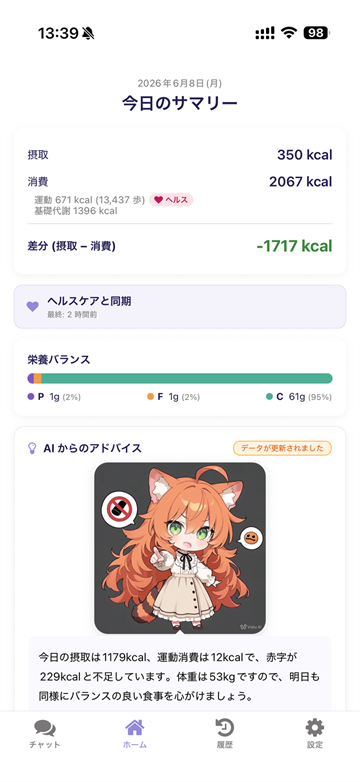

- App Store: https://apps.apple.com/jp/app/id6777913980
- ランディングページ: https://priveat.pages.dev/
- GitHub: https://github.com/kiyohken2000/priveat

> 配信地域は日本のみです。Google Play は審査中です。

---

# 名前の由来

`private`（端末内で完結する＝プライベート）＋ `eat`（食べる）の造語です。最大の強みである「食事記録が端末の外に出ない」を名前に込めました。

---

# 設計原則：「LLM＝言葉、数字＝OCR と食品 DB」

このアプリで一番大事にしているルールはこれです。

> **LLM / VLM は入力（テキスト・写真）の意味理解と、アドバイス・履歴への質問応答だけを担当する。
> カロリー・栄養素・体重などの数値は、OCR（直接読み取り）と食品 DB（公式成分表）から得る。
> LLM に数値を発明させない。**

ChatGPT などに「カレー一杯のカロリーは？」と聞くと、それっぽい数値を返してくれます。でもあれは**生成された数値**であって、根拠のあるデータではありません。健康管理アプリとしては危ない。

なので Priveat はこんな役割分担にしています：

| 担当 | 仕事 |
| --- | --- |
| LLM / VLM | 「鶏もも 200g とごはん」を `{name, grams}` の構造に分解 |
| OCR (ML Kit) | 商品ラベル・レシート・体重計のスクショから数字を直接抜く |
| 食品 DB | 文部科学省「日本食品標準成分表（八訂）増補2023 年」をローカル SQLite に内蔵 |
| LLM（コーチ役） | 実データを見て「今日は脂質多めだね」と**言葉で**コーチング |

LLM はあくまで「自然言語 → 構造化データ」の変換器と、ユーザーへの応答役。数字はちゃんと**外から拾う**設計です。

---

# 機能紹介

## 1. 記録モード：思いついたまま書くだけ

テキスト・写真・ラベル・レシート・ヘルスケアのスクショまで、端末内 LLM が自動で食事・体重・運動に分解してカード化します。

| 入力 | 仕組み |
| --- | --- |
| テキスト | 「鶏もも 200g とご飯 1 杯」→ LLM が分解 → 食品 DB と突合 |
| 料理写真 | VLM がカテゴリ推定 → 食品 DB の代表的な値を提示 |
| 商品ラベル | OCR で栄養成分表示を読み取り |
| レシート | OCR で品目を抽出 → まとめて記録 |
| 体重計スクショ | OCR で体重を抽出 |
| フィットネスアプリスクショ | OCR で歩数や消費 kcal を抽出 |

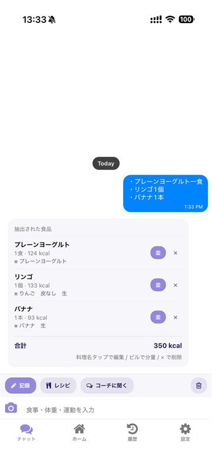
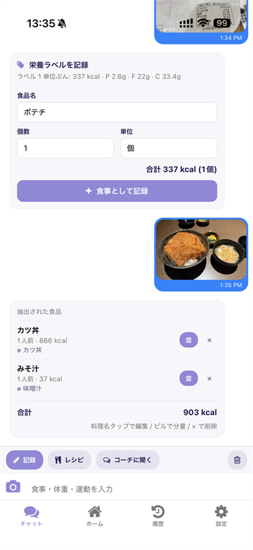
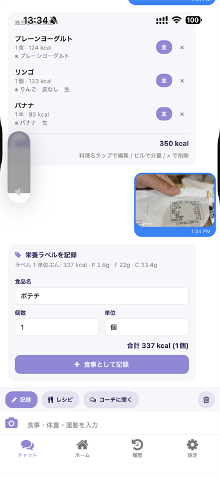
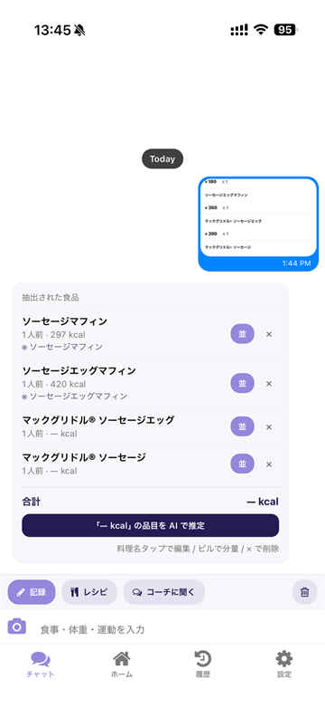

## 2. 今日のサマリー：1 画面で全部わかる

摂取・消費・差分カロリー、PFC バランス、そしてマスコット「にもにゃん」からの AI アドバイスをワンビューで。

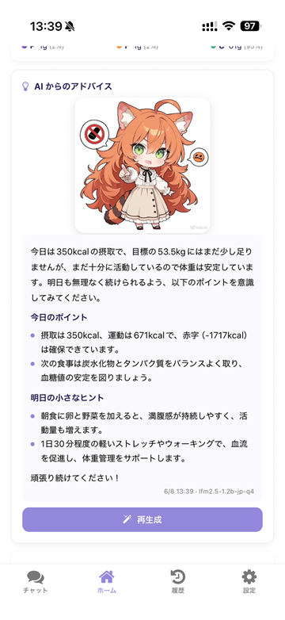
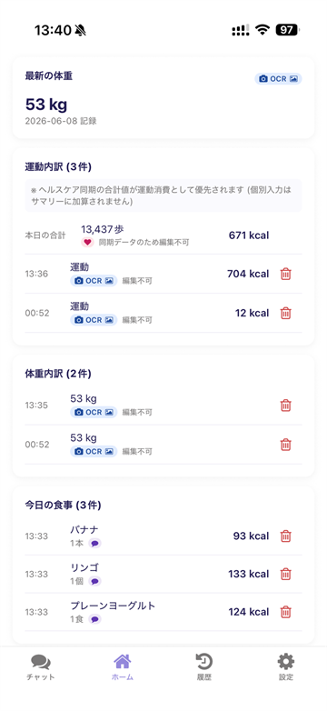

## 3. コーチモード：あなた専用の食事コーチ

その日の摂取・消費・体重を踏まえて、端末内 LLM が傾向と次の一手を返します。雑談もできます。

LLM に投げるプロンプトには「ユーザーの今日のログ」が含まれるので、汎用の AI チャットではなく**自分のデータを見たうえで**話してくれます。

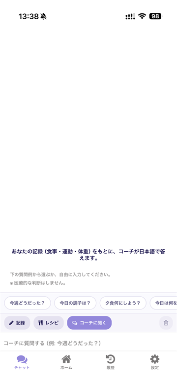
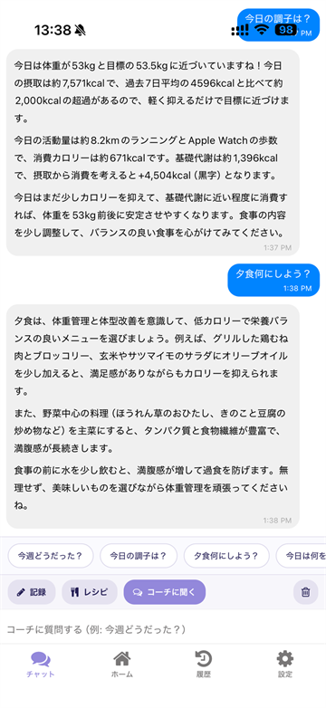

## 4. 履歴：体重とカロリー収支を一望

体重推移（最大 30 日）とカロリー収支（7 日棒グラフ）を可視化。週次の AI アドバイスで停滞期も方向を見失いません。カレンダーから過去の記録に飛べます。

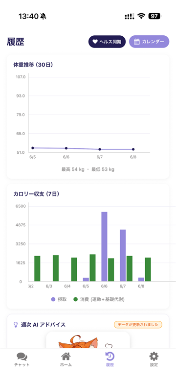
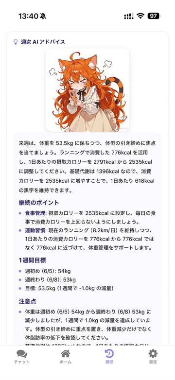
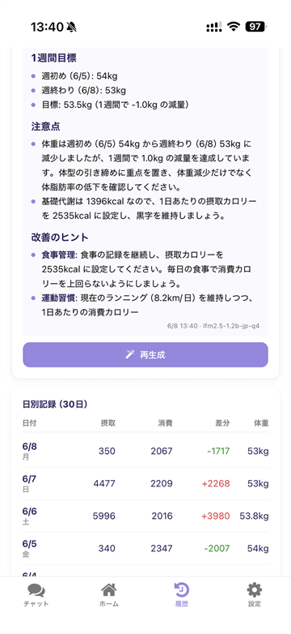

## 5. レシピ：まとめ作りを 1 食分に分割

材料リストと食数を投げると、1 食あたりのカロリーを算出してマスタ化。「カレー 1 食」のように呼び出せます。

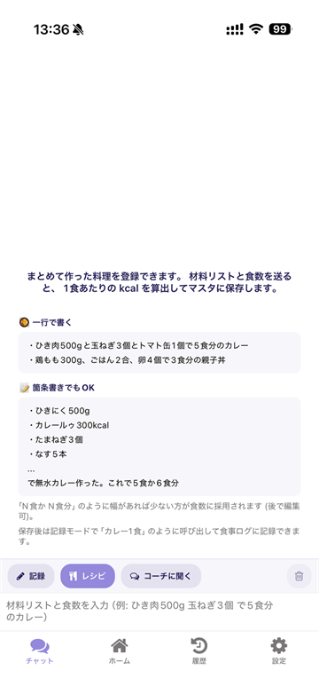
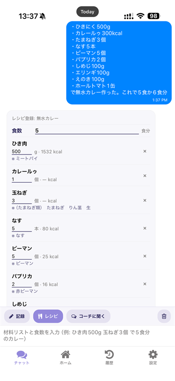

## 6. プライバシー / LLM：モデルもデータも端末内で完結

ここがこのアプリのコアです。

- クラウドに記録を送らない
- LLM 自体も**ぜんぶ端末上で実行**
- 用途ごとに使うモデルを選べる（記録用・コーチ用・写真認識を別々に最適化）
- Qwen3 / Gemma 3 / LFM 2.5 など複数のモデルから選択可
- ベンチマーク機能で速度・精度を見比べて選べる

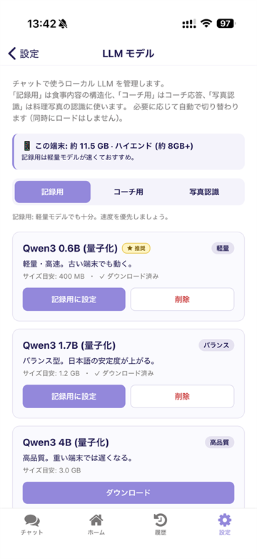
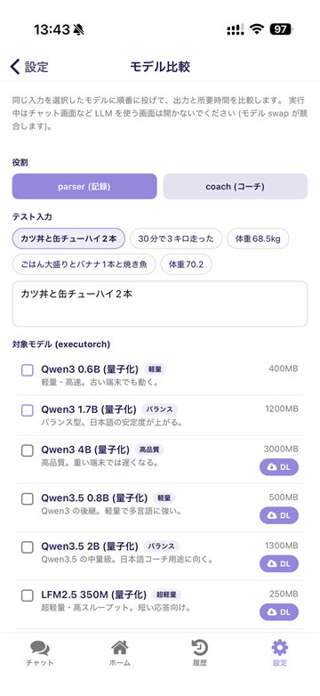

## 7. ヘルス連携：OS のヘルスケアと連動

体重・歩数・消費カロリーを OS のヘルスケアと連動。Apple Watch などのウェアラブルが拾った数値もそのまま活用できます。

- iOS: HealthKit
- Android: Health Connect

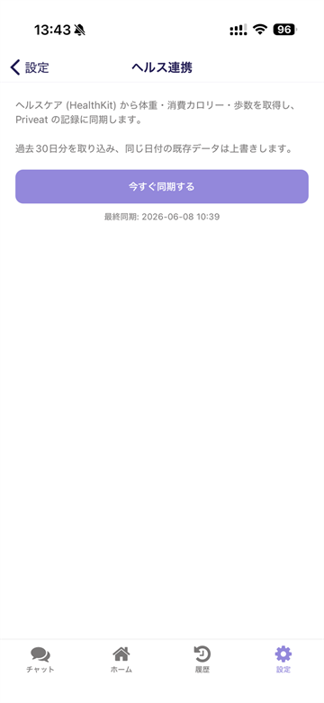

---

# 技術スタック

| 領域 | 採用 |
| --- | --- |
| フレームワーク | React Native + Expo（iOS / Android）, New Architecture 有効 |
| ローカル LLM（主） | [react-native-executorch](https://github.com/software-mansion/react-native-executorch)（`.pte` 形式。テキスト構造化・コーチング・VLM） |
| ローカル LLM（予備） | [llama.rn](https://github.com/mybigday/llama.rn)（GGUF。GBNF 文法フォールバック用） |
| OCR | rn-mlkit-ocr（ML Kit。ラベル・スクショ） |
| チャット UI | react-native-gifted-chat |
| ローカル DB | expo-sqlite（食品成分表・ログ） |
| ヘルス連携 | react-native-health-link（HealthKit / Health Connect） |
| 食品データ | 文部科学省 日本食品標準成分表（八訂）増補 2023 年 |

ビルド前提は **dev client**。Expo Go では LLM 実行ライブラリの native module が動かないので使えません。

---

# 開発で得た知見（個人開発者向け）

## ① ExecuTorch と llama.rn を使い分ける

最初は llama.rn（GGUF）一本で行こうとしていましたが、**Apple の Neural Engine を使いたい / VLM をちゃんと動かしたい**用途では ExecuTorch（`.pte`）の方が筋が良いケースがありました。

- ExecuTorch: 主役。テキスト構造化、VLM、コーチ AI
- llama.rn: GBNF 文法で JSON 出力を強制したいときのフォールバック

「JSON 厳格モード」が欲しい場面では、文法制約をかけられる llama.rn が今でも便利です。

## ② 「LLM に数値を出させない」のは結構大変

LLM はとにかく「親切な答え」を返したがる。なので何も対策しないと「鶏もも 200g」と言うと「だいたい 380kcal」と**LLM の知識から**返してきます。

これを抑える設計：

1. LLM のプロンプトで「数値は一切返すな、`{name, grams}` だけ返せ」と指示
2. JSON Schema / GBNF で構造を縛る
3. 返ってきた構造を**こちらが** SQLite の食品成分表と突合して数値化

地味ですが、ここを徹底するだけでアプリの信頼性が一段上がります。

---

# マスコット「にもにゃん」

アプリには「にもにゃん」というマスコットが住んでいて、サマリーやコーチで講評をしてくれます。LINE スタンプも配信中なので、見かけたら遊んでやってください。

- LINE STORE: https://store.line.me/stickershop/author/5435882/ja

---

# おわりに

「自分のデータを自分の中だけに置く」って、当たり前のようでアプリ側がそう作らないと成立しないんだなと作っていて改めて感じました。

オンデバイス LLM 周りはここ 1〜2 年で激変している領域なので、同じような構成で何か作る人の参考になれば嬉しいです。

- App Store: https://apps.apple.com/jp/app/id6777913980
- LP: https://priveat.pages.dev/
- GitHub: https://github.com/kiyohken2000/priveat
- 開発者を応援: https://buymeacoffee.com/votepurchase

最後まで読んでいただきありがとうございました 🐈

---