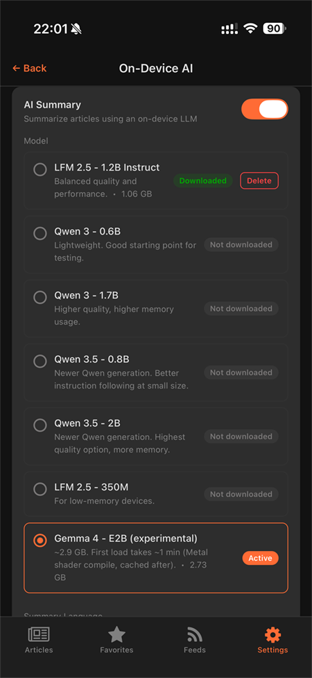
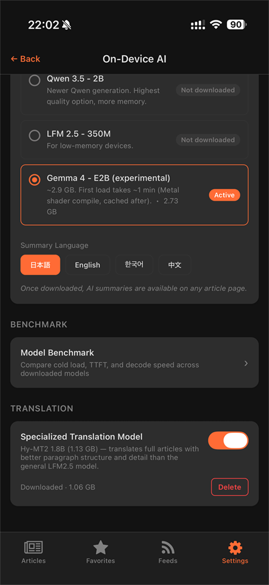
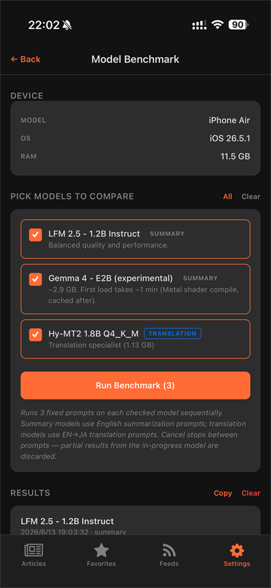
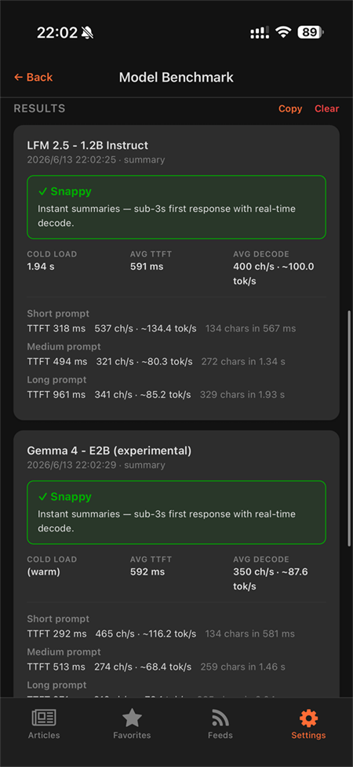
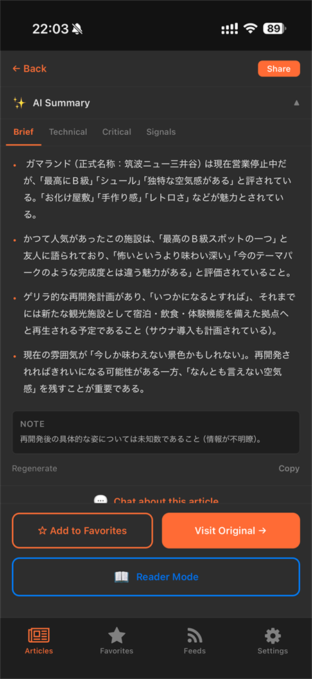
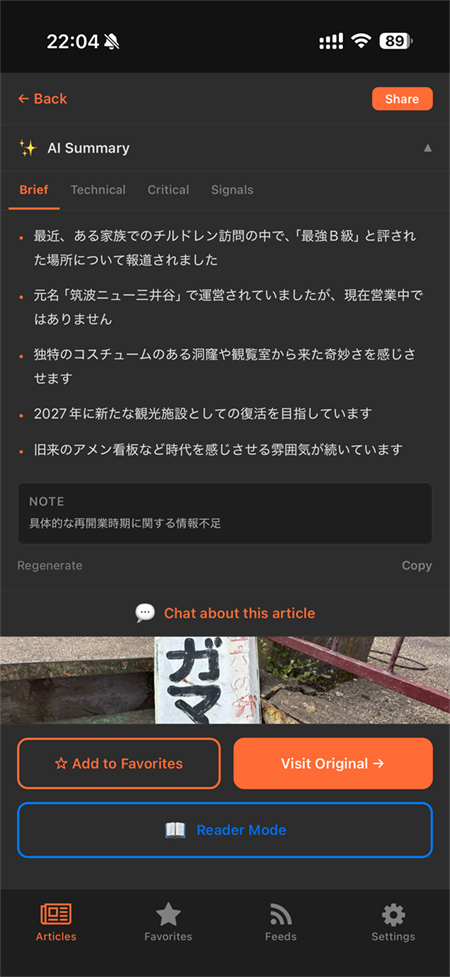
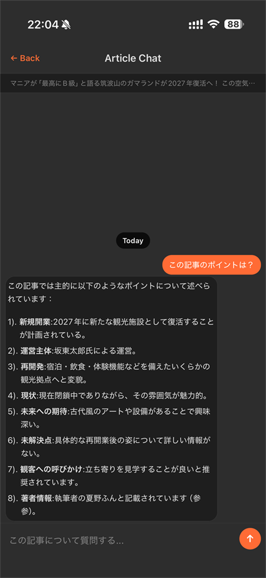
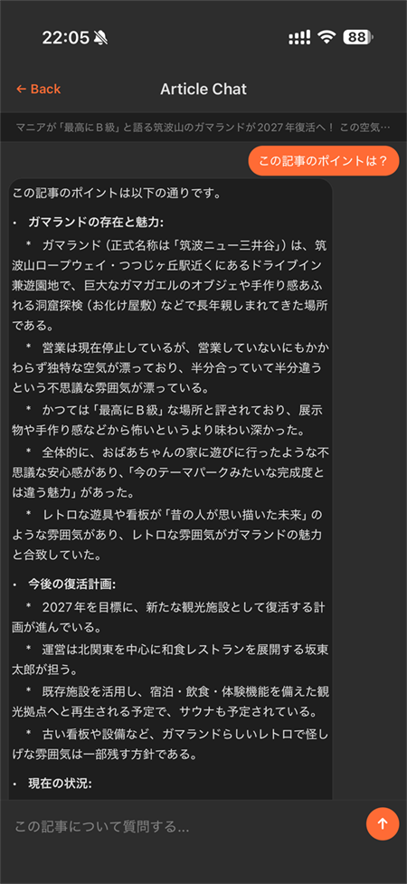

import { Link } from 'gatsby';

## TL;DR

- [前回](https://qiita.com/votepurchase/items/0f24d056b5c252699a79)、自作RSSリーダー **FeedOwn** に完全オンデバイスのAI要約 / シグナル分離 / チャット / 翻訳を載せた
- 今回 (1.0.13) は **`react-native-executorch` を 0.9.0 → 0.9.1** にバンプし、**Gemma 4 E2B** (Google の新 2B クラス、MLX backend) を候補モデルとして追加した
- ただし iPhone 13 mini (RAM 4GB) で**最初の generate で jetsam OOM** 確定。逃げ道として
  - **`minDeviceRamBytes` ゲート (8GB 以上のみ)**
  - **「Snappy / Practical / Slow / Too slow」判定付きの実機ベンチマーク画面**
  を追加した
- iPhone Air (A19 Pro, 11.5GB) の実測: LFM 2.5 1.2B が 400 ch/s ≒ 100 tok/s、Gemma 4 E2B が 350 ch/s ≒ 87.6 tok/s。**速度ではまだ LFM 2.5 1.2B が優位**
- 結論: **デフォルトは LFM 2.5 1.2B 据え置き、Gemma 4 は 8GB+ 端末の "候補" 扱い**
- リポジトリ: https://github.com/kiyohken2000/feedown

---

## 経緯：executorch 0.9.1 で Gemma 4 が来た

[Software Mansion の react-native-executorch](https://github.com/software-mansion/react-native-executorch) は React Native から Meta ExecuTorch を叩くための薄いラッパで、これが 0.9.0 → 0.9.1 で **Gemma 4 E2B** に対応した。iOS は MLX backend、Android は XNNPACK / Vulkan ビルドが公式モデルとして配信されている。

公開されているサイズはざっとこんな感じ：

| プラットフォーム | バックエンド | サイズ |
|---|---|---|
| iOS | MLX int4 | 2.89 GB |
| Android | XNNPACK 8da4w | 2.63 GB |
| Android | Vulkan 8da4w | 2.57 GB |

LFM 2.5 1.2B (1.06 GB) や Qwen 3 0.6B (~0.7 GB) と比べると **2〜3 倍重い**が、その分インストラクション従順性と要約品質の向上が期待値としてあった。とりあえず候補に入れて様子を見ようと判断した。



UI 的には既存のモデル選択リストに 1 行追加するだけ。`(experimental)` ラベルとサイズ / 初回ロード注意書きを添えた。



---

## ハマり：iPhone 13 mini で jetsam OOM

最初に踏んだ。**ダウンロード後、最初の generate を呼んだ瞬間にアプリが落ちる**。Xcode コンソールに jetsam の OOM (Memory Resource Exception) が残っていた。

- iPhone 13 mini: A15 / **RAM 4 GB** → OOM 確定
- iPhone Air: A19 Pro / **RAM 11.5 GB** → 動作 OK

理屈は単純で、**モデルファイル 2.89 GB + RN/Hermes ベースライン + 推論時のアクティベーションメモリ**が 4GB 端末の jetsam 閾値を超える。MLX backend は重み常駐型なので、generate 開始時にまとめて物理メモリに乗ってこのタイミングで OS に殺される。これは推論ライブラリ側でどうこうできる問題ではなく、ハードウェアの壁。

ロード時間も無視できない。**iPhone Air の初回ロードで ~54 秒**かかる。これは MLX が Metal シェーダをコンパイル → キャッシュする一回コスト。2 回目以降はキャッシュが効くので一瞬で立ち上がる。

---

## 対策1：RAM ゲート + フォールバック

「ロード前に弾く」しかない。

`src/ai/models.js` で各モデルに `minDeviceRamBytes` を持たせて、選択時に `canRunOnDevice()` でフィルタする：

```js
export const RAM_TIER = {
  TIER_3GB: 3.0 * 1024 ** 3,
  TIER_4GB: 4.0 * 1024 ** 3,
  TIER_6GB: 6.0 * 1024 ** 3,
  TIER_8GB: 7.0 * 1024 ** 3,  // 8GB 公称 ≒ 実効 7.0GB
}

export const FEEDOWN_LLM_MODELS = [
  // ...
  {
    id: 'gemma-4-e2b',
    label: 'Gemma 4 - E2B (experimental)',
    minDeviceRamBytes: RAM_TIER.TIER_8GB,
    recommendation: 'candidate',
    // ...
  },
]
```

`AiContext` 側で `useMemo` を回して、保存済みの `selectedModelId` がデバイス要件を満たさなければデフォルトに戻す：

```js
const selectedModel = useMemo(() => {
  const saved = models.find(m => m.id === selectedModelId)
  if (saved && canRunOnDevice(saved, deviceRamBytes)) return saved
  return defaultModel
}, [selectedModelId, deviceRamBytes])
```

「以前のバージョンで Gemma 4 を選んだ状態のまま 4GB 端末でアプリを開いた」というケースもこれで救える。

公称 8GB ≒ 実効 7.0GB にしている理由は、iOS の `os_proc_available_memory` が返す値とカタログ値にズレがあるため (8GB 機 ≒ 6.5〜7.2GB が実用上限)。保守的に閾値を切り上げた。

---

## 対策2：実機ベンチマーク画面

「Gemma 4 と LFM 2.5、結局どっちが速いの？」を**ユーザー自身の端末で測れる**ようにした。

Profile → AI Settings → Model Benchmark から開ける：



仕様：

- ダウンロード済みモデルを multi-select
- **3 固定プロンプト**を各モデルに順次投げる (short / medium / long)
- 計測: **Cold load / TTFT / decode 速度 (ch/s と tok/s)**
- 評価: **Snappy / Practical / Slow / Too slow** をモデル種別 (summary / translation) ごとに別閾値で判定
- llama.rn ベースの Hy-MT2 翻訳モデルも比較対象に入る
- 結果は `AsyncStorage` に永続化、クリップボードコピー可
- プロンプト間で Cancel 可能 (途中で止めた中間結果は破棄)

判定閾値はモデル用途で分けている。Summary 用 LLM は decode が **350 ch/s 以上で "Snappy"**、150–350 で "Practical"、それ未満は "Slow / Too slow"。翻訳は段落単位なので Snappy 閾値を別途設定。

---

## 実機ベンチ結果 (iPhone Air / iOS 26.5.1 / RAM 11.5GB)



数字だけ抜き出すと：

| モデル | Cold load | AVG TTFT | AVG decode |
|---|---|---|---|
| LFM 2.5 - 1.2B Instruct | **1.94 s** | 591 ms | **400 ch/s (~100 tok/s)** |
| Gemma 4 - E2B | (warm; cold は ~54s) | 592 ms | 350 ch/s (~87.6 tok/s) |

プロンプト長別の decode 速度：

| プロンプト | LFM 2.5 1.2B | Gemma 4 E2B |
|---|---|---|
| Short  | 537 ch/s (134.4 tok/s) | 465 ch/s (116.2 tok/s) |
| Medium | 321 ch/s (80.3 tok/s)  | 274 ch/s (68.4 tok/s) |
| Long   | 341 ch/s (85.2 tok/s)  | — |

**結論：A19 Pro でも Gemma 4 は LFM 2.5 1.2B より 1.1〜1.7 倍遅い**。サイズも 2.7 倍重い。コールドロードも 1.94s vs 54s と桁違い (キャッシュ後は両方とも一瞬)。

「劇的に賢くなった分そのコストを払う」というロジックなら採用なんだが、後述するように **要約・チャット出力の品質差は小さかった**ので、デフォルト交代は見送り。

---

## 出力比較：要約

同じ「廃墟系テーマパーク・ガマランドの再開発記事」で、LFM 2.5 1.2B と Gemma 4 E2B に Brief 要約を出させた。

### Gemma 4 E2B



- 「最高にB級」「シュール」「独特な空気感」など**記事内の評価語をそのまま取り込む**傾向
- 「ゲリラ的な再開発計画」「サウナ導入」など**詳細を拾う**
- 4 項目で長め

### LFM 2.5 1.2B



- 5 項目に分解、**より構造化**された箇条書き
- 「最強B級」「2027年に新たな観光施設として復活」など**主要事実をコンパクトに**
- 「具体的な再開業時期に関する情報不足」も明示

どちらも事実関係は正しい。**Gemma 4 のほうがやや「記事の声」に寄った要約**、**LFM 2.5 のほうがやや構造的**という印象。好みの問題で、品質序列が逆転するほどの差はない。

---

## 出力比較：チャット

同じ記事に「この記事のポイントは？」と聞いた。

### LFM 2.5 1.2B



8 項目に分解。「新規開業」「運営主体」「再開発」「現状」「未来への期待」「未解決点」「観客への呼びかけ」「著者情報」と**情報のカテゴリ分けが綺麗**。

### Gemma 4 E2B



「ガマランドの存在と魅力」「今後の改善計画」「現在の状況」と**論点ベースの章立て**。各章で 2–3 文の自由記述。情報量はこちらの方が多いが、構造は緩い。

これも好みの差。**プロダクション要件 (オフライン要約・短時間生成) なら LFM 2.5 1.2B のほうが扱いやすい**。

---

## その他 1.0.13 で入れた小改善

ついでなので Gemma 4 周りで踏んだ細かい問題への対応も列挙しておく。

### ダウンロード中のロック

`useLLM` インスタンスは一度に **1 モデルしか追跡できない**。ダウンロード中に別モデルを選択 / AI 全体トグル OFF などをやられると state が壊れる。

- ダウンロード進行中はモデル選択 UI と AI トグルをロック
- **Cancel Download ボタン**を追加 (`ExpoResourceFetcher` の cancel API → 部分ファイル削除)

### Summary リトライの smart truncate

要約の初回 generate がコンテキスト窓超過などで失敗したとき、以前は `text.slice(0, N)` で先頭をぶった切って再試行していた。これだと**記事の結論部分が落ちる**。

`buildArticleContext` 側で**段落構造を保ったまま「lead + tail」に短縮**するヘルパーに置き換えた：

```js
function truncateForRetry(text, maxChars) {
  // <p> / <br> 由来の段落境界を尊重し、
  // 先頭 N% と末尾 M% を [...] でつなぐ
  // → 結論パラグラフが落ちない
}
```

ついでに `stripHtml` でも `<p>` / `<br>` を `\n\n` に変換するよう修正。これで下流の truncation が「実際の段落境界」で切れるようになった。

### Summary 完了レースの修正

短縮リトライ中に **空応答完了イベントが先に飛んでくる**ことがあって、executorch に同時 `generate()` が走る race があった。`handleSummaryComplete` に「リトライ進行中は empty-response trans を無視」ガードを追加して解消。

---

## まとめ

- 新しい速いモデルが出たからといって、**重さがハード壁を超えたら 4GB 端末で必ず死ぬ**。今回の Gemma 4 E2B が典型例
- 逃げ道は (a) **RAM ゲート**, (b) **保存済み選択のフォールバック**, (c) **ユーザーが自分で測れるベンチマーク UI**
- 結果として、**1.0.13 時点ではデフォルト = LFM 2.5 1.2B 据え置き**、Gemma 4 は **`recommendation: 'candidate'`** として 8GB+ 端末ユーザーに提示するに留めた
- ベンチマーク画面は今後別モデルを評価するときに**毎回使い回せる資産**になる。これが本リリースで一番の収穫

オンデバイスLLM界隈は四半期ごとに新モデルが出る状況になってきた。**「載るか / どれくらいで動くか」を端末側で機械的に判定できる仕組み**を内蔵しておく価値は、今後さらに大きくなると思う。

---

## リンク

- 前回記事: [オンデバイスRSSリーダーに「翻訳特化LLM」を後付けして、要約は executorch、翻訳は llama.rn の二刀流にした話](https://qiita.com/votepurchase/items/0f24d056b5c252699a79)
- GitHub: https://github.com/kiyohken2000/feedown
- App Store: https://apps.apple.com/us/app/feedown/id6757896656
- Google Play: https://play.google.com/store/apps/details?id=net.votepurchase.feedown
- `react-native-executorch`: https://github.com/software-mansion/react-native-executorch

---