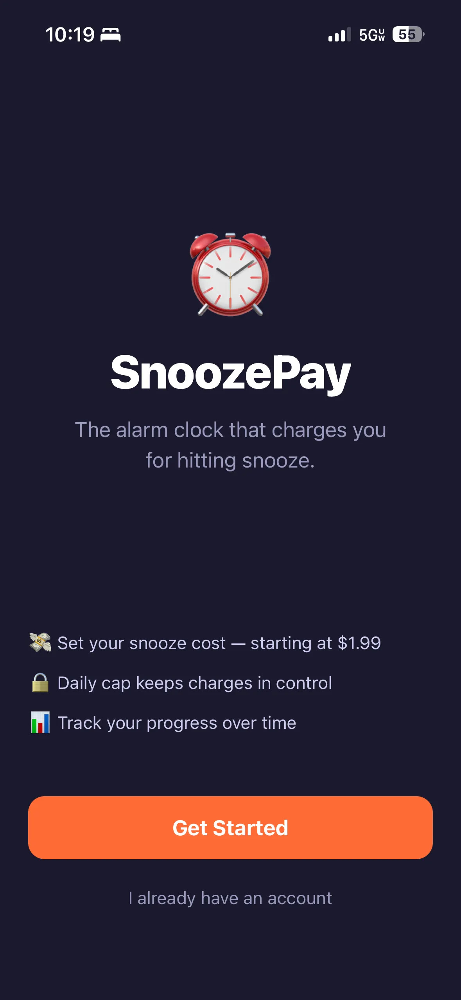
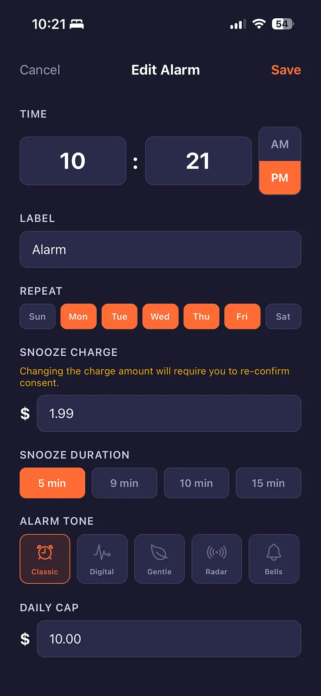
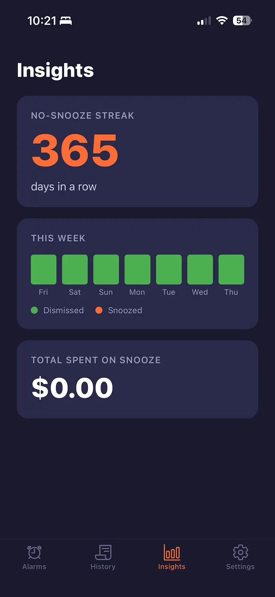
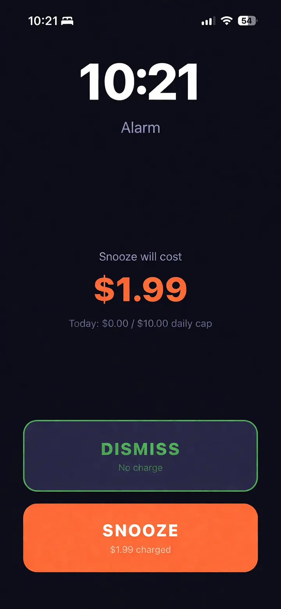
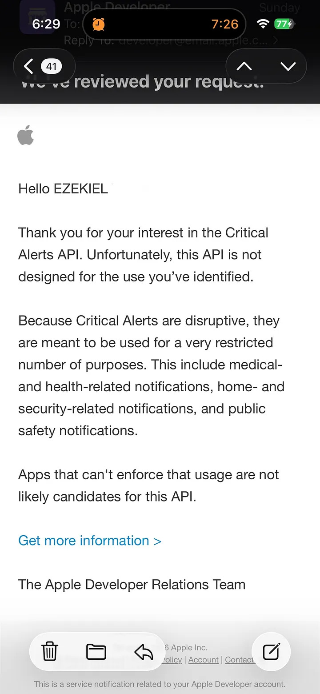

import { Link } from 'gatsby';

*出典: [I built an alarm app that charges you for snoozing. Apple killed it in one email.](https://medium.com/design-bootcamp/i-built-an-alarm-app-that-charges-you-for-snoozing-apple-killed-it-in-one-email-682a6516becb)*

8週間の開発。実機。本物のStripe課金。そして、Cupertinoから届いた3文のメール。

スマホは手の中にあった。アラームが鳴っている——シミュレータではなく、僕の実際のiPhoneで。そしてスヌーズボタンの裏には、本物のStripe課金が仕込まれていた。それが目の前で起きるのを、僕はただ見ていた。8週間の作業が、たった一つの瞬間に凝縮されて、そして——動いた。

その1時間後、Appleから届いたメールが、3文でこのプロジェクトに幕を引いた。

*SnoozePay ― スヌーズを押すと課金するアラーム時計。*

## アイデアはシンプルだった

あまりにシンプルすぎて、てっきり誰かがもうやっているものだと思い込んでいた。スヌーズを押すたびにクレジットカードへ課金するアラーム。ポイント制でもなければ、厳しめの通知でもない。実際にお金が、消える。ベッドから起き上がれなかった、というだけの理由で。名前は **SnoozePay** にした。

僕は筋金入りのスヌーズ魔だ。スヌーズが体に悪いという話は知っている——要するに睡眠サイクルを繰り返し痛めつけているだけで、実質的なメリットは何もない。でも、それを知っていたところで一度もベッドから出られた試しがない。僕に必要だったのは、本当に牙のある「代償」だった。

仕組みはこうだ。アラームをセットし、スヌーズ料金を紐づける（最低$1.99）。アラームが鳴ったら選択肢は二つ。無料で「解除」するか、金を払って「スヌーズ」するか。スヌーズを重ねれば、自分で設定した1日の上限に達する。シンプルで、ちょっと意地悪で、そしてできれば効果があってほしい。

*スヌーズ料金、時間、着信音、1日の上限 ― アラームが鳴る前にすべて設定する。*

なぜ$1.99が下限だったかというと、これは適当な数字じゃない。Stripeの手数料（2.9% + $0.30）を引くと、これより安く設定した場合の手取りが$1を切ってしまう。「代償」を売りにするアプリとしては、それはさすがに格好がつかなかった。

## 技術スタック

- React Native + Expo（TypeScript）
- Firebase — Firestore、Cloud Functions、Auth
- Stripe — Payment Intents、SetupIntent、Webhooks
- 取引メールに SendGrid
- ビルドに EAS

Expoを選んだのは、素のReact Nativeのビルド地獄を味わうことなくクロスプラットフォーム対応をしたかったから。Firebaseは、単純にもう慣れていたから。Stripeは、ユーザーの金をこっそり溶かしたりしないと信頼できる唯一の決済プロセッサだったから。

開発全体を通して、Claudeをコーディングの相棒として使った。松葉杖というより、どんな間抜けな質問にも苛立たない、動きの速いシニアエンジニアといった感じだ。組み立てて、レビューして、直して、次へ。とにかく速く進んだ。

## 8週間

**1〜2週目**は予想以上にきれいにまとまった。Firestoreのスキーマ、Firebase Auth、決済フロー用のCloud Functions。アラーム作成画面——時刻ピッカー、繰り返しの曜日、スヌーズ料金、1日の上限、着信音の選択、ラベル。アラームが鳴ったときのフルスクリーン画面は、「解除」と「スヌーズ（$）」の選択を真ん中にどんと据えた。何にサインしているのかをユーザーが法的に理解するための同意画面。カードを先に保存して後で課金する、StripeのSetupIntentを使った決済セットアップ画面。

この2週間でCloud Functionsを7つデプロイした。決済セットアップ、スヌーズ課金、Stripe Webhookハンドラ、同意ログ、課金失敗時のリトライ、アカウント削除、そして1日の上限をリセットするスケジュール処理。

**3週目**は磨き込み。ソロプロジェクトがだいたい息絶えるのがこのフェーズだ。24時間表示を12時間のAM/PM表示に修正。確認付きのスワイプ削除を追加。着信音のプレビュー。5種類のカスタムトーン（classic、digital、gentle、radar、bells）。ダークネイビーにオレンジの目覚まし時計、という新しいアイコンも作った。ここで初めて、ちゃんとしたプロダクトらしく感じられてきた。

*365日のノースヌーズ記録。使った額は$0.00。アプリが意図通りに機能している状態。*

Expoで作るなら一つ言っておきたいことがある。カスタムの着信音は、開発中のExpo Goでは完全に無音だ。これは仕様通りの挙動で、実際のビルドでしか鳴らない。とはいえ、実際にそこまで進むまで気づけないのが厄介なところだ。

**4週目**は本番投入の試練だった。Stripeをテストキーから本番キーに切り替え。シークレットはすべてFirebase Secret Managerへ移した——本番に`.env`ファイル、ではなく、正しいやり方で。デプロイ済みCloud FunctionのURLを指す本番Webhookを登録。Apple Developer Programに登録し、EASプロジェクトを作成してAppleアカウントと連携させ、自分のiPhoneをテストデバイスとして登録し、初めての実機ビルドを走らせた。

プレビュー用のIPAが自分の実機にインストールされ、スヌーズボタンの裏で本物のStripe課金とともにアラームが鳴った、あの瞬間。それこそが、僕がずっと目指していたゴールだった。8週間の作業が、動いていた。

*決断の瞬間 ― 無料で解除するか、金を払ってスヌーズするか。*

## 誰も教えてくれない壁

iOSのアラームは、Androidのアラームとは違う。

Androidなら、バックグラウンドタスクでそこそこ信頼できるアラームが作れる。ところがiOSでは、App Storeのガイドラインと電力管理の仕組みのせいで、アプリがフォアグラウンドにいない限りアラームの信頼性を担保するのが本当に難しい。SnoozePayにとっての死活問題はこれだった——「電話がDo Not DisturbやFocusモードのとき、どうなるのか？」。DNDで黙らされてしまうアラームは、もはやアラームじゃない。ただの「ご提案」だ。

まずはTime Sensitiveの割り込みレベルを適用してみた。これは部分的には効く。ユーザーが許可していればFocusモードを突き破ってくれる。ただし「ユーザーが許可していれば」というのは、よく言っても心もとない保証だ。本当の解決策は **Critical Alerts** だった。端末が完全にサイレントでも通知音を鳴らせる、特別なエンタイトルメントだ。

僕はそれを申請した。リクエストID: 89H3X7THGB。そして、待った。

## メール

*3段落。プロジェクト、終了。*

3段落。プロジェクト、終了。

内容はこうだ。Critical Alerts APIのリクエストは却下されました。これは医療、ホームセキュリティ、公共安全に関する通知にのみ許可されるものです——。

彼らは間違っていない。読んだ瞬間に、それは分かった。Critical Alertsは、血糖値モニターや、ホームセキュリティシステムや、心臓ペースメーカーの連携アプリのためにある。「起きてください、あと僕らにお金を払う必要があります」のためにあるわけじゃない。

iOSのバックグラウンドでのアラーム信頼性は、初週の時点で最大の技術的リスクとして自分でも挙げていた。ユースケースが十分に説得力を持てば、押し通せるんじゃないかと期待していた。押し通せなかった。

抜け道はある。VoIPプッシュ通知は制約が少ない。医療や安全のユースケースとして技術的に要件を満たすコンパニオンアプリを作る手もある。この壁を創意工夫でくぐり抜けた人たちもいる。ただ、そのどれもが実際の保守負担とプラットフォームリスクを伴うハックだ。そして僕は、ほかにも作りたいものを抱えたソロ開発者なのだ。

## 残すもの

SnoozePayはアーカイブ入りにする。Firebaseのプロジェクトは取り壊し、コードは自分のマシンに残しておく。いつか別のプラットフォーム戦略とともに、あるいはAppleとの戦いに挑みたい共同創業者とともに、また掘り起こす日が来るかもしれないから。

それでも、このビルドは書き留めておく価値のあることを教えてくれた。

カードを課金前に保存するStripeのSetupIntentフローは、UXとして本当によくできている——何を作っているかに関係なく、知っておく価値がある。本番のシークレットはFirebase Secret Managerで扱うのが正解で、本番の`.env`ファイルは正解ではない。EASはiOSの署名とプロビジョニングを、手動なら1週間かかりそうな作業ごとさばいてくれる。そしてClaudeをコーディングの相棒にすると、正直かなり速い。魔法ではないけれど、「これが動いてほしい」から「これが動く」までの距離を縮めてくれて、ソロプロジェクトの手触りそのものを変えてくれる。

もっと大きな学びはこれだ。アプリがDo Not Disturbやサイレントモードを貫いて音を鳴らすことに依存しているなら、Critical Alertsが必須になる。そしてAppleがそれを付与するのは、医療・セキュリティ・公共安全のアプリだけだ。この制約は、決済まわりの実装を1行でも書く前に検証しておくべきものだった——8週間かけて作り上げた「後」ではなく。最大のリスクだとリストには書いておきながら、それに正面からぶつかるのを、僕は待ちすぎた。

SnoozePayを終わらせたのは、コードでもアイデアでもなかった。プラットフォームのポリシーだった。これは、まったく種類の違う失敗だ。技術的な問題なら、デバッグで抜け出せる。でも、Apple Developer Relationsチームを、プルリクエストで突破することはできない。

さて、次へ。

---

*Expo、Firebase、Stripe、そしてClaudeで構築。Appleに葬られる。2026年。*

---