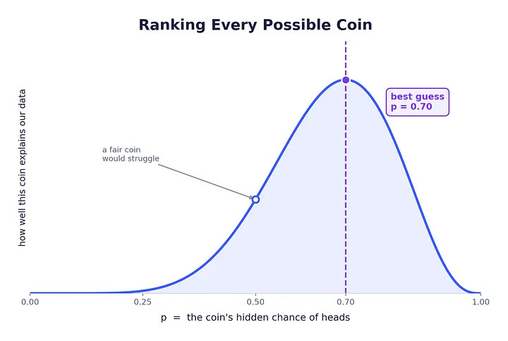
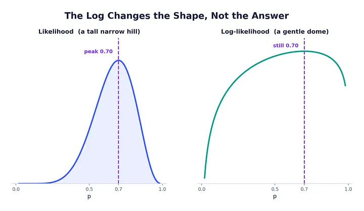
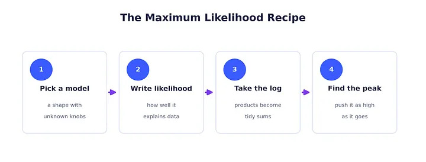
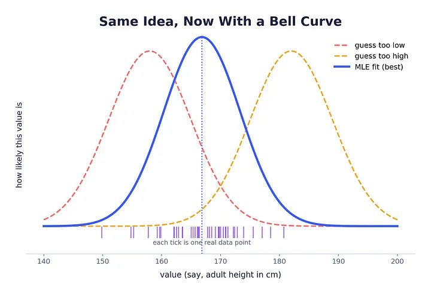
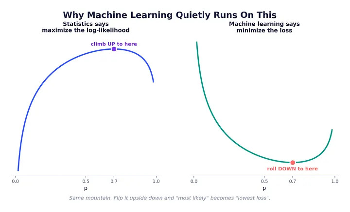
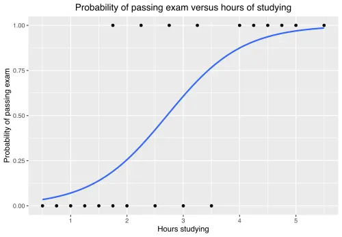
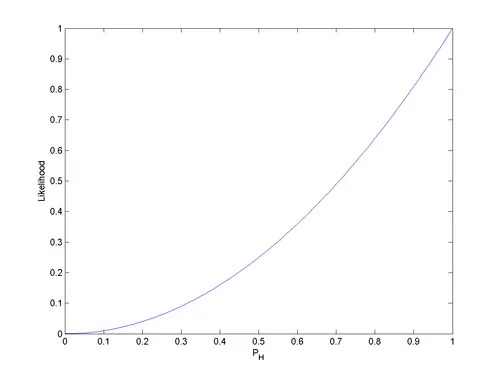
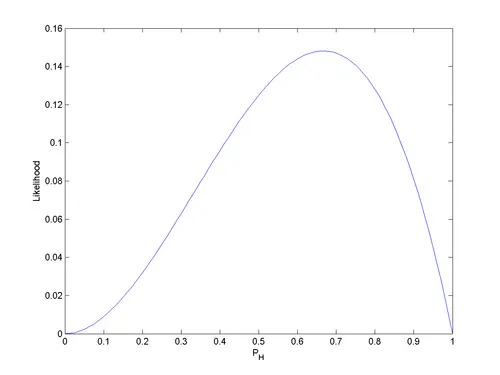

import { Link } from 'gatsby';

*出典: [Maximum Likelihood Estimation Explained Simply](https://medium.com/design-bootcamp/maximum-likelihood-estimation-explained-with-a-coin-flip-f265ea384ade)*

友達がテーブルの上で一枚のコインをこちらに滑らせてくる。「これ、イカサマだよ」と彼は言う。「なんとなく分かるんだ」。

手に取ってみる。ごく普通のコインだ。怪しいラベルも、光る仕掛けも、「私が悪者です」と叫ぶような要素もどこにもない。だから私は、人間にできるいちばん間抜けで科学的なことを始める。ただひたすらコインを投げるのだ。

表。表。裏。表。表。裏。表。表。表。裏。

10回投げて、表が7回。数え終わる前に、もう一つの数字が頭の中に勝手に入り込んで、どっかりと腰を下ろしていた。**70パーセント**。計算なんてしていない。脳が「10回中7回」を見て、バスのドアが開く前に「あ、けっこう混んでるな」と勘で当てるみたいに、ふわっと答えを吐き出しただけだ。

でもここに、誰も言わないことがある。その怠けたひと呼吸のカンこそ、統計学のすべての中でもっとも重要なアイデアの一つなのだ。名前だけ聞くと駐車違反の切符みたいに堅苦しい。けれどこいつは、あなたのスパムフィルターを動かし、メッセージの続きを予測し、銀行が「深夜2時のこの決済、本当に本人？」と判断するモデルの中にちゃんと座っている。

その名も、**最尤推定（さいゆうすいてい）**。

この記事の目的はシンプルだ。読み終わるころには、あなたはこれを「理解している」。「うんうんと頷く」レベルじゃない。ちゃんと分かって、夕食の席で誰かにうんちくを垂れて煙たがられるくらいには分かるようになる。うちの犬がさっきから郵便配達員に吠えているので、さっさと進めよう。

---

## アイデアの全体像を、ひと息で

先に結論を渡しておく。あなたの時間を尊重するし、今日のあなたの集中力がもうだいぶ削られていることも分かっているから。

**最尤推定とは、手元のデータがいちばん「当たり前」に見える説明を選ぶこと。**

以上。額に入れて飾っていい。この記事の残りは全部、この一文のまわりをぐるぐる歩いて、つついて、それでもちゃんと成り立つのを確認する作業にすぎない。

もう一度、今度はゆっくり読んでほしい。あなたの手元にはデータがある。表7回、裏3回。そして、それを説明しうる候補が山ほどある。コインは公平かもしれない。10回中7回は表が出る癖があるのかもしれない。あるいは表しか出ないように接着されているのかもしれない。最尤推定は、それぞれの説明をジャケットみたいに試着させて、たった一つの質問を投げかける。「この説明のもとで、私のデータはどれくらい普通に見える？」

公平なコインでも、10回中7回表は出る。もちろん出る。あることだ。でも、70パーセントの確率で表が出るコインなら、その結果はまるで火曜日みたいに退屈で、ごく当たり前に感じられる。だからあなたのカンは、退屈な説明のほうに傾く。賢いカンだ。

あなたは生まれてからずっとこれをやってきた。私たちはそれにネクタイを締めさせて、肩書きを与えるだけだ。

---

## いちばん忘れないコツ

このアイデアの、私なりのたった一つのたとえ話。これを盗んでほしい。

**あなたは、いつも事件のあとに現場へ着く探偵だ。**

何が起きたのかは決して見ていない。あとから来て、散らかった現場をじっと眺めるだけ。割れたランプ。泥のついた足跡。吠えなかった犬。そしてその混乱から、いちばんありそうな筋書きへと逆向きに推理していく。犯行を選ぶことはできない。ただ、まさにこの散らかり方を残しそうな容疑者を指差すだけだ。

それが最尤推定だ。コインはもう投げ終わっている。データはもう起きてしまっている。あなたはいつものように遅れて到着し、表7回という証拠に最もしっくりくる説明を指差す。

この探偵を頭の隅に置いておいてほしい。あとでまた戻ってくる。

---

## これを飛ばすと全部が台無しになる言葉

双子みたいに見えて、実は別物の二つの言葉がある。**確率（probability）**と**尤度（likelihood）**だ。

日常ではどちらもほぼ同じ意味で使う。「雨が降る確率」「彼女が返信してくる可能性」。バス停で誰もこの違いを気にしない。

けれど統計学では、この二つはまったく別の仕事だ。そして魔法はまさにこの隙間に宿っている。だから、しっかり頭に刻んでおこう。

**確率は、映画を順再生する。** ルールが分かっていて、そこからデータを予測する。コインが公平だと知っているから、「たぶん表は何回出るかな」と問う。あなたは監督だ。ルールを決めて、シーンが展開するのを眺める。

**尤度は、映画を逆再生する。** データはもう起きてしまった。テープに記録済み、終わったこと。そのうえで、「どんなルールならこの映像に説明がつくのか」と問う。もうあなたは監督ではない。またしても遅刻した探偵として、表7回を見つめ、「いったいどんなコインがこれをやらかすんだ」と考える。

確率は原因から結果へ進む。尤度は結果から原因へと這い戻る。現実の統計のほとんどは、這い戻るほうだ。なぜなら、私たちは世界のルールを実際には知らないから。世界が設定をメールで送ってきてくれることはない。ただ散らかった現場を残して、どこかへ立ち去るだけだ。

小さな表にするとこうなる。グリッドのほうがしっくり来る人もいるから。

| 問い | 確率 | 尤度 |
|---|---|---|
| 何が固定されているか | ルール（コイン） | データ（投げた結果） |
| 何が未知か | データ | ルール |
| 向き | ルール → データ | データ → ルール |
| あなたの役割 | 監督 | 探偵 |

---

## では実際に、コインでやってみよう

もう十分しゃべった。動かしてみよう。

コインの横に、隠れたダイヤルが一つ付いていると想像してほしい。このダイヤルは表が出る確率を設定する。この設定を **p** と呼ぼう。p が 0.5 ならコインは公平。0.7 なら10回中7回は表。0.95 なら、たまに事故で裏を吐き出す、ほぼ「表の自動販売機」だ。

私たちにはこのダイヤルが見えない。それがこの問題のすべてだ。ダイヤルは隠されていて、コインは何も教えてくれない。この隠れたダイヤルには、統計学では立派な名前がついている。**パラメータ**と呼ぶのだ。この言葉にひるまないでほしい。パラメータとは、宇宙が設定してあなたから隠した「つまみ」にすぎない。それ以上の意味は一切ない。

では、つまみを探しに行こう。

まずは当てずっぽうから。ダイヤルが 0.5、つまり公平なコインだとしよう。表7回・裏3回を見て、どれくらい驚くべきだろうか。

公平なコインでは、表が出る確率は 0.5。裏も 0.5。各回の結果は互いに無関係だ。コインには記憶なんてない。カード台であなたの叔父が何と言おうと関係ない。だから全体の起こりやすさを求めるには、それぞれの確率を掛け合わせる。10回、それぞれ 0.5。

```
p = 0.5 のときのデータの起こりやすさ
= 0.5 × 0.5 × 0.5 × 0.5 × 0.5 × 0.5 × 0.5 × 0.5 × 0.5 × 0.5
= 0.5 の10乗
= だいたい 0.000977
```

この小さな数字が、私たちのデータのもとでの「公平なコインの尤度」だ。怖いくらい小さく見える。でもサイズは気にしないでほしい。尤度の数字は、それ単体では何の意味もない。値札を一つ見ただけでは、二軒目の店を見るまで安いのか高いのか分からないのと同じだ。

だから二軒目を開こう。ダイヤルを 0.7 にしてみる。

今度は表の確率が 0.7、裏の確率が 0.3 だ。裏は「表じゃない」というだけで、二つは足して1にならなければならないから。表7回、裏3回。

```
p = 0.7 のときのデータの起こりやすさ
= 0.7 × 0.7 × 0.7 × 0.7 × 0.7 × 0.7 × 0.7 × 0.3 × 0.3 × 0.3
= (0.7 の7乗) × (0.3 の3乗)
= だいたい 0.00222
```

二つの数字を見比べよう。0.00222 は 0.000977 に勝っている。2倍以上も大きい。

その意味をじっくり味わってほしい。私たちの表7回は、公平な世界よりも、コインが表寄りの世界のほうが2倍以上も「居心地よく」感じている。70パーセントのコインは、私たちの見た結果にそれほど驚いていない。探偵はそちらに傾く。ゆっくりと。目を細めながら。

---

## なぜ2つの推測で止まるのか

私たちは 0.5 と 0.7 を試した。でもダイヤルは滑らかだ。0.5 でも、0.63 でも、0.701 でも、0 から 1 のあいだのどこにでも座れる。だから欲張ろう。全部試そう。

ダイヤルのあらゆる設定について、同じ質問をする。「もしダイヤルがここにあったら、私の10回中7回はどれくらい驚きが少ないか」。設定ごとに一つの数字が得られる。それをプロットする。横軸にダイヤルの設定、縦軸に尤度。

すべての値についてこれをやると、でたらめな落書きにはならない。滑らかな**丘**が現れる。



*あらゆるコインを、私たちのデータをどれだけうまく説明するかで順位づけした。丘は 0.7 で頂点に達し、ちょっと得意げに見える。*

そして満足のいく部分はここだ。丘の頂点はきっかり一つ。それは 0.7 のちょうど真上にある。

その頂点こそ、私たちのデータをすべての候補の中でいちばん「驚きの少ない」ものにするダイヤル設定だ。手元にある最良の説明。それが尤度の最大値。そしてこれが、我ながら名前がこれ以上ないくらい的確なのだが、**最尤推定値（maximum likelihood estimate）**だ。

頂点は 0.7 にある。7 ÷ 10 だ。私の怠けた脳が、こんなものの存在を知る前、10回目の投げの時点で口走ったのとまったく同じ数字だ。

これは偶然じゃない。統計学という機械が、あなたのカンにこっそり同意して、領収書を手渡しているのだ。コインの場合、最尤推定値はいつだって「表の回数 ÷ 投げた回数」になる。数式は丘や累乗や掛け算に汗を流したあげく、常識がすでに立っていた場所、足を鳴らして時計を確認しながら待っていたその場所に、きっちり着地する。

**なぜこれが大事か。** あなたの直感が正しいとき、この方法は証拠つきで裏付けてくれる。そして直感が役立たずのとき——現実の大半がそうだが——それでもこの方法はちゃんと働き続ける。あなたが本当に買っているのは、この後半の部分だ。

---

## これから激突する問題

10回分の確率を掛けて 0.00222 になった。すでに気持ち悪いほど小さい。ではこれが10回じゃなくて1万個のデータ点だったら、と想像してほしい。現実のデータセットにとっては、のんびりした午後のひとコマみたいな量だ。あなたは1より小さい数字を1万個も掛け合わせることになる。

結果はゼロに近づきすぎて、コンピュータはあきらめ、ぺったりゼロに丸めて、そのまま一日を過ごしてしまう。これは実在するバグで、ちゃんと名前がある。**アンダーフロー**。死んだノートパソコンのバッテリーよりも多くの学生プロジェクトを、静かに壊してきた犯人だ。

小さいものを掛けすぎると、役立たずの小さな粒になる。トリックが必要だ。ありがたいことに、それは有名なもので、しかも名前ほど難しくない。

---

## 対数トリック——この記事で唯一の凝った技、しかも優しい

その技はこうだ。尤度そのものの代わりに、尤度の**対数（ログ）**を使う。これを**対数尤度**と呼び、統計学者はこれが大好物だ。

もし「対数」という言葉で肩がこわばったなら、力を抜いて肩を下ろしてほしい。今日、対数について必要な事実はたった一つ。そしてそれこそが、わざわざこれを使う全理由だ。

**対数は、掛け算を足し算に変える。**

これがトリックだ。「a かける b かける c」の対数は、「log a たす log b たす log c」に等しい。私たちの数字を塵に押しつぶしていた掛け算が、落ち着いていてパニックもアンダーフローも起こさない足し算に変わる。

だから、消えゆく確率を10個掛ける代わりに、それぞれの対数をとって普通サイズの負の数に変え、ただ足し合わせるだけでいい。厄介な積が、こぎれいな和になる。あなたのノートパソコンもほっと一息つく。

ここで賢い反論が出る。あなただ、腕を組んで。「数字をいじったら答えも変わるんじゃないの? 丘全体の対数をとったら、それって頂点の違う別の丘になるんじゃ?」

いい直感だ。なぜ安全なのか説明しよう。

**対数は順序を保つ。** これが魔法の言葉、専門的には「単調（モノトニック）」だが、言葉は忘れて意味だけ持ち帰ってほしい。ある数が別の数より大きければ、その対数もまた大きい。対数はどちらが上かをひっくり返すことは絶対にない。丘を潰したり、平らにしたり、低くしたり、鋭い頂点を柔らかいドームに変えたりはできるが、頂点を横にずらすことはできない。最高点は、まったく同じダイヤル設定の真上に留まり続ける。

だから私たちは、掛け算の代わりに足し算という恩恵をまるごと受け取り、消失も起きず、何の代償も払わない。頂点は 0.7 に駐車したままだ。ただ、そこへ至るもっと快適な道を通るだけ。



*対数は丘をより親しみやすいドームに押しつぶすが、頂点は動くのを拒む。同じ答え、もっと落ち着いた数学。*

**なぜこれが大事か。** あなたがこれから読むあらゆる実用的な統計ライブラリ、あらゆるモデル学習コードは、生の尤度ではなく対数尤度を最大化している。誰も対数を愛しているからではない。同じ丘を、より安定した足場で登れるからだ。野生の中で「対数尤度」という言葉を見かけたら、「コンピュータにとって安全にした尤度」と読み替えればいい。

---

## ちょっとした実話——これは空から降ってきたわけじゃない

このアイデアは、誰かがある朝目覚めたら完成形で持っていた、というものではない。約10年かけて、一人の悪名高いほど気難しい天才によって、この世に引きずり出されたものだ。

1920年代初頭、**ロナルド・フィッシャー**という若きイギリスの統計学者が、100年ほど人々を悩ませてきた問題を噛みしめていた。データが散らかっていて、そこから何かを推定したいとき、いったいどの推定値を信じればいいのか。競合するレシピがいくつもあり、あいまいな身振り手振りが飛び交い、まだデータもないうちに物事を推測させる古い方法に重く依存していた。

フィッシャーは、他人の方法にほぼゼロの忍耐しか持ち合わせていない男で、要するにこう言った。「前もって推測するのはやめろ。データに語らせろ。実際に観測したデータをいちばん起こりやすくする設定を選べ」。彼は学生だった1912年ごろに数値的なアイデアをスケッチし、1921年ごろに「尤度」という概念に名前をつけ、1922年の画期的な論文で完全な理論を打ち立てた。

これは人々の考え方を変えた。「データが現れる前に自分が何を信じていたか」ではなく、フィッシャーはこう問うた。「データそのものは、いちばん強く何を指し示しているか」。最尤推定は現代統計学の耐力壁となり、フィッシャーはさらに、この分野の残りの部分まで理不尽な量を発明していった。

彼の話を持ち出すのは、あなたの手の中にあるものの重みを感じてほしいからだ。テーブルの上のコインは、半分しか見えない情報から誠実に推理しようとした100年の人々に、一本の直線でつながっている。10回の投げと吠える犬にしては、なかなか悪くない。

---

## どんなものにも使い回せるレシピ

コインは感覚でやった。でも、実際のレシピを書き出そう。美しいのは、これが一度も変わらないという点だ。コインだろうと、見知らぬ人々の身長だろうと、顧客の解約だろうと、遠い星の明るさだろうと。毎回、まったく同じ4ステップだ。



*コインからニューラルネットまで、あらゆる最尤推定の背後にある4ステップのレシピ。記号ではなく、形を覚えてほしい。*

**ステップ1。つまみのあるモデルを選ぶ。** 世界のおおまかな形を決めて、正確な設定は空白のままにする。コインなら形は「表は確率 p で起きる」で、p が空白だ。身長なら形は「身長は、ある中心とある広がりを持つ釣鐘型の曲線に従う」となり、今度は空白が二つになる。この空白があなたのパラメータだ。

**ステップ2。実際のデータの尤度を書く。** 各データ点について、あるつまみ設定のもとでどれくらい起こりやすいかを問い、それらを組み合わせる。データ点は普通たがいに影響しないので、掛け合わせる。こうして、どんな設定に対しても「データセット全体がどれくらい驚きが少ないか」を採点する一つの数式ができあがる。

**ステップ3。対数をとる。** 先ほど説明したあらゆる正気を保つ理由から、その積を和に変える。これで対数尤度が手に入る。頂点は同じ、道はより快適に。

**ステップ4。対数尤度を最大まで押し上げるつまみ設定を見つける。** 丘の頂点を探す。簡単なケースなら、ちょっとした微積分がきれいな数式を手渡してくれる。しばしば「ただ平均をとればいい」というくらい、失礼なほどシンプルなものだ。難しいケースなら、丘をコンピュータに渡して「登れ」と言えば、コンピュータが登ってくれる。

頂上にあるその設定が、あなたの最尤推定値だ。以上。このレシピは、信用ならないコインから、詩を書くモデルまでスケールする。そして骨組みは決して変わらない。

---

## Pythonで動くのを見てみよう

手振りはもう十分。コンピュータに頂点を見つけさせて、袖の中にトランプなど隠していないことを確かめよう。同じ「表7回のコイン」を使う。うちのノートパソコンのEnterキーはちょっと引っかかるので、せっかちに聞こえたら許してほしい。

```python
import numpy as np
# 深夜1時にこれを手計算するのは犯罪だと思うので numpy をインポートする。
flips = np.array([1, 1, 0, 1, 1, 0, 1, 1, 1, 0])
# 1 が表、0 が裏。これが実際の証拠。10回のリアルな投げ。
heads = flips.sum()
# sum は 1 を全部足す、つまり表の数を数えるだけ。ここでは 7。
total = flips.size
# size は投げた総数を数える。ここでは 10。

def log_likelihood(p):
    # p はコインの隠れた表の確率の推測値、0 から 1 まで。
    # np.log は自然対数、消えゆく数字に対する我らのトリック。
    # 各表が log(p) を足し、各裏が log(1 - p) を足す。掛けずに足す。
    return heads * np.log(p) + (total - heads) * np.log(1 - p)

candidate_p = np.linspace(0.001, 0.999, 1000)
# linspace はほぼ 0 からほぼ 1 まで、等間隔の推測値を1000個作る。
# log(0) は発散して全部を台無しにするので、ちょうど 0 と 1 は避ける。
scores = log_likelihood(candidate_p)
# 1000個の推測を一気に採点する。numpy がまとめて一発でやってくれる。
best_p = candidate_p[np.argmax(scores)]
# argmax は最高スコアの位置を見つける。そこに立っている p をつかむ。
print(round(best_p, 3))
# 0.7 と表示される。コンピュータがあなたのカンに同意した。驚いたふりをどうぞ。
```

実行すると 0.7 が出る。コンピュータは力ずくで丘を登り、1000枚のコインを試し、0.7 に旗を立てた。数式なし。ただ全部試して、いちばん良いものを残しただけ。

**なぜこれが大事か。** これはこのアイデアの、いちばん生々しいバージョンだ。あらゆる選択肢を採点し、勝者を残す。より洗練されたどんな方法も、1000点を手で確かめなくても同じ頂点を見つける、より賢いやり方にすぎない。

では、大人のやり方を見せよう。1000個の値をただ試すわけにいかないときにスケールするやつだ。

```python
import numpy as np
from scipy.optimize import minimize_scalar
# minimize_scalar は、きれいな数式が存在しないとき代わりに丘を登ってくれる。
flips = np.array([1, 1, 0, 1, 1, 0, 1, 1, 1, 0])
heads, total = flips.sum(), flips.size

def neg_log_likelihood(p):
    # 最適化器は「下り坂の歩き方」しか知らないので、符号を反転させる。
    # 負の値を最小化するのは、元の値を最大化するのと同じ。ずるいけど公正。
    return -(heads * np.log(p) + (total - heads) * np.log(1 - p))

result = minimize_scalar(neg_log_likelihood, bounds=(0.001, 0.999), method="bounded")
# bounds は探索を合法なコインの範囲、0 と 1 のあいだに保つ。外には出さない。
print(round(result.x, 3))
# また 0.7 と表示される。力ずく、微積分、最適化器。全員が握手する。
```

**なぜこれが大事か。** トリックに気づいてほしい。私たちは何かを最大化したわけではない。符号を反転させて、負の対数尤度を最小化しただけだ。これを覚えておいてほしい。これは統計学と機械学習のあいだの秘密の握手であり、あとで換金することになる。

---

## 同じアイデアを、今度は釣鐘型で

コインは素晴らしいが、二値だ。表か裏かしかない。現実のデータは、しばしば数字のにじみだ。身長。体重。バスの待ち時間。だから、まったく同じアイデアを連続的なもので見せよう。ここでこのアイデアは、かわいらしいものから、本当に役立つものへと変わる。

10人の身長をセンチメートルで測ったとしよう。身長はだいたい釣鐘型の曲線、あの有名なこぶの形に従うと信じている。釣鐘型の曲線にはつまみが二つある。こぶが座る場所である**中心**と、こぶがどれくらい幅広くゆったりしているかを表す**広がり**だ。

最尤推定は、いつもと同じ質問をする。「どの釣鐘型の曲線が、私の10個の身長をいちばん驚きの少ないものにするか」。中心を左に寄せすぎると、データの半分が起こりにくい裾のはるか外に取り残される。これはまずい。右に寄せすぎても、反対側で同じ問題が起きる。データにいちばんぴったり寄り添う中心と広がりが、それぞれ一つずつ存在する。



*釣鐘型曲線への3つの推測、勝者は明らか。最尤推定のあてはまりは、実際のデータ点と言い争うのではなく、寄り添う曲線だ。*

そしてニヤリとさせる決め台詞がここだ。釣鐘型の曲線について数式を最後まで挽き切ると、最良の中心はなんと、あなたのデータのただの**平均**になる。最良の広がりは**標準偏差**になる。怖そうな連続のケースが、「平均をとれ」に崩れ落ちる。学校で習って、当時はたぶんうんざりしたやつだ。

```python
import numpy as np
data = np.array([171, 165, 180, 158, 169, 174, 162, 177, 168, 173])
# これらを10人の身長(cm)だとする。コインじゃなくて本物の数字。
mu_hat = data.mean()
# 釣鐘型の中心の最尤推定値は、文字どおりただの平均。それだけ。
sigma_hat = data.std()
# 広がりの最尤推定値は標準偏差。numpy がタダで渡してくれる。
print(round(mu_hat, 2), round(sigma_hat, 2))
# これがあなたの10人の身長を生んだ、いちばんありそうな一つの釣鐘型曲線。
```

**なぜこれが大事か。** あなたがこれまで平均をとったすべての瞬間、あなたはこっそり、釣鐘型を仮定した最尤推定をしていたのだ。中学校で大学院の統計をやっていたのに、誰も教えてくれなかった。ちなみに μ の上の小さな帽子は「〜の推定値」という意味で、真の隠れた値そのものではない。そう書くのは、謙虚でいるためだ。

---

## 微積分をちょっとだけ覗く——痛くないと約束する

この箱は飛ばしても何も失わない。でも、コンピュータがどうやって「頂点を見つける」のか気になったことがあるなら、正直な一段落バージョンをどうぞ。

滑らかな丘の頂点は平らだ。丘の頂上に立っているところを思い浮かべてほしい。どの方向に一歩踏み出しても、もう上には行かない。その平らさこそが、すべての秘密だ。数学では、曲線の傾きを**微分**と呼び、頂点ちょうどでは傾きがゼロになる。だから「頂点を見つける」は「傾きがゼロになる場所を見つける」に変わる。コインの場合、対数尤度の傾きを書き、それをゼロと等しく置き、3行ほどのこぎれいな代数を解くと、「表の回数 ÷ 総数」がぽろっと出てくる。微積分はアイデアそのものではない。すでに理解している丘の頂上へ運ぶエレベーターにすぎない。

**なぜこれが大事か。** 誰かが「微分してゼロと置いた」と言っても、パニックにならないでほしい。彼らはただ丘の頂上に立って、地面が平らになったのを確認しているだけだ。同じ頂点、フォーマルな靴を履いただけ。

---

## なぜ機械学習は、こっそりこれ全部で動いているのか

さあ、冒頭の約束を果たす場所だ。あなたはコインの賭けに勝つためにここまで読んだわけじゃない。このアイデアが、あなたのポケットの中の恐ろしい量のテクノロジーを動かすエンジンだから読んだのだ。いったんその形を知ると、あちこちで見えるようになる。ある言葉を初めて覚えた週に、その言葉を4回も耳にするみたいに。

Pythonの符号反転を思い出してほしい。対数尤度を最大化することは、負の対数尤度を最小化することと同じだ。統計学は「いちばんありそう」まで登るのが好き。機械学習は「いちばん低い損失」まで転がり落ちるのが好き。この二つは同じ山で、片方がただ逆さまになっているだけだ。



*丘を逆さまにひっくり返すと、「いちばんありそう」が「いちばん低い損失」になる。統計学と機械学習は、最初から同じ山を登っていたのだ。*

このたった一つのつながりが、多くのものを解錠する。有名なものをいくつか挙げよう。

**ささやかな平均**は、さっき見たとおり、釣鐘型を仮定した最尤推定だ。あなたは何年もこれをやってきた。

**ロジスティック回帰**は、イエスかノーの問いのための働き者だ。この顧客は解約するか。このメールはゴミか。この患者は、年齢と血圧から見てリスクが高そうか。これらは、状況によってコインの偏りが変わる「コイン投げ」だ。ロジスティック回帰は、状況がどうコインを傾けるかを学習する。しかもそれを、これまで見てきたすべてのイエスとノーの尤度を最大化することで学ぶ。私たちのコインの例が成長し、バッジをつけて、病院に就職したものだ。



*このS字カーブは、状況に応じて表の出る確率がスライドしていくコインにすぎない。*

**スマホのキーボード**は、これまで研究してきた山のようなテキストにもとづいて、あなたのここまでの文をいちばん驚きの少ないものにする次の単語を推測する。それは、パーカーを着た尤度推理だ。

そして機械学習の広大な領域は、「現在の設定のもとで、学習データはどれくらい起こりやすいか」を書き下し、数百万の内部のつまみを、髪の毛一本ずつ微調整して、その尤度を押し上げることで学習する。「モデルを訓練する」と「尤度の丘を登る」は、しばしばまったく同じ文だ。ただ丘が数百万次元あって、コンピュータが日曜日の私よりずっと辛抱強いだけだ。

---

## 正直なところ——コインが平然と嘘をつく話

このアイデアが完璧な神託だと思わせたまま送り出したら、私は悪い案内人だ。これは強力で、あらゆる場所にあり、そして本当に恥ずかしい弱点が二つある。あとで不意打ちを食らわないよう、今のうちに会っておこう。

**少ないデータは嘘をつく。そして最尤推定はそれを即座に信じる。** コインを2回投げる。2回とも表が出る。すると最尤推定は、まったく真顔で「このコインは100パーセント表が出る」と宣言する。2回中2回だから p は 1。疑いなし。恥じらいなし。2回の投げを見て、裏は物理的に不可能だと言い切ったのだ。

これはばかげているが、本物のことを明らかにしている。最尤推定は、たまたま手に入ったデータに対する最良の説明をくれる。けれどそれ自体は、その説明をどれくらい信じてよいかは教えてくれない。2回の投げなら、唾を吐ける距離くらいしか信じるな。1万回の投げなら、大いに信じていい。推定値は、それを支えるデータと同じだけしか誠実ではない。薄いデータのうえでは、一度も間違えたことがなく、間違いを認めもしない男のような落ち着いた自信で、突拍子もないことを言う。

**そして、あなたのデータに恋してしまう。これを過学習(オーバーフィッティング)と呼ぶ。** この方法は、見てきたデータに対する可能なかぎり最良のあてはまりを追い求めるので、十分に柔軟なモデルは、本当のパターンではなく、あなたの特定のデータセットのこぶやノイズを丸暗記してしまうことがある。模擬試験では満点、本番では惨敗。解答キーを暗記して何も学ばなかった学生みたいに。現実の実務家は、こいつを短いリードでつないでおくことに多くのエネルギーを費やす。

うなずくに値する、静かな三つ目もある。釣鐘型の場合、最尤推定による広がりは平均的にほんの少しだけ小さめに出る、内蔵の控えめな値、いわゆる**バイアス**だ。小さく、データが増えれば消え、有名な一行の修正もあるが、「このデータへの最良のあてはまり」と「真の値」がいとこであって双子ではないことを、こぎれいに思い出させてくれる。

これらは、アイデアが壊れているという意味ではない。これは魔法使いではなく道具だ、という意味だ。道具がどこで失敗するかを正確に知っていること。それが、道具を使うことと、道具に使われることの、まるごとの違いだ。

---

## 友達と、怪しいコインに戻ろう

友達はまだテーブルの向こうにいる。コインはまだ、表7回・裏3回の小さな山の上に座っている。隣の家の落ち葉ブロワーがようやく止まった。

今なら彼に、正直な真実を伝えられる。私たちの単一の最良の推測は、このコインは約70パーセントの確率で表が出るということだ。なぜなら、それが私たちの見たものをいちばん驚きの少ないものにする説明だから。でも10回の投げなんて、ほとんど何もないに等しい。家賃を賭けるな。あと200回投げてから、もう一度私に聞いてくれ。

その答えまるごとが、最尤推定だ。「最良の説明」という半分と、「でもデータがどれくらいあるか考えろ」という半分。両方を手に持てば、どんな数式が単体で教えるよりも、あなたはこれをよく理解している。

だからもう一度、最初に始めた一文を。

**最尤推定とは、手元のデータがいちばん「当たり前」に見える説明を選ぶこと。**

あなたはもう、説明が何を意味するか知っている。隠れたつまみの設定だ。いちばん当たり前が何を意味するかも知っている。尤度の丘の頂点だ。数学が崩れるのを防ぐ対数トリックにも、どんなものにも効く4ステップのレシピにも、頂点を見つけるPythonにも、その出どころの100年前の物語にも、平均になる釣鐘型にも、それが密かに動かすテクノロジーの帝国にも、平然とつく二つの嘘にも、あなたは出会った。

これはトピックの「雰囲気」じゃない。これがトピックそのものだ、頭からお尻まで。最初の30秒で、吠える犬とひっかかるEnterキーとともに、あなたが偶然に再発明したアイデアにしては、悪くない。

ダイヤルはずっと隠されていた。あなたはただ、それが最もありそうに座っている場所を見つける方法を学んだだけだ。そして統計学の残りのほとんど、あらゆる信頼区間、あらゆる検定、あなたがこれから訓練するあらゆるモデルは、その一つの動きの、気の利いたリミックスにすぎない。世界はつまみを隠す。私たちは、注意深く、ちょっとだけ頑固に、それがおそらく座っている場所へと推理して戻っていく。

事件は解決した。コインはちょっとイカサマで、あなたはちょっとだけ統計学者になった。

---

## 補足——尤度関数をもう少しだけ

最後に、教科書によく出てくる尤度関数の形を二つ載せておく。丘の話が、より単純な例でどう見えるかを確かめるためのものだ。



*表が2回だけ出た（HH）ときの、表の出る確率についての尤度関数 $p_H^2$（コインの公平さについての事前知識なし）。丘には頂点がなく、p=1 でいちばん高くなる。「2回中2回表だから表100パーセント」という、あの平然たる言い切りの正体がこれだ。*



*表2回・裏1回（HHT）を観測したときの尤度関数 $p_H^2(1-p_H)$（同じく事前知識なし）。今度はちゃんと山型になり、頂点は 2/3、つまり約 0.67 に立つ。「表の回数 ÷ 総数」がそのまま頂点になっている。*

---