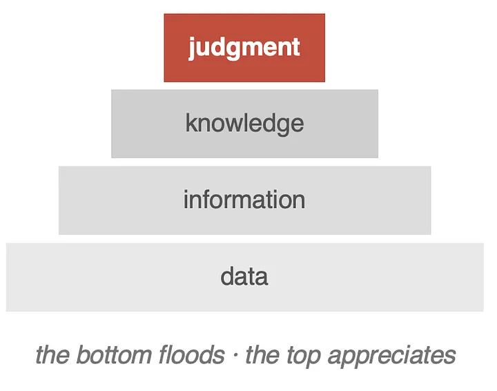
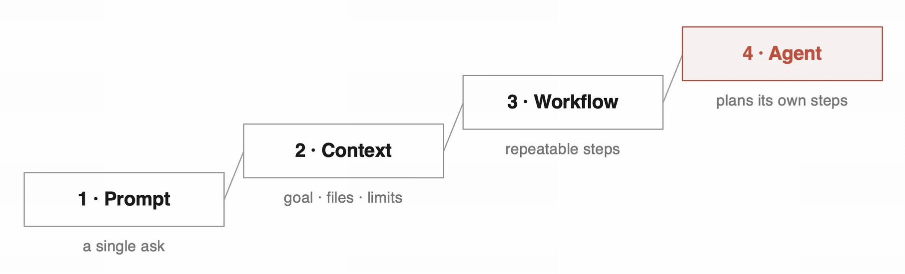

import { Link } from 'gatsby';

*出典: [You Are Not Using AI Enough](https://medium.com/99p-labs/you-are-not-using-ai-enough-4783794241c8)*

## スミス大学での一日

先日、スミス大学を訪ねた。今年度のキャップストーン・プロジェクトのキックオフである。チームはまだ走り出したばかりなので、この日はほとんどが顔合わせだった。学生に会い、指導にあたる教員に会い、これから取り組む課題をひとつずつ見て回り、学生のイノベーションをどう育てていくかを話し合った。

こうした訪問を、私たちは軽く見ていない。99P Labsはソフトウェア工学、応用AI、システム、ヒューマンAIチーミング、材料科学、エネルギーシステムといった領域で、学生や教員と並んで仕事をしている。プロジェクトに資金を出して年に二度ようすを見に行く、という関わり方をするつもりはない。学生が本物の課題に触れ、新しいやり方を試す機会を増やすことが目的だ。

キャンパスにいるあいだ、AIが働き方や学び方、ものの作り方をどう変えているかについて話してほしいと頼まれた。そこで用意した演題が「You Are Not Using AI Enough（あなたはAIを使い足りていない）」だった。

挑発的なタイトルにしたつもりだったし、実際その通りになった。ただ、言いたかったのは「もっと多くの仕事をチャットボットに投げろ」ということではない。ほとんどの人が、AIにできることの一番下の段しか使っていない、ということだ。

## 自動販売機から、設計の道具へ

AIのいちばん簡単な使い方は、自動販売機のように扱うことだ。プロンプトを投入し、出てきた答えを受け取り、次へ行く。それはそれで役に立つ。ただし、ずっと高いはしごの一段目にすぎない。

講演では四つの段を挙げた。

1. **プロンプト** — 一回限りの問いかけ
2. **コンテキスト** — 目的、ファイル、制約、必要な情報をAIに渡す
3. **ワークフロー** — 繰り返し使える手順として組み立てる
4. **エージェント** — 目的に向けて、AI自身に段取りと実行を任せる

はしごを登るとは、AIに質問する段階から、AIとの働き方を設計する段階へ移ることだ。そこには判断が要る。そして判断だけは、AIが肩代わりしてくれない。

学生に勧めているループは単純だ。まず自分が動く。AIがそれをどう扱うか見る。結果を評価する。次の一手を打つ。大事なのは答えではない。その答えで何をするかだ。

## 風力タービンという試金石

話を具体的にするために、スミスのあるプロジェクトを引き合いに出した。小型風力タービンの設計である。

最初のチームは、AIをほとんど使わずに一年かけてこれに取り組んだ。200以上のコンセプトを出し、一学期を調査に費やし、試作機を作り、風洞試験と後流の調査を行い、最後に設計の経済性を詰めた。経済性は厳しい答えを返してきた。採算分岐点は、およそ5,000年だった。

二番目のチームは、ほぼ同じ問題に八週間で挑んだ。今度はAIが大きな役割を担った。63の設計案を生成し、一日の午後のうちに二案まで絞り込んだ。評価を助けるLLMベースのwikiを自分たちで作った。チームの誰も専門にしていなかった数値流体力学も、やり抜いた。

どちらのチームも優れた仕事をした。違いは努力の質ではなく、与えられた時間でどれだけの範囲を踏破できたかにある。この話は会場から鋭い質問を引き出した。そして、その質問は聞くに値するものだった。

## あれは本当に「実験」だったのか

私たちは二つのプロジェクトを「実験」と呼んでいた。ある教員がそこに異を唱えた。もっともな指摘だった。

これは統制された研究ではない。学生も違えば状況も違い、変数を揃える努力も、学習成果を厳密に測る試みもしていない。しかも二番目のチームは、一緒に作業こそしていないものの、最初のチームの成果を見ることができた。もう一度やるなら、二番目のチームに何を見せるかをもっと慎重に考えるだろう。

だから私たちが示したのは、AIが学生を優秀にする、あるいは駄目にするという証明ではない。腰を据えて考えるに値する問いを引き出した経験を、共有したにすぎない。難しい問題に取り組む学生の手に強力なAIを渡したとき、何が起きるのか。

その問いは、さらに厄介な問いへと開けていった。AIが加速したのは学習だったのか、それとも主に生産物だったのか。最初のチームが一年かけて浸りきったことで得た理解や判断力を、二番目のチームは育てずに済んでしまったのではないか。AIが学生を8割の解に素早く届けたとして、残りの2割がなお本物の専門性を要求するとき、何が起きるのか。そして、学びにつきものだった苦闘の一部が消えたとき、専門性そのものはどうなるのか。

答えは出ていない。ただ、異論が出たぶん、議論はよくなった。

## AIは入り口を潰した。物理は潰さなかった

このプロジェクトから、はっきり見えたことが一つある。

AIを使ったチームは、アイデアを探り、知らない分野を調べ、設計を生成し、とにかく動き出すところまでを、最初のチームよりはるかに速くこなした。着手は劇的に楽になった。だが難所に突き当たったとき、彼らにはやはり物理を理解している人間が必要だった。健全な解にたどり着くまでの道のりは、相変わらず険しかった。

この区別は重要だ。AIはアイデアを探索するコストの構造を変える。新しい分野を学ぶ、方向性を試す、候補案を出す——そうした作業の値段を下げる。だが、問題を理解する必要そのものは消さない。むしろ理解の重要性を増す場合すらある。足場が少ないまま、難所に早く到着してしまうからだ。

## 議論は生産性の話を超えていった

学生も教員も、風力タービンの話に長くとどまらなかった。バイアス、知的財産、セキュリティ、ガバナンス、説明責任、エージェント、そして定型的な仕事が自動化されたあとのキャリア初期の働き方。話題は次々に移っていった。

AIに深く頼る前に、学生には知識の土台が要るのではないか。AIが返してくれた時間を、人は何に使うべきか。ひとつの考えが繰り返し浮かび上がった。生産性とは、同じ仕事をより速く多くこなすことではないはずだ。AIが仕事を引き取ってくれるなら、その時間はより深い思考、創造、探索、そして人との関係に向けられる。

AIがさらに有能に、さらに自律的になったときどうなるか、という話にもなった。私たちの立場は単純だ。責任はAIに移らない。エージェントは作業を実行できる。だが結果を引き受けることはできない。だからこそ評価と歯止め、そして人間の判断は、軽くなるどころか重くなる。

## この不安は、初めてではない

会場の懸念のいくつかには聞き覚えがあった。そして、それでいい。情報を安くする技術は、いつも同じ警鐘を鳴らしてきた。文字が広まったとき、人は記憶が衰え、思考が怠惰になると心配した。電卓が教室に届いたとき、子どもは算術を身につけなくなると心配した。そのつど懸念はもっともだったし、そのつど恐れは見当違いの的を指していた。

文字はたしかに記憶を安くした。そして思索する人の価値が上がった。電卓はたしかに算術を安くした。そして数学者の価値が上がった。自動化された技能は値段を失い、その一段上にあった技能が値を上げた。

AIで起きているのも同じ移り変わりだ。それで学びや専門性をめぐる問いが消えるわけではない。ただ、抜け道はこれまでと同じところにあるのだろう。この新しい道具が何を安くしたのかを見極め、それが高くしたもののほうに力を注ぐことだ。

## 学生はこれをどう受け止めるべきか

私たちにとって、この話は学生のイノベーションにまっすぐつながっている。

AIは、しぶしぶ目をつぶる近道であってはならない。学生が積極的に探るべき能力であり、その目的は速く行くことではなく、遠くまで行くことだ。はしごをどこまで登れるか試してほしい。何が効くのかを学び、何が失敗したのかを記録し、その失敗を互いに共有してほしい。

うまくいかなかったやり方は、無駄な労力ではない。次の試みのための評価セットになる。それが99P Labsの考え方だ。私たちが「実験」を、ほとんど失敗すると分かったうえで走らせているのは、その失敗こそが次をよくする方法を教えてくれるからである。

## 作業は自動化せよ。責任は決して自動化するな

締めくくりに、私たちが「AI利用の十戒」と呼んでいるものを紹介した。

1. すべての回答を、ひとつの「主張」として扱え。
2. 出典のない見知らぬ他人の話として受け入れられないものは、受け入れるな。
3. 最初の答えを崇めるな。あと二つ出させろ。
4. 体裁ではなく、中身で判断しろ。
5. AIに、自分への反論をやらせろ。
6. 「何が示されればこれは間違いになるか」を問え。
7. 最初の一手は自分で打て。
8. 責めるより先に文脈を渡せ。まずい出力の多くは、指示の出し方の問題だ。
9. 失敗を記録に残せ。失敗はあなたの評価セットだ。
10. 世に出すものはすべて自分が引き受けろ。作業は自動化せよ。責任は決して自動化するな。

## おもしろい時代に生きている

最後の一つがいちばん大事かもしれない。そして、それは私たちが楽観している理由でもある。

AIは情報を安くしている。値上がりするのは判断だ。こう考えてみてほしい。一番下にデータがあり、その上に情報、さらに知識、そして頂上に判断が乗っている。AIはこの積み重ねの底を水浸しにする。頂上には届かない。むしろ、そこにあるものの値段を押し上げる。

人間が置き換えられることはない。価値が上がるのは、ある種の人間の能力のほうだ。何が重要かを決める、何を信じるかを決める、何を作るかを決める、何を引き受けるかを決める——この仕事は自動化されない。その下にあるものが楽になるほど、重みを増していく。

学生にとっての好機は、AIをもっと使うことではない。もっと真剣に使うことだ。自動販売機から離れよう。最初の一手は自分で打とう。返ってきたものを疑おう。失敗から学ぼう。作ったものの責任は自分で取ろう。

さあ、何か作って、それが自分の一手に何を返してくるか見てみよう。

**大胆に使え。容赦なく疑え。**

---