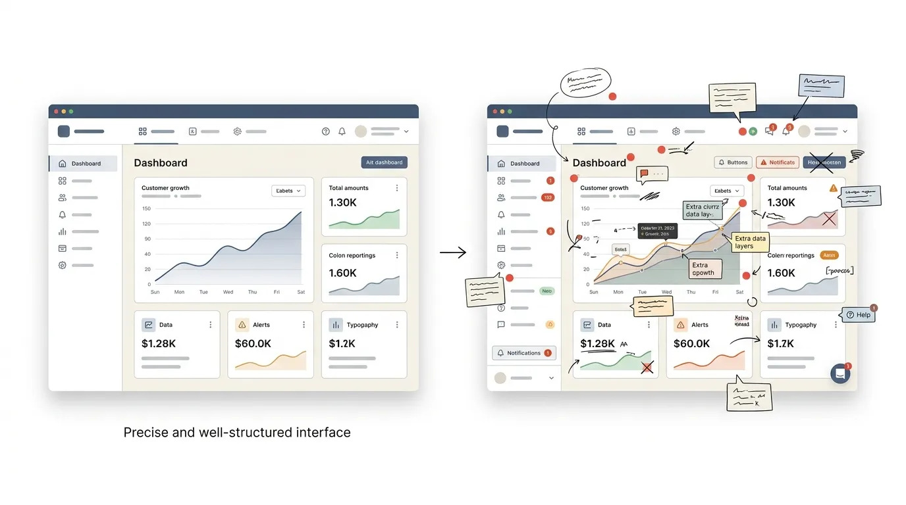

import { Link } from 'gatsby';

*出典: [Why Most Design Critiques End Up Making Products Worse](https://medium.com/design-bootcamp/why-most-design-critiques-end-up-making-products-worse-f6f5a5a5c785)*

*その儀式はアイデアを鋭くするためのものだ。だが実際には、面白い部分をすべて削り落としているだけのことが多い。*

出来のいいオンボーディングフローが、三回の批評会をかけて死んでいくのを、私は目の前で見たことがある。

一つの悪い判断で死んだのではない。十一の、それぞれもっともな判断によってだ。

そのデザイナーが持ち込んだものは鋭かった。たしかに少し型破りではあったけれど、何ヶ月も放置されてきた本物の問題を解いていた。三巡目を終える頃には、尖った角はすべて削り落とされていた。視点と呼べるものは、誰も反対できない何かへと丸められていた。最終的に出荷されたフローは、問題なく動いた。そして、互いの前で間違うことを恐れているチームがつくる、どのアプリにもあるオンボーディングフローと、そっくり同じ見た目をしていた。

あの部屋にいた誰も、厳密な意味では間違っていない。どの指摘も、単体では筋が通っていた。ただ、合わさったときにそれはゆっくりとした浸食として働き、進行中は誰もそれに気づかなかった。

デザイン批評を語るとき、人があまり話題にしないのがこの部分だ。私たちはそれを疑う余地のない善として、成熟したデザイン文化のしるしとして扱っている。作業を見せる。フィードバックをもらう。反復する。いかにも責任ある態度に聞こえる。エゴ駆動のデザインの対極に聞こえる。

けれど、テーブルの両側で十分な時間をこの手の部屋に費やしてきた者として、口に出すには少し居心地の悪いことを言いたい。多くのチームが実践しているかたちの批評は、救う仕事より損なう仕事のほうが多い。

いつもではない。どこでもではない。ただ、いま向けられている以上の検証に値するくらいには、しばしば。

## そもそも作品を守るための仕組みではなかった

デザイン批評はプロダクトチームで生まれたものではない。出自は美術学校で、その環境ならこの形式にはそれなりの理があった。絵画は一人の作家の単独のビジョンであり、それを評価する仲間たちには、その絵が商業的に成功するかどうかに利害がない。締切もなければ、翌四半期に達成すべきユーザー指標もない。批評は、技を磨き前提を揺さぶるためのものだった。下手な意見を言ったときの実際のコストが、気まずい沈黙だけで済む場所での話だ。

プロダクトチームはこの形式を借り、儀式をそのまま持ち込んだ。けれど賭け金のほうは、まるごと変わってしまった。

いま部屋にいるのは、これが出荷されることにロードマップがかかっているPM。すでに工数を見積もり終えたエンジニア。別のプロダクト、別の会社、キャリアの別の十年によって形づくられた意見を持つシニアデザイナー。ときには、十分だけふらりと立ち寄り、帰る前に「ちゃんと聞いてもらえた」と感じる必要のあるステークホルダー。

この人たちが意見を持つこと自体は、何も間違っていない。問題は構造のほうにある。開かれた芸術的探索のために設計された形式を、収束し、出荷され、実際の行動に照らして測られなければならない意思決定に適用してしまっている。

何年分もの会議を振り返って一番驚いたのは、「目の前のこの決定に、そもそも批評という道具が適しているのか」を問う人がほとんどいないことだった。私たちはただ、反射的にそれを選ぶ。新しいフロー？ 批評会を設定しよう。設定画面のリデザイン？ 批評会だ。その問題に本当に六人分の意見が必要なのか、それとも、まず三人のユーザーに話を聞く規律を持った一人の意思決定者が必要なのかを、誰も問わない。

批評は、手法になる前に習慣になった。

この区別は、多くのチームが思っているよりずっと重い。

## 賢いフィードバックが、それでも弱い決定を生む

気づくのに恥ずかしいほど時間がかかったことがある。批評の場で出る個々のコメントの質は、最終的な成果の質とほとんど相関しない。

思慮深く、善意にあふれ、本当に腕のいい人たちで部屋を埋めても、入ってきたときより悪いデザインを持って出ていくことはある。これは能力の問題ではない。集団力学の問題で、いくつかの予測可能なパターンとして現れる。

一つめは、シニオリティ勾配だ。デザインディレクターが「この余白、どうかな」と言うとき、その一言は、ジュニアデザイナーがまったく同じことを言ったときとは違う重さを持って着地する。観察として優れているからではない。誰が言ったか、それだけの理由で。本人が意見として固めてすらいない何気ない一言のせいで、方向性がまるごと静かに放棄されるのを、私は何度も見てきた。本人は考えを口に出していただけだ。部屋はそれを判決として受け取った。

二つめは、意見のロンダリングとでも呼ぶべきものだ。個人的な好みを、すでに決着のついた原則であるかのように述べる。「ユーザーは長いフォームを嫌う」「オンボーディングのコピーなんて誰も読まない」。こうした物言いはリサーチのように響く。半分くらいは、白衣を着た気分の問題でしかない。そして「それ、データはあるんですか」と言い出す役を誰も引き受けたくないので、検証されていない主張が、その会議の残り時間ずっと事実として扱われる。

三つめ、そしておそらく最も有害なのが、収束圧力だ。会議には合意へ向かう自然な引力がある。誰かが変更を提案する。何人かがうなずく。部屋は合意へ動きはじめる。アイデアが良いからではなく、この時点で異を唱えることの社会的コストが高くつくからだ。私自身、これをやっている自分に気づいたことがある。本心では同意していない指摘に、押し返すほうがその場では面倒だという理由でうなずいていた。あれは協働ではない。疲労が整合性の服を着ていただけだ。

見方が変わったのは、批評がいつも混ぜてしまう二つの問いを、意識的に分けはじめてからだった。これは問題なのか。そして、これはその問題に対する解なのか。たいていの部屋は解のほうへ直行する。「ボタンを大きく」「プログレスインジケーターを足そう」「このコピーをシンプルに」。これらは診断ではなく処方であり、批評が本来生むはずの思考を回路ごと短絡させてしまう。

ここで役に立つ心の模型を、私は医師のコミュニケーション訓練のあり方から借りた。あらゆるフィードバックを、処方になる前に必ず診断を通過させる。実際に観察している問題は何か。それはどこに現れるか。誰に影響するか。それが明確に名指しされて初めて、修正案を出してよい。そして理想を言えば、修正案を出すのは症状を見つけた人ではなく、その仕事を所有している人のほうがいい。

この「処方の前に診断」という一つの転換だけで、批評文化の不具合の半分は静かに直る。

## 千の小さな修正による死

*左：的確で、構造のはっきりしたインターフェース。右：同じ画面が、それぞれ単体では妥当な指摘に覆われた状態。*

これが、見ていて一番こたえたパターンだ。起きている最中は、どこからどう見ても損傷に見えないからだ。

一貫したデザインには視点がある。選択をしている。その選択のいくつかは荷重を支えていて、体験全体がそれらの持ちこたえに依存している。ほかのものは表層的で、実際に改善の余地がある。

通常のかたちの批評文化は、すべての要素を等しく交渉可能なものとして扱う。十二人がそれぞれ一つずつ、単体では妥当な小さな指摘を寄せる。ここの余白を詰めて。このコピーを変えて。この要素を上に。ツールチップを足して。どれも単独では悪くない。合わさると、それらは堆積物のようにふるまう。層また層と重なり、元の意図は、互いに何の調整もされていない善意の小さな修正の山の下に埋もれていく。

私はこれを集積の問題と呼ぶようになった。そして一度見えてしまうと、批評偏重のチームのほとんどで、これが見えなくなることはない。

悲惨なのは、これだけのフィードバックを受け取るデザイナーが、どの一つに対しても、防御的に見えずに押し返すことができない点だ。「ツールチップくらい足せばいいじゃない、何か害がある？」。単体で取り出せば、たしかに何の害もない。合わさったときに、自信のある、具体性を持った仕事が粥になる。安全で、当たり障りがなく、忘れられる。

ヤコブ・ニールセンのヒューリスティック評価に関する研究は、じつは数十年前にこの問題の一種を予見していた。ただ、その誤用が絶えない。彼の本来の指針は、評価者が独立に別々にレビューし、そのあとで所見を集約するという構成に基づいていた。集団思考と社会的圧力が結果を汚染するのを避けるため、まさにそのためにそう設計されていた。多くのチームがやっているのは正反対だ。全員を一つの部屋に集め、独立した判断が形成される機会を持つ前に、最も声が大きく最も自信のある人物に、全員の知覚を固定させてしまう。

これを繰り返し見て学んだのは、同じ会議で発せられたというだけでは、すべてのフィードバックが等しい権威に値するわけではない、ということだ。構造に関わる指摘がある。装飾の指摘がある。UX原則の衣装を着た個人の趣味もある。これらをその場で仕分けること、そして「それは使いやすさの問題ではなく好みですね」と言えるだけの立場を持つこと。これは、ほとんどのデザインチームが明示的に訓練していない技能だ。

その仕分けの機構がないかぎり、どの批評会も平均化マシンに成り下がる危険を抱える。そして平均化されたデザインが良いデザインであることは、まずない。それはただ、部屋の誰も積極的には嫌わなかったデザインというだけだ。

## 批評が本当に最適化しているもの

批評が純粋にプロダクトを良くするためのものなら、最も厳しく最も有用なフィードバックは、それがどう受け取られるかに最も利害を持たない人から出てくるはずだ。実際には、たいてい逆のことが起きる。

認めるかどうかは別として、多くの批評会はキャリアの安全装置として機能している。デザイナーは、自分が入念に見ていると映るフィードバックをする。PMは自分のロードマップを守るフィードバックをする。エンジニアは、何かが壊れたときに将来の責任追及を先回りして封じる懸念を表明する。誰もが程度の差こそあれ、自分の露出を管理している。

これは冷笑ではない。口を開くたびに職業上の評判が静かに賭けられている部屋で、人間がどうふるまうか、というだけのことだ。私自身やってきた。黙っているほうが、何でもいいから懸念を口にして注意を払っている姿勢を示すより危険に感じられたから、自分でも本気で信じていない懸念を挙げたことがある。

結果として生まれるのは、品質ではなく弁明可能性を最適化するシステムだ。弁明可能なデザインとは、あらゆる決定が会議上の何らかの合意にまでたどれるデザインのことを指す。後で失敗しても、その失敗を所有する個人はいない。部屋が集団として所有する。それは機能的には、誰も所有していないのと同じだ。

これを、一貫して優れたプロダクトを出すことで知られる場所で、強い創造的決定が実際にどう下されているかと比べてみてほしい。アップルのデザインプロセスは、少なくともケン・コシエンダのような元社員が『Creative Selection』などで公に書いているところによれば、開かれた民主的な批評としては機能していない。本物の審美眼と本物の決定権を持つ少数の人間が判定するデモの連続として機能し、広い聴衆に届く前に、素早く、そして閉じた場で反復される。目指しているのは合意ではない。品質であり、しかもその判断に責任を負う人たちによる判断としての品質だ。

これは、多くのプロダクトチームが置かれているインセンティブ構造とは根本的に異なる。そちらでは、批評は責任を広く分散させ、結果が振るわなくても個人が責められないようにするために、部分的に存在している。

このパターンを何年も見てきて、予想していなかった学びが一つある。最も個性的で最も愛されるプロダクトを出すチームは、最も開かれた批評文化を持つチームであることは、まずない。そういうチームが持っているのは、最も明確な決定権だ。早い段階で大量のインプット。最後に実際の拒否権を持つ人はごく少数。それ以外の全員の仕事は、意思決定者をより賢くすることであって、投票することではない。

インプットか、権限か。この一つの区別が、私が実地で出会ったほぼすべての批評フレームワークから抜け落ちている。

## より良い型：民主制ではなく、診断としての批評

以上は、批評をなくすべきだという話ではない。フィードバックのループは大事だ。新鮮な目は本物の問題を見つける。出荷前に作業を見せたいという衝動は健全なものだ。

失敗しているのは衝動ではない。形式のほうだ。

自分の経験と、一貫して筋の通った自信ある仕事を出しているチームを見てきた経験から、うまくいくとわかったのは、いくつかの構造上の変更だ。どれも小さく聞こえるが、部屋のふるまいを根本から変える。

**一つめ。発散的な思考と、収束的な意思決定を分け、同じ会議で起こさせない。** 早期の批評は可能性を生み、問題を浮かび上がらせるためのもの。後期の批評は決定へ絞り込むためのもの。この二つのモードを混ぜると、新しい方向性を探索しながら同時に出荷日を確定しようとする部屋ができあがる。誰も本当は望んでいない、あの濁った妥協はそこから生まれる。

**二つめ。決定権を、会議が始まる前に明示的に割り当てる。終わってからではなく。** 一人が判断を所有する。それ以外の全員はインプットを寄せるのであって、票を投じるのではない。単純すぎて効きそうにないが、心理的な転換は大きい。自分の発言が拘束力のある票ではなくインプットだとわかっているとき、人はより鋭く、より正直なフィードバックをする傾向がある。結果への影響力を奪い合う必要がないからだ。

**三つめ。修正案を出す前に、問題を特定することを義務づける。** 「Xを期待してYが出てきたので混乱しました」は有用だ。「とにかく大きくして」は、具体的に観察された問題に結びついていないかぎり、有用ではない。この規律を、たとえ非公式にでも採り入れたチームは、先に挙げた集積の問題を生むばらまき型の指摘が、はっきり減る。

**四つめ。荷重を支える決定を、軽い上書きから守る。** ある設計上の選択が体験にとって構造的なものなら、誰か一人の通りすがりの好みを理由に再交渉にかけられるべきではない。どの決定が土台なのかを批評会が始まる前に名指ししておけば、部屋は何が本当に議論に開かれていて、何がすでに相応の理由で決まっているのかを知ることができる。

**五つめ。これは居心地が悪いが必要だ。フィードバックの重みを、肩書きや声の大きさではなく、関連する専門性と問題への近さで決める。** あるフローでユーザーが苦戦するのを六時間見てきた物静かなリサーチャーは、その具体的な問いに関して、九十秒だけ眺めたディレクターより発言の正統性を持つ。どちらの肩書きが上かとは関係なく。

これで意見の対立がなくなるわけではない。良い批評は、むしろ摩擦を生むべきだ。変わるのは摩擦の種類のほうだ。漠然とした居心地の悪さが、誰も全面的には支持していない十数個の小さな修正へと積み上がる代わりに、より鋭く具体的な対立が生まれ、それが誰かが責任を負う決定へと解決していく。

より深いところでの心構えの転換は、こういうことだと思う。批評は、委員会の採決よりも、専門医の診断に近い感触であるべきだ。診断は問題を明確に特定し、どう治療するかの判断は、その仕事を所有する人の手に残す。委員会の採決は責任を薄く引き伸ばし、結果が良かろうが悪かろうが、誰もその重みを感じなくなる。

多くのチームは委員会をつくってしまった。本当に必要だったのは、見えたものを口に出し、そのあと道を空ける専門家たちの部屋だったのに。

## 一度見えてしまうと、何が変わるか

集積の問題に気づいてしまうと、もう同じ気持ちで批評会に座っていられなくなる。診断と好みの違いが、その場で聞き分けられるようになる。部屋が収束しているのが本物の合意によるものか、社会的な疲労によるものかが見えるようになる。そして静かに問うようになる。この決定に本当に六人が部屋にいる必要があったのか、それとも、自信のある一人と、実際のユーザーとの的を絞った三回の会話が必要だっただけなのか。

どんな批評の枠組みよりも、この問いこそが、私が関わった仕事を最も多く救ってきた。

すべてを変えて何一つ引き受けない批評は、フィードバックではない。照明の当たり方が良くなっただけの、責任の分散だ。

私が近くで見てきた最も強いデザインの仕事は、フィードバックに最も開かれた部屋から生まれたものではなかった。どのフィードバックが作品を変えるに値するかについて、最も規律正しかった部屋から生まれていた。

冒頭で触れたあのオンボーディングフローは、ついに元に戻らなかった。チームは角の取れた版を出荷し、指標が「まあ悪くない」あたりに着地するのを眺め、あの三回の会議で実際に何が起きたのかを一度も話し合わないまま、次のプロジェクトへ移っていった。誰もそれを失敗とは呼ばなかった。内側から見れば、プロセスのどこも壊れて見えなかったからだ。全員が思慮深く貢献していた。全員が理にかなっていた。

いまだに引っかかっているのは、その部分だ。システムは設計どおりに正確に機能した。ただ、その仕事を良いものにしていたものを守るようには、設計されていなかった。

もしすべてのフィードバックが、修正を提案する前に具体的な問題を名指しすることを求められたら、あなたのチームの批評会はどう変わるだろうか。

---